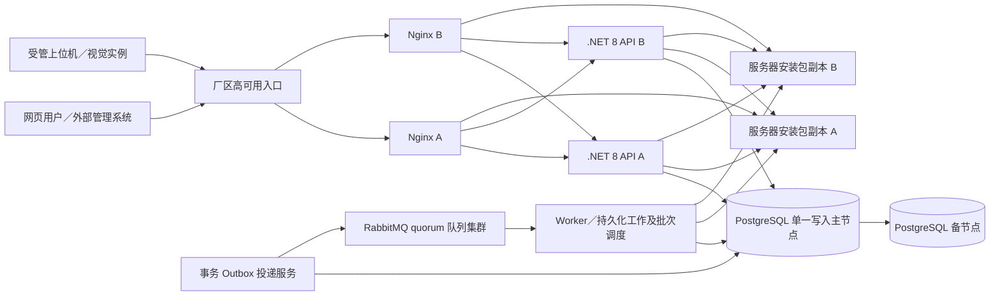
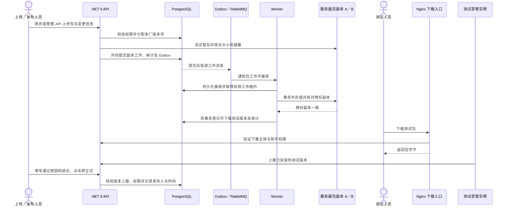
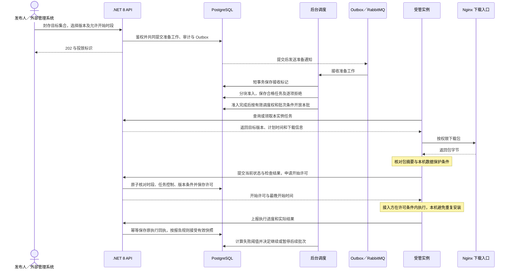
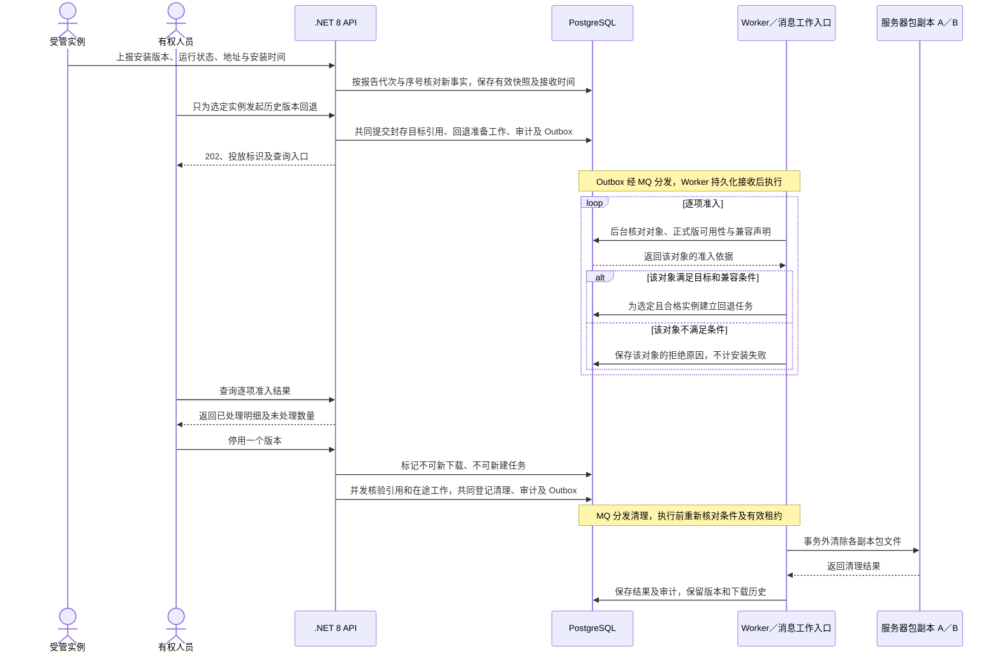

# 制造业软件版本管控平台总体架构

> 状态：既有业务架构已审阅；本次现场台账及软件映射配套修订待复核。以[需求规格说明](./需求规格说明.md)为唯一业务需求输入；本文定义逻辑架构与故障边界，模块职责见[模块设计](./模块设计.md)，接口与状态见[详细设计](./详细设计.md)，工程与依赖契约见[软件框架设计](./软件框架设计.md)。现场输入见[架构测试与验收要求](./架构测试与验收要求.md)第 2 节；工程骨架、数据库基础及人员会话链路已有实现，当前覆盖与待完成项统一见软件框架设计第 3.5、11 节；完整架构和生产运行验收未完成。

## 1. 系统边界与架构结论

每个隔离厂区独立部署一套 Linux / .NET 8 平台，各自管理人员、工序、设备台账、设备与软件映射、软件分类、版本、包、实例、任务、上报和审计。厂区之间无实时依赖，同一软件需在各厂分别上传并独立编号。平台交付网页、自有管理/接入 API 和后台处理；上位机、视觉等可执行软件的本机安装、回退及数据保护由接入方负责。

现场入口沿用 REQ-ASSET-01～04 的“厂区 → 工序 → 设备 → 对应软件”。台账与映射由本平台维护，登记只能引用已有设备和映射，名称中的期别不产生额外层级。六模块的数据归属见模块设计；台账、目录和映射管理 API/网页已有实现，不创建真实设备种子；实例/上报、版本登记和安装包双副本/测试下载已有实现；测试转正式、任务及清理仍待实现。本机两个逻辑节点未验收生产故障域或高可用。PLC 按 REQ-ASSET-05 仅记录程序备份、压缩包归档方向，具体流程尚待确认。

平台与 Cloud 或其他既有业务平台无数据、身份或业务集成依赖。Cloud 只提供固定架构和工程机制参考；自有 API 供授权调用方使用，厂区信息、工序及设备编号不由外部主数据同步生成。

本架构选用可横向增加 API 节点的**模块化单体**。网页和自有管理 API 进入同一业务规则；可执行软件实例通过接入 API 查询、领取任务、上报状态与回执。平台不建立到现场的常驻推送连接。批次开放与失败暂停由服务端后台处理，任务事实持久化在 PostgreSQL，不能依赖某个进程的内存状态。

服务端异步工作采用 RabbitMQ 与事务 Outbox/Inbox：包处理、投放准备和控制工作通过 MQ 分发；数据库保存权威工作记录、派发代次和调度租约。状态上报直接写有效快照，批次条件和开始许可直接核对 PostgreSQL。工程采用 DDD、依赖倒置、内置 DI 和 CQRS 管道，精确版本、许可与实现约束由软件框架设计统一定义。

## 2. 单厂区部署视图

图中 A/B 是逻辑冗余节点，不规定应用、Nginx 和包副本必须各占一台物理服务器。部署设计须保证关键副本不在同一故障域；入口可由厂区现有高可用入口或冗余 Nginx 配合地址切换提供。若入口本身只有一台服务器，则 API 后端集群仍存在入口单点，不能宣称单节点故障后全站可用。Nginx 负责 API 负载均衡和安装包字节传输，下载字节不经 .NET API 服务转发；受保护的包目录不能直接作为无鉴权的公开静态目录。[Nginx 负载均衡说明](https://nginx.org/en/docs/http/load_balancing.html)

| 逻辑组件 | 职责与状态边界 |
|---|---|
| Nginx 入口／下载节点 | 分配 API 请求、校验下载权限后传输包、记录下载访问；任一节点故障时由另一节点承接。 |
| .NET 8 API 副本 | 承载网页业务、管理 API、接入 API 与权限校验；不保存唯一的会话、任务或包事实。 |
| 后台调度实例 | 依持久化任务和互斥租约开放批次、计算失败暂停、恢复中断工作；多实例运行时同一批次只有一个有效执行者。 |
| RabbitMQ／Outbox／Inbox | 分发包、投放准备及控制工作；消费者持久化接收后确认，执行器按数据库工作续接。消息不是任务事实，不替代本地事务或客户端 API。 |
| PostgreSQL 主备 | 本平台工序、设备与映射、分类与版本、实例状态、任务、权限和审计的权威来源；始终只有一个可写主节点。 |
| 服务器安装包副本 | 首次开放测试下载及转正式时，至少两份不同故障域的副本已核对大小和摘要；运行中退化时从剩余健康副本供包并修复，无健康副本则拒绝供包和相应开始许可。Nginx 从本机或受控挂载读取文件。 |

PostgreSQL 复制与故障切换是独立能力：需有主节点检测、旧主隔离、备节点提升和连接地址切换机制。仅配置数据库备节点或 Nginx 负载均衡不等于完成数据库自动切换；具体管理组件、同步策略和物理仲裁在部署设计中选定并实测。[PostgreSQL 高可用概览](https://www.postgresql.org/docs/current/high-availability.html)、[故障切换说明](https://www.postgresql.org/docs/current/warm-standby-failover.html)

### 2.1 厂区部署条件

厂区须提供可分布在不同故障域的服务器资源、可切换的统一网络入口与受信任 TLS、应用到数据库和包副本的内部访问网络，以及独立于在线副本的备份空间。服务器数量、CPU、内存、磁盘、网络拓扑、数据库切换组件和仲裁方式依[架构测试与验收要求](./架构测试与验收要求.md)第 2.2 节 IN-01～IN-03、IN-09、IN-11 测量和确认。在条件落实并完成故障演练前，本文的冗余拓扑只代表设计目标，不代表现场已具备高可用能力。

RabbitMQ 生产条件包括三个 broker 节点、独立持久化卷、不同故障域、受控服务间网络与 TLS；具体资源及恢复目标同样归 IN-01、IN-09、IN-11。开发单 broker 只能验证消息功能。MQ 与数据库、包副本分别监控和恢复，不能共用单盘后仍宣称各自冗余。

## 3. 数据与安装包归属

PostgreSQL 保存软件与版本元数据、三段版本号分配、包摘要与副本状态、受管实例身份、最后上报快照、任务及批次状态、执行回执和审计事件。当前状态与历史事件分开：每分钟上报更新实例的最新快照；版本变化、安装结果、发布和权限操作进入可追溯历史，不把每次周期性上报都永久追加为一条业务历史。下载记录与包内容分别管理，下载完成或任务创建不能替代安装回执。

业务工作、必要审计和待发送消息在同一 PostgreSQL 事务中提交，提交后的 Outbox 再向 RabbitMQ 发送。Inbox 负责传输去重，所属模块的工作标识、派发代次和幂等条件负责业务去重；不承诺依靠 MQ 实现恰好执行一次。技术表及接收、执行边界见软件框架设计第 7～8 节。

安装包字节存放在厂区服务器上，使用不可覆盖的内容路径与摘要。上传在 API 侧流式写入不可下载的暂存区，避免将整个包放入应用内存；平台核对大小和摘要、在两个故障域形成一致副本后，才把版本登记为可供测试下载。任一步失败都不得留下页面可见、文件缺失的可用版本；未完成暂存和孤儿文件由后台核对清理。包副本丢失后先停止向该副本分流，按权威摘要修复；若全部副本不可用，拒绝下载并保留任务待恢复。

停用版本先禁止新下载与新任务，确认无未完成任务引用、在途下载和未停止的文件工作后，登记并执行清理；并发核验、可信结束依据和中断恢复见详细设计第 7.3 节。版本号、说明、下载和操作历史保留。数据库备份与包文件备份分别执行，恢复时按包清单与摘要核对两者；保存周期、容量和恢复目标引用验收输入 IN-01、IN-02、IN-09。接入方电脑上的业务数据库和日志不属于平台备份范围。

## 4. 关键流转

### 4.1 上传、测试和转正式

网页和管理 API 的上传走同一版本分配与发布规则。版本号分配须在数据库并发写入下保持唯一；测试版本可下载不等于正式发布。转正式只检查对应测试版本的实例上报和有权人员填写的结论，不另要求运行状态证明。发布事实与工号、时间、原因、结论需作为一个可审计的业务结果落库。若副本校验或数据库提交失败，版本保持不可用并支持安全重试，不以文件落盘单独宣称发布成功。

### 4.2 投放、上报和部分回退

日常默认目标、配置时段与人员覆盖遵循 REQ-REL-07、REQ-UPD-03；投放创建时固定目标版本和参数。合格实例继续建任务，不合格项单独返回原因；准入完成后才编批。领取和提前下载不授予安装权限，开始许可、错过时段、暂停范围及超时处理以详细设计第 6 节为准。已获准开始的任务仍可在时段结束后回报，平台不据创建、下载或许可推断现场已安装。断线后恢复原任务和执行关联，重复领取、回执及调度重启不得错误推进状态。

未知结果的人工关闭沿用 REQ-UPD-04、REQ-UPD-08：平台在受控事务内结束跟踪并保留未知，不证明现场成功或失败；原执行的迟到回执不推进后续任务，也不覆盖当前实例快照。人员权限、现场核实条件和具体流转见详细设计第 6.5、9.2 节。

部分回退使用同一任务链，但只对选定实例生成任务，且必须先验证目标历史正式版仍可用、接入方已声明兼容当前数据库；未确认兼容或已声明不兼容时拒绝创建。平台不执行 Windows 安装、数据库迁移或日志覆盖，现场数据完整性由接入方实施并验收。

### 4.3 周期上报、部分回退与包清理

上报频率与五分钟边界遵循 REQ-CLI-07；最后有效接收时间由详细设计第 5.1、8.1 节的代次、序号与重复处理规则决定，旧报告不刷新时间。地址和位置按 REQ-CLI-06 展示。回退只对选中且合格对象建立任务，现场执行仍归接入方。停用阻止新下载，在途请求允许结束；结束记录丢失时清理等待可信结束或运维进程终止证据，具体见详细设计第 7.2～7.3 节。

## 5. 身份与下载安全

各厂区维护独立人员账号及工号，网页与管理 API 对软件范围和操作分别授权。外部管理系统和每个受管实例使用各自可吊销的凭据，实例身份不靠 IP 地址判定；凭据仅在服务端安全保存校验材料，不在包目录、下载 URL 或日志中泄露。API 副本共享同一权威身份与权限状态，不能因请求落到不同节点产生权限差异。

下载请求先由 API 校验主体、软件、版本与目标范围，Nginx 再传输文件字节。基线选择 Nginx 的 `auth_request` 子请求完成下载鉴权；部署时须验证 Nginx 已启用该模块，且鉴权失败时文件字节不可访问；技术参考索引见详细设计第 11 节。测试包下载记录工号与时间，受管实例下载可追溯到独立身份。厂区内管理与接入通信使用受信任的 TLS，权限变更和凭据吊销在所有 API 节点一致生效；人员会话、凭据格式、登记及恢复协议见详细设计第 3、8.2、8.6 节。

## 6. 容量、监控与恢复目标

单厂基准为五万台设备、十万个受管实例；每实例每分钟一次状态上报，均匀到达时平均约 **1,667 次上报／秒**，尚未计入版本查询、任务领取、网页登录及失败重试。架构不得依赖上报恰好均匀分布。API 节点可横向增加；周期性状态只维护最新快照，避免十万个实例每天约 1.44 亿条上报全部成为永久业务历史。包下载由 Nginx 与服务器包副本承载，并对并发和带宽设置可配置限制，避免一次投放挤占上报与管理流量。

容量、配置和恢复目标统一引用[架构测试与验收要求](./架构测试与验收要求.md)第 2.2 节 IN-01～IN-11；持续报告、混合查询、批量任务、并发下载及重连验证见其第 10～11 节。一次投放的原始下载需求约为各目标实例所需包大小之和，还须计入续传与失败重下；完成时间受实测带宽、并发限制和领取节奏约束。本文不另设固定全量完成时间或生产参数。

监控至少覆盖 API 请求量和延迟、鉴权失败、数据库连接及复制状态、调度租约和待领任务量、分批成功与失败、超过五分钟未有效上报实例数、Nginx 下载流量、包副本一致性及磁盘余量。故障演练与备份恢复方法见验收文档第 8 节；数据库切换须保持单一可写主节点，RTO/RPO 按 IN-09 事先确认并实测，不能把“有备机”当成已验证的无损切换。

MQ 另监控连接、quorum 可用性、数量与最老消息时长、Outbox 待发、Inbox 清理、错误队列和未接收工作；消息量按异步工作频率预算，不复制每分钟全部状态上报。MQ 短时不可用时 API 可以接受已持久化的异步工作并报告待处理；积压上限与入口限额须配置，不能无限接收直至磁盘耗尽。

## 7. 故障处理边界

| 故障或中断 | 平台预期行为 | 验证重点 |
|---|---|---|
| 单台 API 节点故障 | 入口转向其他 API 副本；已保存的版本、任务和权限不依赖故障节点内存。 | 登录、上报、任务领取持续可用；重试无重复任务。 |
| 单台 Nginx 入口故障 | 冗余入口接管新请求；进行中的请求可失败并由调用方重试。 | 入口切换后 API 和包下载可恢复。 |
| 一份包副本损坏或缺失 | 发现后停止向故障副本供包，从健康副本修复并核对。 | 已发现坏副本不得继续供包；接入方校验拒绝错误字节，不将下载当作安装成功。 |
| 全部包副本不可用 | 拒绝供包及相应新开始许可，任务留存并告警；修复后按任务当前条件恢复。 | 不删除任务、延长旧许可或伪造成功回执。 |
| PostgreSQL 主节点故障 | 切换管理机制隔离旧主并提升备节点；切换期间拒绝不确定写入。 | 无双主，已确认发布与任务不被重复或静默丢失。 |
| 调度实例故障 | 互斥租约到期后由其他实例接续，数据库任务仍有效。 | 批次不被重复开放，失败暂停仍生效。 |
| RabbitMQ 不可用或积压 | Outbox 保留发送意图；已持久化接收的工作继续，新工作等待消息接收。上报与已有回执按数据库处理。 | 不丢已受理工作；API 健康与后台降级分别展示，积压受控。 |
| 消息重复／消费者重启 | Inbox 与模块派发代次共同去重；ACK 后依持久化工作恢复。 | 重复不造成重复业务副作用；旧代次不能推进新工作。 |
| 接入方实例断线或重复调用 | 保留有效任务；恢复后继续领取并幂等接受回执。 | 不把未上报判作已停止，不重复推进完成状态。 |
| 上传、复制或清理中断 | 未齐备副本的版本不可下载；停用后即使文件清理失败也不能重新下载。 | 暂存与孤儿文件可核对、重试和最终清理。 |

## 8. 方案取舍

| 选择 | 理由与代价 |
|---|---|
| 模块化单体加 API 横向扩容 | 统一网页与 API 的业务规则，减少多服务协同运维；应用节点须无本地权威状态。 |
| PostgreSQL 持久化任务与互斥租约 | 保存业务事实和并发条件；需验证高频上报、Outbox 及调度并发下的数据库容量。 |
| RabbitMQ 加事务 Outbox/Inbox | 分发后台工作，支持重启与至少一次投递；代价是 broker 冗余、积压及错误恢复运维，仍须业务幂等。 |
| 普通展示采用进程内缓存 | 减少必要基础设施；权限、凭据、开始许可和批次条件保持权威读取。 |
| 服务器本地冗余包副本加 Nginx 下载 | 符合厂区服务器存包的要求，下载流量与 API 处理分离；代价是包副本同步、磁盘容量和恢复巡检。 |
| 接入方主动调用 API | 符合标准 API 接入边界，断线后可继续领任务；平台不能承诺接入方未调用 API 时完成本机安装。 |
| 独立厂区部署 | 不依赖跨厂实时网络，权限和数据各自管理；同一软件须分别上传、独立编号。 |

## 9. 需求对应与配套文档

| 本文内容 | 需求规格编号 |
|---|---|
| 人员、系统和实例身份；鉴权与审计 | `REQ-AUTH-01`～`REQ-AUTH-04`、`REQ-NFR-03` |
| 版本生成、包流转、测试转正式和历史清理 | `REQ-REL-01`～`REQ-REL-09`、`REQ-NFR-04` |
| 上报、状态展示和标准接入 API | `REQ-CLI-01`～`REQ-CLI-08` |
| 分批任务、计划时间、失败暂停与部分回退 | `REQ-UPD-01`～`REQ-UPD-08` |
| 厂区隔离、容量与现场量测 | `REQ-NFR-01`、`REQ-NFR-02`、`REQ-NFR-05`、`REQ-NFR-06` |
| 本地现场台账、软件分类、强制设备映射、设备详情和 PLC 边界 | `REQ-ASSET-01`～`REQ-ASSET-05` |

[模块设计](./模块设计.md)定义职责与数据归属；[详细设计](./详细设计.md)定义数据、状态、事务和接口；[软件框架设计](./软件框架设计.md)定义类库、许可、管道和消息，第 10～11 节记录框架验收要求与实际状态；[厂家接入文档](./厂家接入文档.md)提供示例；[架构测试与验收要求](./架构测试与验收要求.md)规定业务与现场验证。Cloud 仅作架构参考，文档审阅不等于运行验收。
