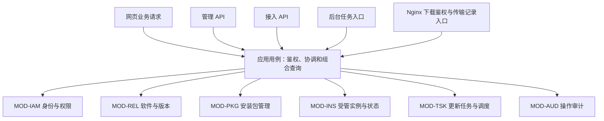
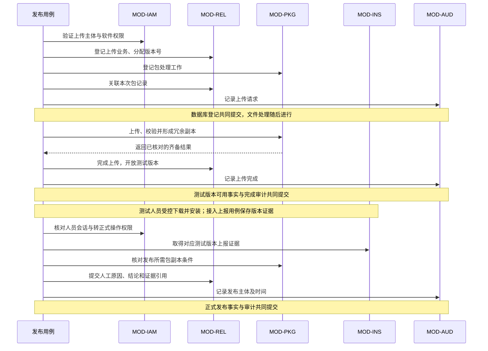
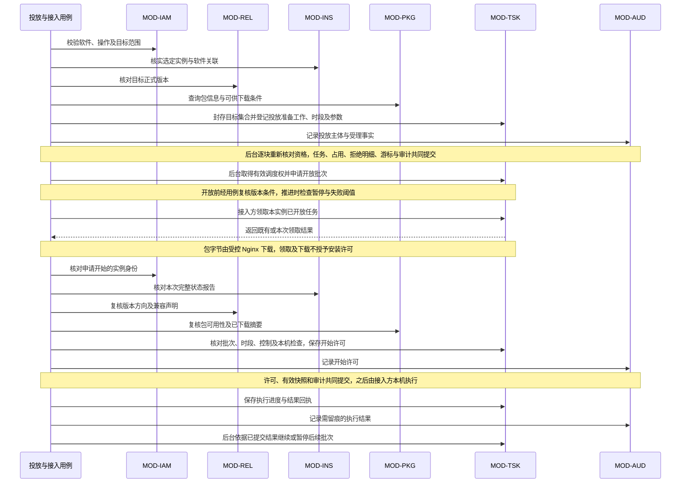
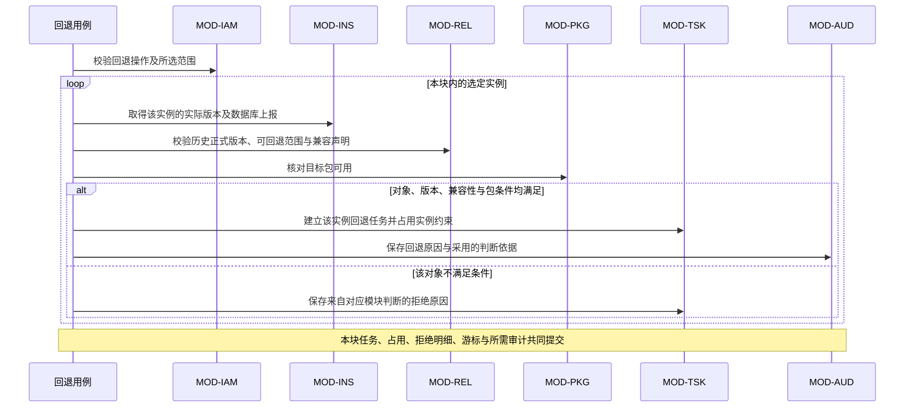
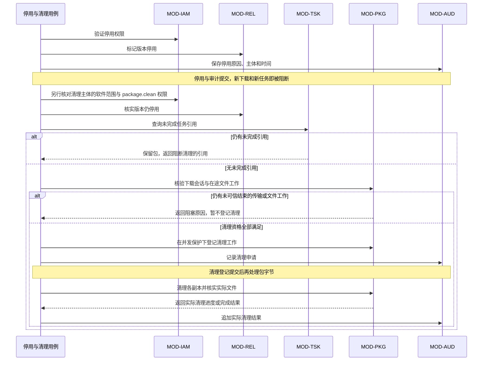

# 制造业软件版本管控平台模块设计

> 状态：既有模块职责已审阅；现场台账及软件映射配套修订待复核。以[需求规格说明](./需求规格说明.md)和[总体架构](./总体架构.md)为输入，本文定义模块职责、数据归属和内部协作契约；具体数据与接口见[详细设计](./详细设计.md)，工程映射见[软件框架设计](./软件框架设计.md)。保留六个逻辑模块；人员管理、台账/目录/映射及消息发送/消费基础已有实现，PKG、TSK 尚无业务实现，其空工程已移除。真实业务消费者、实例接入和版本包任务仍待实现。当前覆盖与待完成项统一见软件框架设计第 3.5、11 节。

## 1. 模块与调用方向

平台按总体架构采用厂区内的 .NET 8 模块化单体。六个模块共同承载网页、自有管理/接入 API 和后台处理；网页按“厂区 → 工序 → 设备 → 对应软件”进入测试/正式版本、实例状态和投放进度，不按内部模块逐页操作。平台自主维护台账与映射，不同步其他业务平台主数据；期别称呼属于设备名称。

| 编号 | 模块 | 负责的核心事实 |
|---|---|---|
| MOD-IAM | 身份与权限 | 谁在调用、可管理哪些软件、可执行哪些操作 |
| MOD-REL | 软件与版本 | 上位机/视觉软件分类、软件产品及其共用版本库、正式发布和回退声明 |
| MOD-PKG | 安装包管理 | 包内容是什么、哪些副本可供下载、文件处理进行到哪一步 |
| MOD-INS | 现场台账、受管实例与状态 | 本平台工序、设备、设备与软件映射、实例安装履历及最后上报事实 |
| MOD-TSK | 更新任务与调度 | 给哪些实例安排什么任务、批次是否开放、收到哪些执行回执 |
| MOD-AUD | 操作审计 | 谁在何时对什么对象做了什么、原因及已确认结果 |

当前实体工程按模块归并目录，Core 与 Service 的程序集和依赖边界保留：

| 逻辑模块 | 工程位置 | 当前实现 |
|---|---|---|
| MOD-IAM | `src/modules/Identity` | 人员、会话与授权 |
| MOD-REL | `src/modules/Releases` | 上位机/视觉软件目录；版本与发布待实现 |
| MOD-INS | `src/modules/Instances` | 工序、设备与软件映射；实例接入待实现 |
| MOD-AUD | `src/modules/Audit` | 必要审计事实 |
| MOD-PKG、MOD-TSK | 尚无业务工程 | 契约、权限、schema 与消息归属保留；有实际实现时再建立工程 |

应用编排位于 `src/application`，内层契约和公共管道位于 `src/shared`。完整工程及直接引用白名单只在[软件框架设计第 3 节](./软件框架设计.md#3-目录类库和完整引用关系)维护；目录归并不改变下述六模块职责或跨模块端口。

箭头表示业务调用方向。应用用例按业务流程划分，每个用例只依赖所需模块的公开内部契约；模块之间不直接调用彼此的实现，也不回调应用用例。跨模块流程由用例层顺序调用所需契约，模块内部只处理自己的规则与数据，形成单向依赖。

模块通过各自的存储、文件或时钟接口使用基础设施；适配实现归所属模块边界管理，物理上可以共用 PostgreSQL。应用用例协调事务，但不直接读写业务表；一个模块不能借用另一模块的仓储或自行查询其表。代码层次、类库与完整引用白名单由[软件框架设计](./软件框架设计.md)第 3～4 节定义，IOC、CQRS 和管道契约由其第 5～7 节定义。

应用用例不成为第七个业务模块，也不另存一份发布、实例或任务状态。后台入口只触发同一组用例：包处理的工作进度归 MOD-PKG，批次和调度租约归 MOD-TSK；重启后从这些持久化事实恢复。

物理实现采用 `Core.<模块>` 与对应 Service；Application 只依赖模块门面，Hosts 组装实现。包处理、投放准备与控制工作由 RabbitMQ 分发，消息消费者通过内部用例持久化接收，再由执行器恢复工作。MQ 接收和业务完成分别记录，事件总线不成为第七个业务模块。

## 2. 六个模块的职责

以下“依赖输入”由应用用例通过其他模块契约取得并传入，不构成模块之间的反向调用。跨请求的旧查询结果不能直接充当本次写入的校验依据；提交时的一致性要求见第 5 节。

### 2.1 MOD-IAM：身份与权限

| 项目 | 定义 |
|---|---|
| 职责 | 管理本厂人员账号与工号、外部系统和实例接入主体；验证身份并按软件范围、操作授权；发放、维护和吊销独立凭据。 |
| 数据归属 | 主体、账号、工号关联、授权关系、凭据校验材料与吊销状态；受限登记授权、登记结果及数量、单实例恢复授权；接入主体到实例标识的绑定。实例本身和上报流归 MOD-INS。 |
| 提供能力 | 主体识别、授权判断、受限登记与恢复、凭据生命周期操作、授权范围查询；输出由服务端建立的调用主体与授权上下文。 |
| 依赖输入 | 用例提供由 MOD-REL、MOD-INS 确认存在的软件和实例标识；身份模块不复制软件详情、实例地址或运行状态。 |
| 失败处理 | 未识别、已吊销或无权限时拒绝操作；身份服务或数据库不可用时不能降级为放行。凭据变更按第 5 节与审计一起提交。 |
| 对应需求 | 主责 `REQ-AUTH-01`、`REQ-AUTH-03`、`REQ-AUTH-04`、`REQ-NFR-01`、`REQ-NFR-03`；支持所有受保护业务入口。 |

后台任务使用受限的服务端身份，审计关联原发起主体和适用的授权接管事实；后台身份不使网页或接入 API 获得额外权限。凭据格式、受限登记、单次恢复及相关人员权限见详细设计第 3、8.2 节。

### 2.2 MOD-REL：软件与版本

| 项目 | 定义 |
|---|---|
| 职责 | 登记上位机/视觉软件分类、分配本厂每软件版本号、维护变更说明、转正式和停用；维护回退兼容性与现场数据保护说明。 |
| 数据归属 | 软件及分类、软件产品共用的版本号分配记录、版本说明、版本到包的关联、测试或正式属性、停用事实、发布结论及证据引用；兼容性声明和接入材料修订。 |
| 提供能力 | 软件和版本查询、上传业务登记、版本生成校验、开放测试版本、转正式、停用、选择最新可用正式版、查询目标版本及兼容性条件。 |
| 依赖输入 | 授权上下文、MOD-PKG 的包处理结果、MOD-INS 的测试版本上报证据和回退对象的实际版本上报；用例将材料交给本模块完成发布或兼容性判断。 |
| 失败处理 | 编号冲突、包未齐备、测试证据缺失或权限不满足时不推进发布；不兼容或未声明兼容时不给出可回退结论。文件处理失败不通过重分配版本号或覆盖旧包掩盖。 |
| 对应需求 | 主责 `REQ-REL-01`～`REQ-REL-07`、`REQ-NFR-06`、`REQ-ASSET-02`、`REQ-ASSET-05`；为停用、部分回退及数据保护提供版本依据。 |

本模块保留发布时采用的测试上报引用，并维护供回退判断使用的兼容性材料修订，避免后续材料变更使原决定失去依据。安装版本号本身不证明当前数据库兼容；声明不能覆盖所选实例的现场数据库情况时，返回兼容性未确认。模块记录接入方声明和验收材料，现场保护责任沿用 `REQ-UPD-06`、`REQ-UPD-07`。

PLC 后续程序备份、压缩包归档方向按 REQ-ASSET-05 记录，由本模块牵头确认资料语义，INS/PKG 配合设备关联与文件能力设计；具体实体、接口、编号和备份执行方式未确定，不因现有包能力推定已支持 PLC。EXE、安装包或压缩容器的格式不改变软件分类。

### 2.3 MOD-PKG：安装包管理

| 项目 | 定义 |
|---|---|
| 职责 | 接收流式上传、校验内容、形成服务器副本、提供受控文件定位、核对和修复副本、清理停用版本的包。 |
| 数据归属 | 不可覆盖的包记录、摘要与大小、受控存储位置、上传和复制进度、副本校验及健康记录、清理工作记录；下载运行会话及可信结束依据。包文件由本模块管理，下载历史审计归 MOD-AUD。 |
| 提供能力 | 开始和继续包处理、查询副本是否齐备及当前健康来源、核对与修复副本、维护下载会话、核验并登记清理；向用例返回可供 Nginx 读取的内部文件定位。 |
| 依赖输入 | 由用例提供版本关联、下载授权上下文、版本可下载结论和清理资格。模块不自行认定某版本已正式发布或无任务引用。 |
| 失败处理 | 暂存、摘要校验和副本复制失败时不报告上传就绪；隔离已发现的故障副本。清理失败保留逐副本进度重试，不恢复版本下载权限。 |
| 对应需求 | 主责 `REQ-REL-08`、`REQ-REL-09`、`REQ-NFR-04`、`REQ-NFR-05`；支持上传、下载和批量投放。 |

首次开放测试下载和发布所需副本条件沿用总体架构。运行中副本退化时由本模块返回健康来源并修复；没有健康来源时拒绝供包。Nginx 负责传输包字节，用例与本模块只参与授权、定位和处理状态管理。

### 2.4 MOD-INS：现场台账、受管实例与状态

| 项目 | 定义 |
|---|---|
| 职责 | 自主管理工序、设备台账及设备与软件映射；维护引用这些关联的实例，接收安装/运行上报并提供现场导航和设备详情。 |
| 数据归属 | 工序、设备编号/名称/工序归属、设备与软件映射；实例标识与稳定关联、上报 IP、安装版本/时间、运行状态、接收时间、安装履历和测试证据。 |
| 提供能力 | 维护本地台账及映射、核验登记设备关联、按工序/设备/软件查询、接受上报、提供安装履历及测试证据、计算状态新鲜度。 |
| 依赖输入 | MOD-IAM 确认的接入主体与实例绑定、MOD-REL 提供的软件和版本对应信息；由用例组合 MOD-TSK 的最近任务结果用于页面展示。 |
| 失败处理 | 无设备、无映射、授权范围或实例绑定不符时拒绝；登记不能创建、改名或改绑设备。上报中断保留最后事实；任务或下载不能被转换为已安装。 |
| 对应需求 | 主责 `REQ-CLI-01`～`REQ-CLI-03`、`REQ-CLI-05`～`REQ-CLI-08`、`REQ-NFR-02`、`REQ-ASSET-01`、`REQ-ASSET-03`、`REQ-ASSET-04`；为发布和目标筛选提供实例事实。 |

最新快照与需追溯的版本上报证据分别保存；快照被后续周期上报更新，不会使已引用的测试证据消失。周期上报频率、五分钟边界和状态含义遵循 `REQ-CLI-07`；稳定标识、报告流、重复判定和有效接收时间见详细设计第 3、5.1、8.5 节。

### 2.5 MOD-TSK：更新任务与调度

| 项目 | 定义 |
|---|---|
| 职责 | 封存目标并逐项准入，管理执行时段、分批开放、领取及开始许可、进度与结果回执、暂停、取消、继续、暂缓、受控重试和未知结果人工关闭；更新和部分回退共用任务链。 |
| 数据归属 | 目标集合、准入明细、投放与批次、逐实例任务、时段和有效参数、执行尝试与许可、接入方回执、人工关闭记录、实例执行约束、调度租约、控制工作与游标、任务操作幂等记录。 |
| 提供能力 | 创建及查询任务，领取与授予开始许可，保存回执、暂停/继续/改期/暂缓/取消/重试及人工关闭，查询未完成引用，取得有效调度权并推进批次。 |
| 依赖输入 | 经授权的软件和实例范围、MOD-REL 的目标版本及回退判断、MOD-PKG 的包信息；服务端配置提供默认时间及批次参数，用例传入本次实际选择。 |
| 失败处理 | 重复领取或回执按契约去重，不重建目标或重复计数；失去有效调度权不能推进批次。断线保留有效任务，成功/失败依据有效回执；人工关闭只结束跟踪并保留未知，不制造安装结果。 |
| 对应需求 | 主责 `REQ-CLI-04`、`REQ-UPD-01`～`REQ-UPD-08`；承担任务相关的权限、规模和完整性配合要求。 |

任务保存本次时段与批次参数，后续配置不隐式重写既有投放。领取和下载不等于获准开始；人工暂停与自动失败/超时暂停的范围、等待计时和继续条件见详细设计第 6 节，不能把平台暂停显示成现场已经停止安装。现场参数统一引用[架构测试与验收要求](./架构测试与验收要求.md)第 2.2 节 IN-04、IN-11。

### 2.6 MOD-AUD：操作审计

| 项目 | 定义 |
|---|---|
| 职责 | 追加业务操作记录，按主体、软件、版本、实例或任务查询追溯链，关联下载请求及传输记录。 |
| 数据归属 | 操作主体和必要的当时身份快照、时间、对象引用、操作、原因、结果及关联关系；测试包下载人员和时间。 |
| 提供能力 | 在业务事务内追加审计、记录已确认的文件处理结果、追加下载请求和传输结果、按授权范围查询。 |
| 依赖输入 | 用例传入已经由相关模块确认的业务事实和服务端身份上下文；传输结果来自可信的 Nginx 记录入口。 |
| 失败处理 | 必须留痕的业务变更不能在审计持久化失败时返回成功；重复交付同一事实不重复形成业务操作。外部文件处理按第 5 节保留待核对状态。 |
| 对应需求 | 主责 `REQ-AUTH-02`；配合版本追溯、下载记录和各类任务操作留痕。 |

审计保存操作事实及引用，不取代版本、实例和任务的当前业务记录，也不负责从审计日志反向驱动调度。周期上报不逐条复制成永久操作审计，版本变化和任务回执分别由其所属模块留存，遵循总体架构的数据保留边界。

## 3. 数据归属与组合查询

| 数据或展示内容 | 唯一负责模块 | 跨模块使用方式 |
|---|---|---|
| 人员、工号、系统或实例接入凭据、授权 | MOD-IAM | 其他模块接收服务端授权上下文；不另存可用凭据 |
| 工序、设备台账、设备与软件映射、受管实例及现场归属 | MOD-INS | IAM 保存获准设备范围及实例身份绑定；任务仅引用有效实例，登记不生成台账 |
| 软件分类、软件产品与版本、编号、发布和停用事实 | MOD-REL | 多台设备共用软件版本库；下载、投放查询版本条件，不修改版本属性 |
| 版本与包的关联 | MOD-REL | 通过包标识查询 MOD-PKG；内容变化必须成为新的上传记录 |
| 包摘要、文件位置、副本和处理进度 | MOD-PKG | 版本和任务引用包记录；文件只由包处理能力管理 |
| 下载运行会话及节点代次、可信结束依据 | MOD-PKG | 清理核验是否仍有传输；MOD-AUD 通过请求标识关联不可变下载历史 |
| 最后上报快照、版本变化和测试上报证据 | MOD-INS | 发布保存证据引用；任务用例读取实际上报版本 |
| 兼容性声明、数据保护说明及现场验收材料 | MOD-REL | 回退用例取得带来源和修订依据的判断，任务保留采用的依据 |
| 目标集合、准入、批次、执行及许可、回执、人工关闭、实例执行约束与工作租约 | MOD-TSK | 实例页面组合任务结果；清理用例查询未完成引用；占用只在原任务受控结束时释放 |
| 操作记录、下载人员与时间、传输结果 | MOD-AUD | 通过对象引用串联业务历史；不参与判定实际安装成功 |
| 最新可用正式版、实例综合列表、进度汇总 | 各事实的所属模块；应用用例组合展示 | 不另建可反向修改业务事实的“统一状态”来源 |

版本是否允许使用由 MOD-REL 的业务条件与 MOD-PKG 的文件可用信息共同决定；两者分别代表发布政策和文件事实。实例是否未上报由 MOD-INS 计算，任务是否成功由 MOD-TSK 依据回执保存，两个状态在页面上分别表达。

组合查询先应用本厂台账、软件与实例权限，再分页或批量读取模块契约。台账查看权限不自动授予软件查看权限；设备汇总、数量及安装履历只包含有权对象，不能用可见设备泄露其他软件详情。十万实例不得一次全量返回或逐行查询。查询字段、索引和汇总见详细设计第 2.3、8、10.1 节。

## 4. 契约与入口归属

### 4.1 内部协作契约

以下是能力与结果语义，不是方法签名、数据库结构或 HTTP 报文。直接调用方统一为应用用例，模块不能通过契约再次调回其他模块。

| 契约 | 提供模块 | 用例提供的信息 | 结果与失败责任 |
|---|---|---|---|
| C-IAM-01 主体与授权 | MOD-IAM | 调用凭据或已验证会话、本厂资产、目标软件或实例、所需操作 | 返回授权上下文或拒绝；凭据内容不进入业务审计正文 |
| C-IAM-02 身份维护 | MOD-IAM | 已确认的软件、设备映射、实例引用、授权范围及登记/恢复关联 | 返回账号、受限授权、登记及凭据结果；名额、身份与审计共同提交，设备校验和流代次由用例协调 MOD-INS |
| C-REL-01 软件与版本登记 | MOD-REL | 软件、变更级别、说明、上传关联和授权上下文 | 返回本厂版本标识与编号；拒绝绕过生成规则或覆盖旧版本 |
| C-REL-02 发布与停用 | MOD-REL | 包齐备结果、测试上报证据、发布结论，或停用请求 | 返回发布或停用事实；不满足前置条件时不推进 |
| C-REL-03 目标版本与回退判断 | MOD-REL | 软件、选定版本、实例实际上报版本及相关兼容性材料 | 返回版本条件与有依据的兼容结论；未知和不兼容均不能授权回退 |
| C-PKG-01 包处理 | MOD-PKG | 上传关联、包流或待恢复工作引用 | 返回已持久化的处理进度、摘要和副本核对结果；未就绪不能报告可用 |
| C-PKG-02 下载定位与清理 | MOD-PKG | 已核对的下载或清理条件、包引用及可信传输关联 | 返回健康来源、下载会话或清理结果；无健康来源拒绝下载，在途传输/文件工作阻止清理，结束依据与审计共同提交 |
| C-INS-01 实例维护与上报 | MOD-INS | 已核对的设备映射、实例身份、安装/运行上报或接入生命周期操作 | 返回实例和接收结果；不接受客户端改写台账或跨实例写入 |
| C-INS-02 实例与证据查询 | MOD-INS | 授权范围、工序/设备/软件和实例，或测试版本 | 返回权限过滤的实例页、安装履历或测试证据；由用例组合 REL 发布历史与 TSK 结果 |
| C-INS-03 本地台账与设备映射 | MOD-INS | 本厂台账权限、工序/设备维护请求及 REL 确认的软件引用 | 返回工序、设备和映射结果；无效关联拒绝，被实例引用的映射保留且不能改绑；必要审计共同提交 |
| C-TSK-01 任务操作、领取与许可 | MOD-TSK | 已校验的目标集合、逐项依据、时段和批次参数、调用实例，或获授权的控制/关闭请求 | 返回准入、任务、执行记录及许可/控制结果；应用当前批次、时段和实例约束，关闭保留未知；所需审计共同提交 |
| C-TSK-02 回执与批次推进 | MOD-TSK | 实例、任务及执行尝试的对应关系、回执，或有效调度权 | 返回既有或本次结果；阻止旧调度者或旧尝试回执错误推进当前任务 |
| C-TSK-03 未完成引用查询 | MOD-TSK | 版本或包引用、清理用例的并发校验范围 | 返回是否仍被未完成任务引用；不能用早先查询代替清理登记时的核验 |
| C-AUD-01 追加与查询 | MOD-AUD | 经确认的主体、业务事实、对象引用和操作关联 | 返回持久化结果或授权范围内记录；失败不得被当成已完成留痕 |

### 4.2 网页、开放 API 与后台入口

| 入口能力 | 应用用例协调的模块 | 职责界限 |
|---|---|---|
| 账号、软件权限和接入凭据维护 | MOD-IAM、MOD-REL、MOD-INS、MOD-AUD | 软件和实例存在性由所属模块确认；身份绑定与审计一致提交 |
| 软件选择、测试版和正式版列表、上传、手动转正式 | MOD-REL、MOD-PKG、MOD-INS、MOD-IAM、MOD-AUD | 网页和获授权管理 API 复用适用的业务用例；转正式保留需求规定的人工结论 |
| 本厂工序/设备台账、软件映射、设备详情及实例安装履历 | MOD-INS、MOD-REL、MOD-TSK、MOD-IAM、MOD-AUD | INS 维护台账与关联；用例按权限组合分类、共用发布目录、安装履历及任务，IP/运行状态来自上报 |
| 网页或管理 API 的投放、暂停、取消、继续、重试与回退 | MOD-TSK、MOD-REL、MOD-INS、MOD-PKG、MOD-IAM、MOD-AUD | 目标选择与调度走同一任务链；不向上位机/视觉实例建立额外控制通道 |
| 接入 API 的版本查询、领取、开始许可与回执 | MOD-REL、MOD-TSK、MOD-PKG、MOD-INS、MOD-IAM、MOD-AUD | 独立实例身份限定范围；开始时重新核对当前条件，按回执和报告顺序区分任务结果与安装现状 |
| 接入 API 的安装与运行状态上报 | MOD-INS、MOD-REL、MOD-IAM | 接入方报告事实，服务端记录接收时间；自研与厂家共用契约 |
| 包信息查询、Nginx 下载鉴权与传输记录接收 | MOD-PKG、MOD-REL、MOD-TSK、MOD-IAM、MOD-AUD | 按下载场景核对范围；测试人员下载不以已有投放任务为前提 |
| 包复制、核对、修复与清理；批次推进 | MOD-PKG 或 MOD-TSK，以及相关校验和审计模块 | 后台入口复用用例；有效工作记录和执行权来自所属模块 |
| 操作历史查询 | MOD-AUD、MOD-IAM | 按授权范围查询，不借历史记录暴露凭据或越权对象 |

版本化接入文档由 MOD-INS 牵头，各能力模块负责业务语义，入口层统一协议表达。URL、字段、错误码与状态定义见[详细设计](./详细设计.md)第 3～8 节；[厂家接入文档](./厂家接入文档.md)提供对应示例，本文不另定义外部报文。

## 5. 一致性、并发与恢复责任

### 5.1 数据库业务变更与审计

同一厂区的模块共享 PostgreSQL 时，需要一起成立的业务变更和操作审计在同一个本地事务内提交。应用用例协调事务，各模块通过自己的契约写自己的数据；任何一步失败则整体回滚。发布、停用、任务操作、身份权限变更等不能先返回成功再依赖进程内队列补审计。

需要跨进程分发的发送意图加入同一事务的 Outbox。技术 Outbox/Inbox 表由框架持久化适配维护，工作事实、派发代次和接收标记仍归 MOD-PKG 或 MOD-TSK；字段及 MassTransit 实现只在软件框架设计第 8 节定义。领域事件在所属模块内处理，跨模块强一致协作仍由应用用例调用门面，不能改成异步事件后补。

主体和资源范围必须在用例入口核对；版本停用、任务创建、开始许可、批次开放和清理资格等并发条件，还须在提交时保持一致。用例通过所属模块的并发保护参与事务，不能只做一次查询后任由条件变化再写入。锁顺序、租约代次与事务边界见详细设计第 7.1 节。

同一操作重复调用、提交后连接中断，均依据持久化操作关联返回或核实既有结果；不能把响应丢失直接认定为提交失败并重新执行。业务幂等与审计去重共用操作关联，但审计不得合并掉人员明确发起的新一次重试或新的执行尝试。

### 5.2 包文件与数据库

文件复制、删除和下载字节不纳入数据库事务。MOD-PKG 先保存可恢复的工作记录，再执行文件处理。文件处理后，由应用用例在同一个数据库事务内调用 MOD-PKG 登记核对结果、调用 MOD-AUD 追加相应操作事实；需要同时推进版本时，由 MOD-REL 参与该次提交。包字节处理期间不持有跨整个上传或下载过程的数据库事务。

工作创建与派发 Outbox 共同提交；消费者在短事务中持久化当前派发的接收标记，提交后 ACK。执行器按工作记录取得租约、事务外处理字节，再短事务保存结果。ACK 后崩溃由原工作恢复，不能丢入进程内队列后就当作接收完成；执行权与文件停止证明继续遵循详细设计。

文件已写入而数据库提交未完成时，由 MOD-PKG 依据既有工作引用、路径和摘要核对，再报告齐备结果；未确认关联的孤儿文件保持不可下载。文件已删除而结果未提交时，恢复后核实各副本已不存在，再登记清理完成，版本和审计历史继续保留。

清理的入口是已持久化的版本停用事实。用例在受并发保护的事务内核验未完成任务、下载会话和未停止的上传/复制/修复工作，再登记清理；与任务创建、开始许可共用版本条件保护，实际删文件在提交后执行。文件互斥、可信下载结束和旧工作者恢复限制见详细设计第 7.2～7.3 节。

### 5.3 调度、回执与实例状态

MOD-TSK 的有效调度权和批次状态共同约束每一次推进；数据库提交必须原子检查执行者仍有权推进。租约到期后旧处理者恢复运行，也不能覆盖新处理者的结果。失败统计、自动暂停与后续批次开放必须受同一推进条件控制，避免一个处理者判定暂停、另一个仍开放后续批次。

领取和回执都与调用实例、具体任务及执行尝试关联。重复结果不重复计数，旧尝试回执不推进新的重试；冲突结果由 MOD-TSK 拒绝错误流转并保留可追溯依据。实例恢复访问后，是否仍有有效任务由本模块回答。

任务成功不使目标版本自动成为实例实际安装版本。回执附带报告时，用例先按 MOD-TSK 的原执行及回执状态确认该报告可应用，再调用 MOD-INS 校验流代次与序号，在同一事务提交；人工关闭、已取消或已结束任务的迟到附带报告只留存，不更新现状。独立周期报告仍由 MOD-INS 处理，具体见详细设计第 6.6、8.5 节，不能靠下载日志补造现场事实。

### 5.4 下载与审计

下载鉴权用例确认授权并持久化主体、包及请求时间后，才向 Nginx 放行。该记录表示下载请求获准，不表示文件完整到达；传输开始、完成或中断由可信的 Nginx 记录关联补充。记录收集暂时中断时须从可恢复的传输日志继续交付；日志未齐全时保留结果未知，不补造完成记录。

MOD-AUD 负责人员工号、时间与传输历史，MOD-PKG 负责文件校验及用于清理的下载运行会话，MOD-TSK 负责接入方的安装回执。会话与历史按 requestId 关联并共同提交，HEAD 不记为完成下载，具体见详细设计第 7.2 节。三种事实不能互相替代；下载传输与本机安装之间没有平台可保证的原子事务。

## 6. 四条模块协作流程

图中“用例”均指第 1 节的应用用例，各箭头通过第 4 节的内部契约。图展示职责协作与主流程，不替代详细设计第 7.1 节的事务及加锁顺序；图后的说明给出阻断和恢复责任，不另定义状态枚举。

### 6.1 上传到转正式

编号规则由 MOD-REL 唯一执行，包就绪由 MOD-PKG 判断，测试证据由 MOD-INS 提供。测试下载留痕按第 5.4 节处理。上传成功只开放测试版；缺少对应上报、人工结论或授权时，由用例阻断发布，不额外要求运行证明。

上传或副本处理中断由 MOD-PKG 根据工作记录恢复；用例重新核对并完成版本登记。发布数据库提交结果不明确时先查既有发布事实，不能重复生成版本或审计。MOD-INS 的后续快照变化不会擦除发布已引用的证据。

### 6.2 批量投放

版本、对象和权限校验失败时不得产生可领取的越权或无效任务；混合目标按 REQ-UPD-01 保存逐项拒绝并继续合格对象，拒绝不计安装失败。目标集合归 MOD-TSK，封存后不随筛选变化增加成员；全部准入完成才编批。实例只能领取自己的已开放任务，开始许可另按详细设计第 6.3 节重新核验条件。

调度故障由 MOD-TSK 的租约及推进记录恢复。失败/等待超时暂停、复核继续、暂缓、重试和人工关闭均通过同一模块契约留痕；参数及流转见详细设计第 6、8.4 节。人工关闭与释放原实例约束共同提交，迟到原回执不影响新任务。本机安装和避免重复安装由接入方实现。

### 6.3 部分回退

MOD-REL 对声明与版本条件负责，MOD-INS 对上报来源负责，MOD-TSK 只创建被明确选定且通过校验的对象任务；未选实例不受影响。不合格对象及原因由详细设计第 8.4 节的准入明细返回，不计安装失败，不能悄悄换版本或扩大目标。

断线恢复和重复回执沿用同一任务链。兼容性或版本条件变化时，由回退用例重新核对尚未放行的任务，不能沿用旧查询结果放行不兼容目标。现场数据库、日志和其他数据的保留，由接入方按材料实施和验收；API 成功只证明平台收到了对应结果。

### 6.4 停用与包清理

MOD-REL 负责立即阻断停用版本的新使用，MOD-TSK 返回未完成引用，MOD-PKG 保留文件直到清理资格成立。未完成任务不能因等待清理而被自动标成成功或从历史删除；需要取消或其他受控处理时走任务用例并保留结果。部分副本已删、节点重启或审计提交失败时，按第 5 节重新核对和登记，不重新开放下载。

## 7. 需求逐项对应

“主责”表示该需求的业务牵头模块；协作模块仍只修改自己的数据。跨模块的入口、容量和厂区隔离要求由应用用例及总体架构共同落实，不因列出主责而归入一个模块内部。

| 需求编号 | 主责模块 | 协作与落实位置 |
|---|---|---|
| REQ-AUTH-01 | MOD-IAM | 所有入口统一校验软件和操作权限，业务模块处理自己的对象约束 |
| REQ-AUTH-02 | MOD-AUD | 各业务用例提供经确认的主体、对象、原因和结果 |
| REQ-AUTH-03 | MOD-IAM | MOD-REL、MOD-TSK 分别核对操作授权并保留同一人员操作事实 |
| REQ-AUTH-04 | MOD-IAM | MOD-INS 提供实例标识；本厂独立主体与凭据 |
| REQ-REL-01 | MOD-REL | MOD-PKG 提供下载条件，网页展示测试、正式与历史 |
| REQ-REL-02 | MOD-REL | MOD-IAM、MOD-PKG、MOD-AUD；上传入口复用同一用例 |
| REQ-REL-03 | MOD-REL | MOD-PKG 执行包处理，MOD-AUD 保存上传主体与时间 |
| REQ-REL-04 | MOD-REL | MOD-PKG 供包、MOD-AUD 留下载记录、MOD-INS 提供版本证据 |
| REQ-REL-05 | MOD-REL | MOD-IAM 核权限、MOD-INS 供证据、MOD-AUD 保存人工发布事实 |
| REQ-REL-06 | MOD-REL | 组合 MOD-INS 证据、MOD-PKG 对应包、MOD-AUD 历史 |
| REQ-REL-07 | MOD-REL | 所有版本入口和 MOD-TSK 使用统一编号与目标选择结果 |
| REQ-REL-08 | MOD-PKG | MOD-REL 维护不可悄悄替换的版本与包关联 |
| REQ-REL-09 | MOD-PKG | MOD-REL 停用、MOD-TSK 查引用、MOD-AUD 保留清理历史 |
| REQ-CLI-01 | MOD-INS | MOD-IAM 验证实例，MOD-REL 提供软件与版本对应信息 |
| REQ-CLI-02 | MOD-INS | 运行状态与安装事实独立于 MOD-TSK 回执及包下载 |
| REQ-CLI-03 | MOD-INS | 组合 MOD-REL 可用版本和 MOD-TSK 最近更新结果 |
| REQ-CLI-04 | MOD-TSK | MOD-REL、MOD-PKG、MOD-IAM 协作提供版本、包与任务链 |
| REQ-CLI-05 | MOD-INS | 所有接入能力采用同一套厂家与自研规则 |
| REQ-CLI-06 | MOD-INS | 从设备台账取得工序与设备信息，MOD-IAM 限权，MOD-AUD 留台账维护记录 |
| REQ-CLI-07 | MOD-INS | 服务端接收时间计算未上报时长，页面按规则展示 |
| REQ-CLI-08 | MOD-INS | 各契约提供模块共同定义语义；详细设计第 8 节、厂家接入文档及验收用例对应 |
| REQ-UPD-01 | MOD-TSK | MOD-IAM、MOD-REL、MOD-INS、MOD-PKG、MOD-AUD 参与创建用例 |
| REQ-UPD-02 | MOD-TSK | 目标集合和分批开放由同一任务链持久化 |
| REQ-UPD-03 | MOD-TSK | 配置提供默认值，用例传入明确选择，任务保存有效计划 |
| REQ-UPD-04 | MOD-TSK | MOD-AUD 追溯暂停、继续、重试与人工关闭；实例约束和未知结果由任务模块维护 |
| REQ-UPD-05 | MOD-TSK | MOD-REL 判断兼容、MOD-INS 供实际版本、MOD-PKG 供历史包 |
| REQ-UPD-06 | MOD-TSK | MOD-REL 保存接入方保护及验收材料；现场保护由接入方负责 |
| REQ-UPD-07 | MOD-TSK | 配置提供批次参数；MOD-REL 保管接入方数据恢复方案 |
| REQ-UPD-08 | MOD-TSK | 持久化有效任务和幂等结果，接入方保证本机不重复安装 |
| REQ-NFR-01 | MOD-IAM | 六模块及基础设施均在本厂运行，依据总体架构隔离 |
| REQ-NFR-02 | MOD-INS | 上报容量牵头；MOD-TSK、MOD-PKG 及其余模块分别承担相关负载 |
| REQ-NFR-03 | MOD-IAM | 各入口及 MOD-AUD 核对和追溯实际授权主体 |
| REQ-NFR-04 | MOD-PKG | MOD-TSK 不以下载代替安装成功，接入方核对完整性 |
| REQ-NFR-05 | MOD-PKG | MOD-TSK 提供投放条件，按验收输入 IN-02、IN-03、IN-08 测量并确认下载及恢复目标 |
| REQ-NFR-06 | MOD-REL | MOD-PKG 在本厂独立接收包，MOD-IAM 隔离主体与权限 |
| REQ-ASSET-01 | MOD-INS | 本平台维护工序、设备及现场导航；MOD-IAM/AUD 负责权限和留痕 |
| REQ-ASSET-02 | MOD-REL | 管理软件分类和共用版本库；MOD-INS 保存多设备、多软件关联 |
| REQ-ASSET-03 | MOD-INS | MOD-IAM 限制登记范围与名额，Application 共同提交设备映射校验及身份建立 |
| REQ-ASSET-04 | MOD-INS | 组合 MOD-REL 版本目录、MOD-TSK 任务结果及 MOD-IAM 权限；安装履历与发布历史分别展示 |
| REQ-ASSET-05 | MOD-REL | 仅牵头后续 PLC 备份资料边界，MOD-INS/PKG 配合；具体能力待确认 |

## 8. 文档衔接与验收入口

本稿评审检查六个模块是否各有明确的数据归属，四条协作流程是否只通过所属模块契约修改数据，以及第 7 节是否覆盖全部需求。还需逐条核对：转正式不以运行证明为前提；周期状态不被任务结果替代；失去调度权不能推进批次；未完成引用阻止清理；现场数据库与日志保护责任没有转移到平台。

[详细设计](./详细设计.md)第 10.2 节逐项承接内部契约，第 2～8 节给出数据、状态、事务与接口；[厂家接入文档](./厂家接入文档.md)演示对应调用；[架构测试与验收要求](./架构测试与验收要求.md)第 4～10 节验证模块、权限、一致性、任务、文件恢复及容量，第 12 节对应全部需求。

业务规则引用需求规格；接口参考沿用详细设计；框架版本、实现与验证状态见[软件框架设计](./软件框架设计.md)。Cloud 仅作架构和工程参考，设备台账与映射不从其他系统同步；现场输入只在验收文档第 2.2 节维护。本批实现范围与局部验证见框架设计第 11 节；实例及版本业务设计待实现，文档复核与系统验收分别记录。
