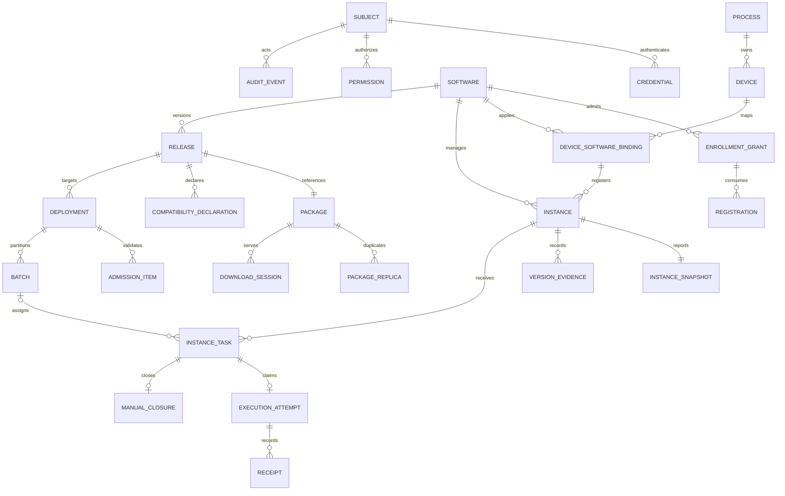
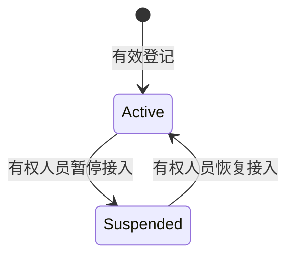
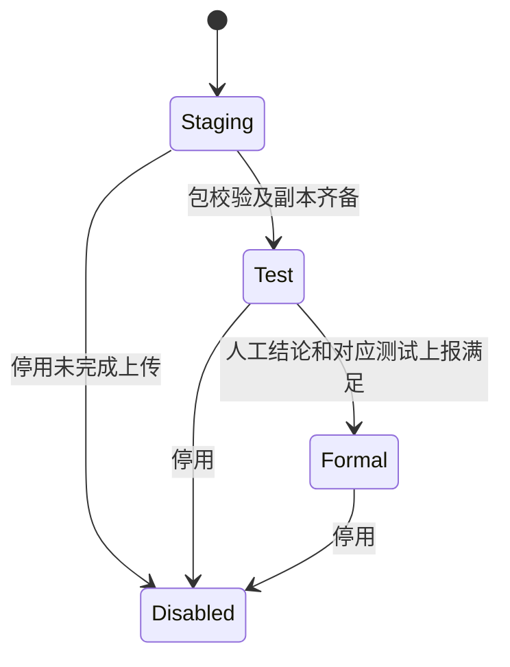
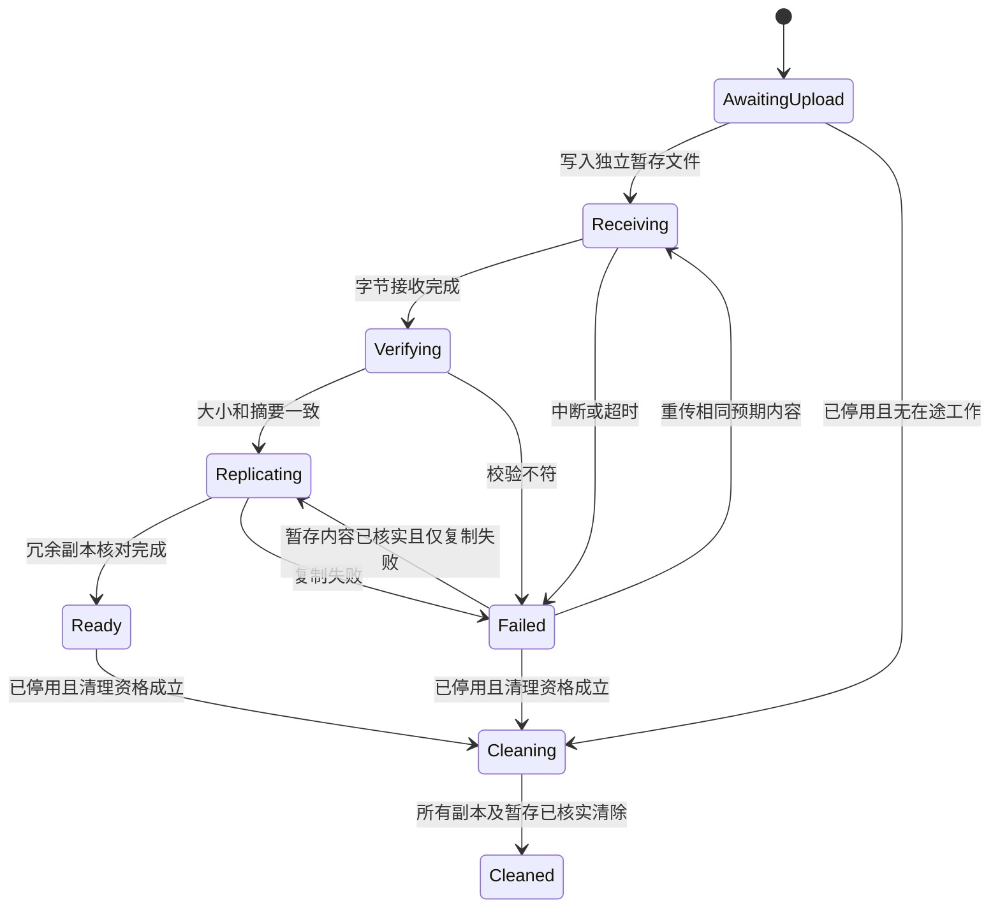
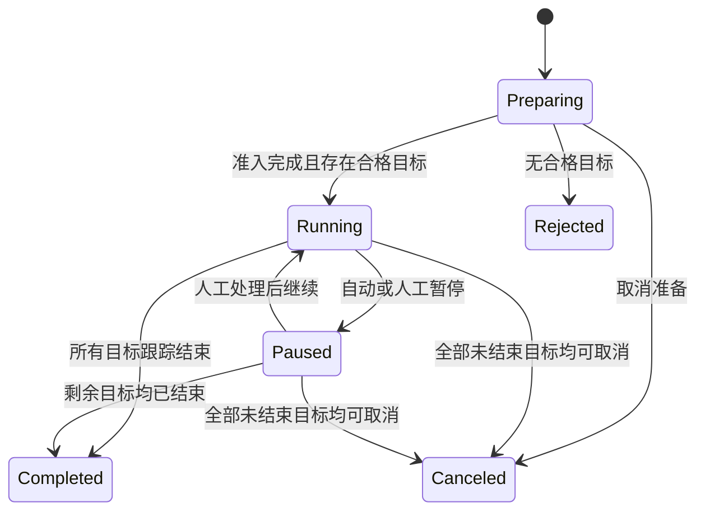
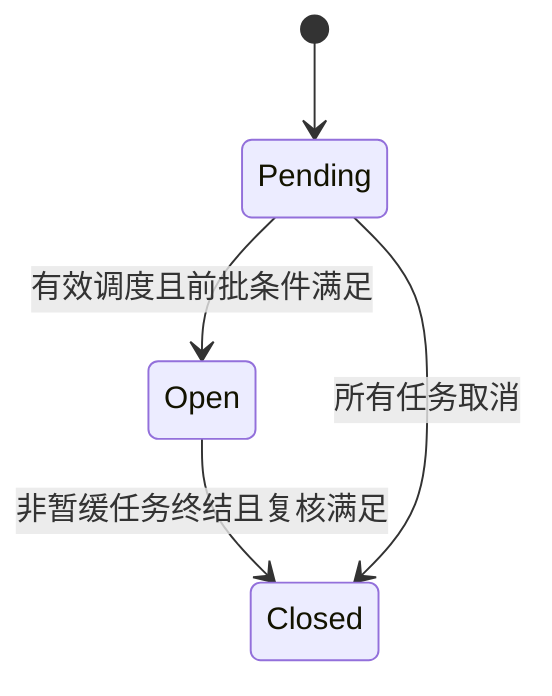
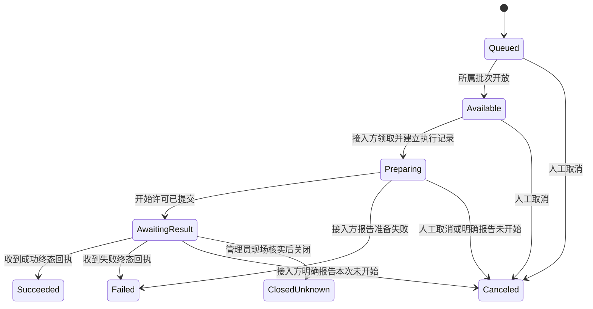
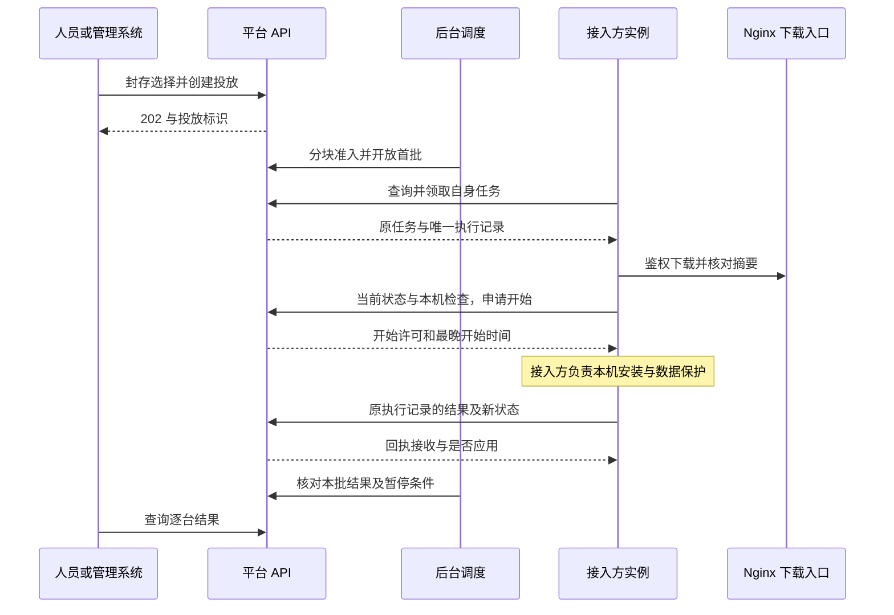
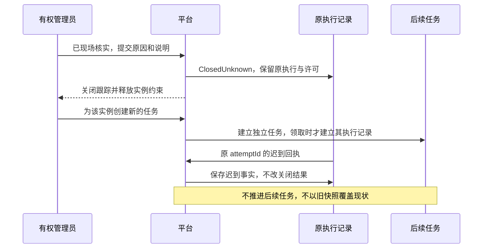

# 制造业软件版本管控平台详细设计

> 状态：既有业务和接口设计已审阅；本次版本与安装包修订待复核。以[需求规格说明](./需求规格说明.md)、[总体架构](./总体架构.md)和[模块设计](./模块设计.md)为输入；本文是业务数据、状态、事务及 API 契约正文，[软件框架设计](./软件框架设计.md)定义工程基础、技术表及消息契约，[厂家接入文档](./厂家接入文档.md)和[架构测试与验收要求](./架构测试与验收要求.md)承接示例与验证。第 8.2 节人员/软件授权及登记/恢复许可、实例凭据，第 8.3 节台账/目录/映射及实例查询/接入管理，第 8.5 节 context/报告流/状态报告和对应网页已有实现；第 8.3、8.5、8.6 节版本登记/包接收/双副本、测试版本/下载、停用及关联安装证据已有实现；管理系统凭据、正式发布/兼容声明、任务与清理仍属未实现设计。当前覆盖见软件框架设计第 3.5、11 节，系统验收尚未完成。

## 1. 通用约定与配置

### 1.1 系统与协议边界

每个厂区使用独立 Linux / .NET 8 服务、PostgreSQL、身份和包副本，沿用总体架构。六个模块的写入归属沿用模块设计；跨模块操作由应用用例协调。本文的数据表名表示逻辑设计；已建立的持久化模型、类库及未覆盖范围以软件框架设计第 11 节为准。

现场入口为“厂区 → 工序 → 设备 → 对应软件”，本部署厂区信息由平台配置管理，工序、设备和软件映射由本平台维护。期别属于设备名称，不自动拆层；无 Cloud 或其他业务平台集成。本文可执行软件分类为上位机、视觉，PLC 只按 REQ-ASSET-05 记录后续程序备份、压缩包归档方向，尚不定义备份模型、接口或任务。

工程采用 Core、Services、Application、Infrastructure 和 Hosts 分层，六模块不直接引用存储或 MQ 实现。精确版本、许可、项目引用、IOC/CQRS 和鉴权顺序由软件框架设计规定；MQ 只承接服务端异步工作，不改变以下公共协议。

管理接口前缀为 `/api/v1/manage`，实例接口前缀为 `/api/v1/client`，首次登记为 `/api/v1/enrollment`。网页使用同一组管理用例。JSON 使用 UTF-8、camelCase 字段；标识符使用 UUID 字符串，计数和序号使用非负整数，状态使用本文列出的区分大小写字符串。所有公开通信使用 TLS；安装包字节由 Nginx 提供。

数据库时间使用 UTC 时间点，接口传递带 `Z` 或明确偏移的 ISO 8601 时间。厂区时区是服务端配置，网页按该时区显示；不接收没有偏移的模糊时间。服务端接收时间用于状态新鲜度，数据库时间用于租约和执行许可。安装时间、运行状态及数据库标识是接入方上报事实，页面保留其来源。

通用实体有 `id:uuid`、`createdAt:instant`；可变实体另有 `revision:int64`、`updatedAt:instant`。下文 `?` 表示允许为空，`[]` 表示列表。终态历史和审计不因包清理删除。

### 1.2 参数与默认值

| 配置组 | 必需配置 | 用法 |
|---|---|---|
| 厂区与时间 | `siteId`、`siteName`、`siteTimeZone`、`defaultStartLocalTime`、`defaultLatestStartLocalTime` | siteId 是本部署厂区稳定标识，名称由本平台配置维护；不切换到其他厂区的数据。网页默认选取下一次尚未开始的本地时段；结束时刻小于开始时刻时表示跨日，相等拒绝；提交 UTC 时间点 |
| 投放 | `batchSize`、`failureLimit`、`resultWaitSeconds` | 都是正整数；创建投放时保存有效值快照，默认从服务端配置读取，后续配置变化不改写既有投放 |
| 接入与认证 | `enrollmentMaxLifetimeSeconds`、`enrollmentMaxCount`、`sessionLifetimeSeconds`、`recoveryMaxLifetimeSeconds` | 限制签发范围和有效期；具体签发值须在上限内，不提供全厂永久接入授权 |
| 请求与后台 | `defaultPageSize`、`maxPageSize`、`maxRequestBytes`、`selectionChunkSize`、`leaseSeconds`、`pollRetrySeconds` | 限定分页、分块接收、后台事务和轮询；租约须可续约且推进时检查仍有效 |
| 文件 | `maxPackageBytes`、`uploadIdleSeconds`、`replicaCheckIntervalSeconds`、`downloadConcurrencyLimit`、`downloadBandwidthLimit` | 上传限额和副本核对、分发资源限制；不作为固定下载完成时间承诺 |

配置键及用法由本节定义，实际取值与确认方法统一引用[架构测试与验收要求](./架构测试与验收要求.md)第 2.2 节 IN-01～IN-11，本文不另填生产参数。缺少或不合法的必需配置时，相应写入能力返回 `CONFIGURATION_INVALID`，不使用隐含数值投放。非业务数值限制可由配置查询接口供网页和厂家读取。

上报频率和超过五分钟的状态边界直接引用 `REQ-CLI-07`，不作为厂区随意放宽的默认值。批次大小、失败阈值和等待时限在首期由配置管理；发布人在创建表单覆盖执行时段，不能通过任意请求字段改写其他配置。

## 2. 数据模型与归属

### 2.1 关系图

图中关系是业务引用，不授予模块跨表写入权限。跨模块引用由用例调用所属模块核验；同一 PostgreSQL 内的关键引用可建立限制删除的外键，迁移仍归数据所属模块管理，不使用级联删除清除历史。

### 2.2 实体字段

| 模块 | 实体 | 主要字段和用途 |
|---|---|---|
| MOD-IAM | `Subject`、`UserAccount`、`Permission` | `kind:Human/ManagementSystem/Instance`、`employeeNo?`、`displayName`、`isEnabled`；人员密码校验材料；`softwareId?`、`operation`。工号由人员账号提供，不能由发布请求自填 |
| MOD-IAM | `Credential`、`WebSession` | 凭据：`subjectId`、`secretHash`、`expiresAt?`、`revokedAt?`；会话：主体、会话校验值、过期和撤销状态。服务端不保存可重新读取的凭据明文 |
| MOD-IAM | `EnrollmentGrant`、`Registration`、`RecoveryGrant` | 授权：`softwareId`、固定的 `deviceIds[]`、`secretHash`、`expiresAt`、`maxInstances`、`usedCount`、`revokedAt?`；登记：`softwareId`、`deviceId`、`grantId`、`installationKey`、`requestHash`、`instanceId`、`credentialId`；恢复授权固定到一个实例且只能成功消费一次 |
| MOD-REL | `Software`、`VersionCounter` | `code`、`name`、`description`、`category:UpperComputer/Vision`；每软件共用一套最高已分配三段版本及 `revision`，与设备数量无关，已经登记的编号不复用 |
| MOD-REL | `Release` | `softwareId`、`major/minor/patch`、`state`、`packageId`、`changeLevel`、`changeSummary`、`changeReason`、上传主体；`testEvidenceId?`、`publishReason?`、`publishConclusion?`、发布主体与时间、停用原因与时间 |
| MOD-REL | `CompatibilityDeclaration`、`IntegrationMaterial` | `targetReleaseId`、不可变 `declarationRevision`、`sourceReleaseIds[]`、`databaseMode:None/Present`、`databaseRequirements[]`、声明主体与时间；数据保护说明、数据位置、恢复方案和现场验收材料文本或受控资料引用 |
| MOD-PKG | `Package`、`UploadWork`、`PackageReplica`、`CleanupWork` | 包：`expectedSize`、`expectedSha256`、实测大小和摘要、`state`；工作：版本或包引用、`Pending/Running/Completed/Failed`、阶段、租约、错误；副本：`nodeId`、受控位置、`state`、校验时间；每次上传有独立包记录 |
| MOD-PKG | `DownloadSession` | `requestId`、`packageId`、`nodeId`、`workerGeneration`、授权主体、`state:Open/Closed/Interrupted`、开始与结束时间；用于清理前核实仍在传输的请求 |
| MOD-INS | `Process`、`Device`、`DeviceSoftwareBinding` | 工序：本部署 `siteId`、`code`、`name`；设备：`processId`、`deviceNo`、`name`；映射：`deviceId`、`softwareId`。均由平台维护，具有稳定平台标识/关联及 `revision`，名称不编码额外层级 |
| MOD-INS | `Instance` | `softwareId`、`deviceId`、`installationKey`、`lifecycle:Active/Suspended`；必须引用已有设备与软件映射，现场归属从设备及工序取得。接入主体绑定归 MOD-IAM，实例不自存另一套可编辑位置 |
| MOD-INS | `InstanceSnapshot`、`VersionEvidence` | 快照：`streamEpoch`、`reportSeq`、`lastAcceptedAt?`、安装状态、实际版本、安装时间、运行状态、上报 IP、`databaseState`；证据：原上报主体、软件、installationState、installedReleaseId/installedVersion、installedAt、上报运行状态、接收时间和当时内容摘要。初始快照尚无接收时间，周期快照更新不删除证据 |
| MOD-TSK | `Deployment`、`AdmissionItem` | 投放：软件、目标版本、`kind:Update/Rollback`、`state`、原发起主体、`authorizationSubjectId`、时段和参数快照、选定集合引用、准备游标、各类数量；准入项：请求中的实例标识、`Accepted/Rejected`、`reasonCode`、`taskId?`；被拒绝的未知标识允许保存，不能强制其已存在实例外键，合格任务则必须引用有效实例 |
| MOD-TSK | `Batch`、`InstanceTask` | 批次：投放、顺序、`Pending/Open/Closed`、开放时间、`failureRevision`、`reviewedFailureRevision`；任务：实例、原批次、目标版本、`state`、时段、`waitReason?`、`responseDeadlineAt?`、暂缓标记、`retryOfTaskId?` |
| MOD-TSK | `ExecutionAttempt`、`Receipt`、`ManualClosure` | 执行记录：`taskId`、领取时间、`startAuthorizedAt?`、`mustBeginBefore?`、绑定的版本/包/兼容声明；回执：`eventId`、`sequence`、类型、结果及内容摘要；人工关闭：主体、原因、现场说明、时间，结果固定为未知 |
| MOD-TSK | `InstanceExecutionGuard`、`SchedulerLease`、`TargetSelection`、`DeploymentControlWork` | 约束每实例一个未结束任务；调度权：持有者、到期时间、单调增加的代次；目标选择：软件、所属主体、成员分块、`Draft/Building/Sealed/Failed` 与成员总数；控制工作：投放、`Reschedule/Cancel`、`Pending/Running/Completed/Failed`、游标、逐项结果，投放以 `controlPending` 阻止控制期间的新许可和开批 |
| MOD-AUD | `AuditEvent` | 操作关联、主体及当时工号/名称快照、软件/版本/实例/任务引用、操作、原因、结果、服务端时间；同一事件重复交付不重复生成记录 |
| 各所属模块 | `OperationResult` | 模块内写入操作的幂等键、主体、操作类型、请求摘要、结果引用、完成状态；敏感正文不保存，回执去重与通用写入幂等分开 |

业务实体的 owner 不变。包工作、目标选择、投放准备和控制工作追加内部派发/接收元数据；框架另维护事务 Outbox/Inbox 技术表，其字段正文见软件框架设计第 8 节。技术字段不暴露为公共 API 状态，不替代本表中的工作游标、结果和租约。

`databaseRequirements` 的每项为 `{databaseKey, acceptedSchemaIds[]}`。`databaseState` 为 `{mode:Unknown/None/Present, items:[{databaseKey,schemaId}]}`。数据库标识和模式来自接入方，平台不读取其数据库；声明必须覆盖所有上报数据库，未知、缺项或额外未声明数据库都不能得到兼容结论。无本地数据库也须明确声明 `None`，空值不代表兼容。

### 2.3 唯一性、索引与历史

| 对象 | 数据库约束和主要索引 |
|---|---|
| 身份与登记 | `UserAccount.employeeNo` 唯一；`Registration(softwareId,installationKey)` 唯一；登记保护已有设备映射并锁定授权核对设备范围及 `usedCount < maxInstances`，名额、实例、身份和审计同事务提交 |
| 软件与版本 | `Software.code` 唯一；`Release(softwareId,major,minor,patch)` 唯一；同软件 `VersionCounter` 行锁；版本按三段数值排序，不按字符串排序 |
| 包 | `Release.packageId` 唯一；`PackageReplica(packageId,nodeId)` 唯一；工作按状态与到期租约索引；摘要不能被更新为另一份内容 |
| 现场台账与映射 | `Process(siteId,code)`、本厂 `Device.deviceNo`、`DeviceSoftwareBinding(deviceId,softwareId)` 唯一；设备必须引用本厂工序，实例以设备/软件复合引用约束映射；工序到设备、设备到映射及映射到实例索引支持导航 |
| 实例与状态 | `Instance(softwareId,installationKey)` 唯一；快照每实例一行；`(softwareId,lastAcceptedAt,instanceId)`、`(deviceId,softwareId,instanceId)` 及工序关联索引支持过滤，IP 不作为唯一键 |
| 版本证据 | `(instanceId,streamEpoch,reportSeq)` 唯一；`(softwareId,releaseId,receivedAt)` 支撑转正式证据查询；只留需追溯事件，不永久追加每次周期快照 |
| 投放与领取 | `AdmissionItem(deploymentId,instanceId)`、`InstanceTask(deploymentId,instanceId)` 唯一；每实例最多一个未结束任务由 `InstanceExecutionGuard` 的实例主键保证 |
| 执行与回执 | 每个任务最多一个 `ExecutionAttempt`；人工重试建立关联的新任务，不覆盖原尝试；`Receipt(attemptId,eventId)`、`Receipt(attemptId,sequence)` 唯一并校验正文摘要 |
| 调度与列表 | `Batch(deploymentId,ordinal)` 唯一；任务按 `(instanceId,state)`、`(batchId,state)`、`responseDeadlineAt` 索引；选择成员按 `(selectionId,instanceId)` 去重 |
| 审计与幂等 | 审计事件标识唯一；按主体、对象和时间分页；幂等键唯一范围为“所属模块、主体、操作类型、键”，保留结果引用以防过期键再次创建业务 |

业务历史、兼容声明修订、已引用测试证据、原回执和人工关闭记录保留。身份或软件停用不级联删除这些记录。大量事件的分区、归档和备份周期在部署容量设计中配置，归档后仍须可追溯；包文件清理权限不包含清理这些事实。只在任务原子进入 Succeeded、Failed、Canceled 或 ClosedUnknown 时释放对应实例约束，删除时同时核对该约束仍指向本任务，不能误删后续任务的占用。

### 2.4 台账、映射与两类历史

厂区层只展示本部署的 `siteId/siteName`；工序、设备及映射由本平台有权人员维护，不读取外部主数据。工序 code、设备 deviceNo 是本厂台账编号，平台生成的 id 才是稳定 API 引用；名称及期别称呼不生成节点。设备名称/工序归属变更须留审计，不改实例标识或重写既往历史。

设备与软件映射使用 `(deviceId,softwareId)`，同设备可有多个软件、同软件可关联多设备。仅未被任何实例引用的映射可由有权人员撤销；被引用的工序、设备和软件不得删除；已被实例引用的映射不得删除或改变设备/软件端点，不级联清除身份、版本、任务及历史。实例暂停接入使用原 `lifecycle`，不靠删除映射实现。登记与映射撤销在同一保护边界核对，不能在校验后并发生成悬空实例。

软件发布历史由 REL 保存并供关联设备共用；实例安装履历由 INS 的首次有效报告及版本变化证据提供，保留实际上报版本、安装时间、接收时间及证据来源。安装履历不复制发布目录，也不从目标任务推定安装结果。设备详情按实例展示 IP、接入生命周期、运行状态及新鲜度；未登记映射显示“尚未登记”，从未上报显示“尚未上报”，不填充虚构版本或状态。

台账导航与维护需要本厂资产权限，设备软件清单另核对该软件 `software.read` 和 `instance.read`；设备可见不使其他软件、实例、统计或历史自动可见。软件映射写入还需该软件 `instance.manage`，授权范围由服务端取得。既有软件查询可作辅助入口，但现场导航及归属只采用本节台账。

## 3. 身份、登记与凭据恢复

### 3.1 主体与权限

人员通过本厂账号登录，服务端取得工号；网页会话使用 Secure、HttpOnly Cookie，写请求校验 CSRF，API 认证失败返回 401 而不是跳转页面。会话撤销状态保存在共享数据库，使用 ASP.NET Core Cookie 时所有 API 节点共享受保护、持久化的 Data Protection 密钥材料。框架用法参考第 11 节。

外部管理系统和实例使用 `Authorization: Bearer <credentialId>.<secretMaterial>`。首次登记使用受限授权凭据，只能调用登记接口，不能用于查询任务、下载或上报。随机秘密由受控调用方生成并保管，至少包含 256 位随机性，以 base64url 传入；网页创建授权时可生成并展示一次。平台返回凭据标识，保存秘密的 SHA-256 校验值并作固定时间比较，不回显秘密；密码使用专用密码哈希机制，不能套用随机 API 秘密的快速摘要。

采用调用方持有秘密的登记协议，是为了在响应丢失后重发同一请求，仍能恢复相同身份而不在服务器保存可重发的秘密明文。秘密不得进入 URL、审计、访问日志或幂等响应缓存。日常业务接口先完成身份鉴别，再处理业务正文，实例标识从凭据绑定取得；登记响应恢复分支同时核验原授权引用和正文中已建立实例秘密的证明。

| 权限 | 作用范围 |
|---|---|
| `identity.manage` | 本厂人员、管理系统和授权维护；仅人员管理员 |
| `asset.read`、`asset.manage` | 本厂工序、设备台账；台账维护及设备映射写入仅人员，映射操作另需对应软件 `instance.manage`；资产查看不授予软件详情权限 |
| `software.create` | 本厂软件登记；创建者的初始授权同事务落库并留痕 |
| `software.read`、`release.upload`、`release.publish`、`release.disable` | 指定软件；转正式必须有平台可识别的人工主体与工号，首期仅人员会话调用发布接口 |
| `instance.read`、`instance.manage`、`enrollment.manage` | 指定软件；实例查询/履历、设备映射维护、暂停接入、创建受限授权及恢复凭据 |
| `deployment.create`、`deployment.control`、`deployment.rollback` | 指定软件；系统凭据可在授予的操作范围调用 |
| `task.closeUnknown`、`package.clean`、`audit.read` | 指定软件；人工关闭仅人员会话，包清理和审计另行授权 |

同一人员可持有上传、发布和投放权限，沿用 `REQ-AUTH-03`。管理系统不通过请求中的 `employeeNo` 冒充人员；首期没有系统代表员工发布或人工关闭的委托接口。实例固定一个软件范围，只能领取自己的任务、提交自己的事实和下载被授权的包。

当前人员管理只允许已完成首次改密且具有厂级 `identity.manage` 的人员。工号唯一且不可修改，不删除历史主体；新账号及密码重置要求下次改密，停用或重置时同事务撤销全部旧会话，重新启用不恢复旧会话。授权可维护四项厂级权限 `identity.manage`、`software.create`、`asset.read`、`asset.manage` 及既有权限目录的软件范围操作；新增软件授权须经 REL 端口确认真实软件，保留或撤销已有历史条目不凭空创建软件。软件创建者只同事务取得该软件 `software.read`、`instance.read`、`instance.manage`，其他权限由人员管理员逐项授予。权限存在不表示版本上传、发布、登记或任务 Command 已开放。

### 3.2 自动登记与恢复

1. 本平台有权人员先建立工序、设备台账和设备与软件映射，再创建 `EnrollmentGrant`，指定软件、已映射的非空设备范围 `deviceIds[]`、截止时间、最大登记数量和随机秘密。设备范围在创建时固定，不接受跨厂或无映射设备；创建记录与审计共同提交，名单和数量遵守请求/配置上限。
2. 接入方从本厂管理员取得平台已有的 `deviceId` 并保存本次软件安装的稳定 `installationKey`。同设备不同软件引用同一 deviceId，各自保存安装标识、身份与秘密；不得自行生成平台设备 id、提交设备名称或以 IP 建台账。
3. 登记请求引用 `softwareId/deviceId` 并提交安装标识及随机 `secretMaterial`。平台核对设备存在、软件映射及授权设备范围，再在短事务保护映射、锁定授权、重验当前条件及剩余名额，共同创建实例、主体、凭据、审计和登记结果。拒绝不创建台账或身份、不消耗名额。
4. 相同安装标识、相同请求和相同秘密重试，返回同一 `instanceId`、`credentialId`。已有安装标识但秘密或绑定内容不同，拒绝自动接管；不能靠另一份批量授权覆盖原身份。
5. 已完成登记的响应丢失时，即使批量授权后来到期、耗尽或撤销，仍可用原许可证明、原幂等键、完全相同的登记请求和仍有效的原实例秘密取回既有结果；此分支不建立新身份、不消耗名额，已吊销实例凭据不能借此恢复。不同许可不能接管原登记，无既有成功记录则按当前授权状态检查。
6. 凭据丢失或重装需恢复时，有权人员签发固定到原实例的单次 `RecoveryGrant`。接入方提交新秘密完成恢复；消费恢复授权、吊销旧凭据、重建上报代次与审计同事务完成。实例及历史标识不变，未完成任务仍保留，恢复身份不等于结束现场执行。

授权状态由当前时间与记录计算：`Active/Expired/Exhausted/Revoked`；到期、耗尽或撤销只限制新增登记，不吊销已登记实例。恢复授权成功消费后为 Consumed，同原键/秘密只核实原恢复结果，不能二次生成凭据；新凭据已吊销则不能核实成有效恢复。实例生命周期为 `Active/Suspended`，与“未上报状态未知”分开。暂停接入或吊销凭据后拒绝新实例请求，恢复秘密不自动解除接入暂停。

`NeverReported/Fresh/Unknown` 是基于接收时间计算的展示状态，不是上述实例生命周期，也不触发凭据或任务变更。

## 4. 软件版本与包状态

本节只适用于 UpperComputer/Vision 可执行软件，允许 EXE、安装包及承载这些内容的压缩容器；平台不根据文件扩展名推断 PLC 类型或实现 PLC 下装。PLC 备份归档按 REQ-ASSET-05 另行确认。

`Release.state` 使用上述四个值。包处理失败时版本保持 `Staging` 并显示包错误，不生成另一编号掩盖失败。版本号由该软件最高已登记编号按 `REQ-REL-07` 分配，首条记录为 `1.0.0`；后续小改、次版本、主版本分别递增对应段并归零较低段。网页和 API 都不能直接改号。请求可带 `expectedVersion` 作为并发预期；与本次计算结果不符时返回 `VERSION_CONFLICT`，事务不分配新号。已登记后上传失败的编号仍留痕、不回收。

副本健康单独使用 `Healthy/Suspect/Missing/Repairing`，运行中副本故障不改写已发布版本。首次测试开放和正式发布须符合总体架构的副本条件；之后从健康副本下载，全部不可用时拒绝供包并等待修复。

上传创建时登记预期大小、SHA-256、显示文件名和变更说明。二进制 PUT 流式写临时文件，完成后服务器重新核对大小及摘要，再通过后台形成副本；不解压、执行或解析 EXE 内部版本。暂存文件以工作标识隔离，发布文件的内部路径由包标识生成，用户文件名不参与路径定位。首期上传中断重传整个包，下载支持续传，两种能力分别说明。

转正式提交测试证据引用、通过原因和结论。平台检查证据来自同软件的受管实例且明确对应该测试版本；不要求另一个运行证明，也不增加审批页面。正式版本、原编号和包关联保持一致。停用后禁止新下载和新任务，历史信息保留；首期不提供停用版本的恢复下载操作。

## 5. 实例上报与回退依据

### 5.1 报告顺序与展示

实例建立上报流时取得单调增加的 `streamEpoch`；每个流内 `reportSeq` 从 1 递增。重启后可用当前凭据和预期代次申请新流，数据库比较预期值后递增，旧流不再更新当前快照。接入方不得把一个实例身份复制到多个软件安装中使用。

状态上报传递完整快照，而不是只传变化字段。新流的新序号更新 `lastAcceptedAt`；相同序号和相同内容返回原接收结果，不刷新时间；同序号不同内容返回冲突；旧流或较小序号只返回 `applied:false`，不覆盖新状态。未收到首份报告显示“尚未上报”；之后按 `REQ-CLI-07` 计算，恰好五分钟尚不越界，超过五分钟显示“状态未知”，同时展示最后的上报值及其时间。

安装上报允许 `NotInstalled/Installed/Unknown`。`Installed` 时报告 `installedVersion` 和 `installedAt?`；能对应平台版本时同时提供 `installedReleaseId`，服务端核对软件及版本号。无法对应平台记录的现场版本如实显示为未关联版本，不能用作转正式证据或自动推断可回退。运行状态为接入方声明的 `Running/Stopped/Unknown`。

首次有效报告、版本变化和满足测试证据要求的报告形成 `VersionEvidence`，周期性相同状态只更新快照。设备名称、编号和工序从设备台账取得，上报 IP 不覆盖归属；请求地址不能代替上报 IP 或实例身份。版本变化证据同时提供安装履历，不用发布目录或任务结果代替。

当前实现现场快照与安装履历：首次有效报告，以及安装状态/版本/安装时间变化，追加安装事实；心跳、IP 或运行状态变化只更新当前快照，不追加永久心跳记录。非空 installedReleaseId 必须引用本软件真实版本且 installedVersion 精确匹配；不存在/跨软件返回 RESOURCE_NOT_FOUND，版本号不匹配返回 VALIDATION_FAILED。有效关联安装履历可查询为测试证据，未关联现场版本仍允许 null，不能凭版本字符串生成发布记录。新流只重置流内序号，保留最后事实及接收时间；建立流不刷新新鲜度。恢复先作废当前流，随后必须显式建立新流再上报。

### 5.2 兼容性声明与开始前核对

接入方的声明由有权上传人员或管理系统登记为目标版本的不可变兼容修订：允许的来源版本、数据库模式及各数据库可接受的模式标识、数据保护说明和必要恢复方案。修改声明生成新修订，投放与执行记录保存采用的修订引用。

回退准入须满足来源版本明确、目标历史正式版本可用、当前数据库上报与声明完整匹配。未知数据库、未声明的数据库或标识不匹配返回不兼容或未确认原因。开始前，实例在许可请求中再次提交当前状态和本机检查结论；平台重新匹配，而不是沿用创建投放时的旧结论。接入方拒绝保护现场数据时不授予执行许可。

平台保存声明、上报和现场验收材料，不执行数据库或日志操作。成功回执不能代替 `REQ-UPD-06` 要求的现场数据完整性验收。

## 6. 投放、批次与逐实例任务

### 6.1 固定目标与异步准入

网页和管理 API 先建立 `TargetSelection`。显式选择从 `Draft` 开始，以分块 PUT 提交实例标识后封存；筛选选择进入 `Building`，后台在一个受控数据库快照中物化成员，成功后转为 `Sealed`，失败为 `Failed` 且不能投放。封存后不随页面筛选、后续新登记或设备工序归属变化增加成员。选择记录绑定创建主体和软件，使用前仍重新核对其当前权限。成员快照只固定目标集合，各对象是否仍合格在准入时重新判断。

创建投放接收封存的选择、目标版本及本次时段，快速返回 202 和 `deploymentId`。后台按固定成员顺序分块准入；每个对象核验软件归属、版本和兼容条件、实例是否暂停以及是否已有未完成任务。合格对象建立任务并占用实例执行约束；不合格对象保存 `AdmissionItem.reasonCode`，不进入批次、不算安装失败。处理游标、逐项结果、任务和相应审计按分块事务提交，中断后续接，不重建已处理对象。

默认选择编号最新的可用正式版；明确选择历史正式版时也使用相同准入。目标低于该实例已知安装版本必须走 `Rollback` 权限和兼容校验，不能以 `Update` 名称绕过；目标相同返回 `ALREADY_AT_TARGET`，版本未知且无法判断方向时返回 `CURRENT_VERSION_UNKNOWN`。明确上报未安装的实例可接收 `Update`，开始前仍检查数据保护；可回退范围不能靠版本大小推导。

全部成员处理完成后才按合格任务的固定顺序编批；没有合格任务则投放为 `Rejected`。有合格任务则进入 `Running`，首批可提前开放供查询和下载。准备阶段取消或全局版本条件失效时停止继续准入，已建但未授予开始许可的任务被取消并释放实例约束；保留拒绝和取消明细。任务开始前再次校验，准入时通过不代表未来始终允许执行。

### 6.2 投放和批次状态

`Completed` 只表示投放跟踪结束，另行返回成功、失败、取消、人工关闭未知的数量，不能显示为全部安装成功。投放仍有暂缓但未结束的任务时不能完成，转为 `Paused` 并提示剩余对象。

批次状态为 `Pending → Open → Closed`，同一投放一次只开放一个批次。`Open` 时只允许本批任务领取；关闭条件是本批所有未暂缓对象均已终结，并完成失败或超时复核。暂缓对象保留原批归属与未结束事实，其后续处理通过人员恢复或新的明确安排进行，不能自动绕过批次限制补安装。取消投放时，尚未开放批次在所含任务均取消后直接由 Pending 转 Closed，不经过领取阶段。

| 暂停来源 | 保存的控制范围 | 效果 |
|---|---|---|
| `FailureLimit`、`ReceiptTimeout` | `FutureBatches` | 阻止后续批次开放；当前已开放批的任务仍按各自时段和条件申请开始 |
| 人工暂停 | `NotStarted` | 同时阻止后续批次开放和未获得开始许可的任务取得许可 |
| `WindowExpired` | `NotStarted` | 未取得许可的任务等待重新安排时段 |
| `AuthorizationChanged` | `NotStarted` | 本次有效发起授权已失效，等待具备对应权限的主体接管并留痕 |
| 只剩暂缓对象 | `NotStarted`，原因 `DeferredOutstanding` | 等人员恢复、处理或关闭跟踪 |

已授予开始许可的任务可能已经执行，暂停不撤销现场进程，也不把它直接变为失败或中止。用户界面明确显示暂停范围。

### 6.3 逐实例任务与开始许可

`waitReason` 与暂缓标记是附加信息，不另制造安装终态。使用 `WindowMissed/Paused/NoHealthyPackage/CompatibilityUnknown/PrecheckRejected/ReceiptTimeout` 表达等待原因。`AwaitingResult` 的网页含义为“已允许开始，等待结果”；只有接入方报告 `Installing` 时才附加显示“上报正在安装”。

一次领取创建一个 `ExecutionAttempt`，重复领取返回同一标识和当前状态。开始许可请求必须属于该实例及该执行记录，并在数据库事务内验证：实例身份有效、任务未取消或人工关闭、未暂缓、批次已开放、暂停范围允许、无控制工作、`notBefore <= 数据库当前时间 < latestStart`、版本可用、包校验及回退兼容满足、本机数据保护检查通过。按这次新上报重新判断版本方向，不能让创建时为更新的任务在开始时绕过回退校验；条件改变需人员重新安排。成功返回不可变的 `startAuthorizedAt` 和 `mustBeginBefore = latestStart`。

响应丢失时，重复开始请求返回同一许可，不产生第二次执行记录；超过 `mustBeginBefore` 后重取旧许可不能据此开始新安装。接入方须按服务端时间判断许可，在时限前开始并保证本机同一执行记录不重复安装。许可提交和现场实际开始之间没有平台可保证的原子性。

未取到许可的任务错过时段后保持未执行状态，显示 `WindowMissed`；由人员重新安排。已经取到许可但明确没有开始的接入方，提交 `NotStarted` 终态回执，本次任务按未开始取消，之后由人员重试。平台不能因超过时段或未回执自行断言没有开始。

### 6.4 等待时间、失败计数与继续

批次开放时，未结束任务的等待截止为 `max(batch.openedAt, task.notBefore) + resultWaitSeconds`。这是等待最终结果的预算，领取、下载进度和重复报告不延长它。超过截止仍未结束且未暂缓时，暂停后续批次；没有报告不生成失败回执。

当前批失败数量按具有明确 `Failed` 终态的不同实例计数，准备阶段明确报告的包下载或校验失败也属于本次更新失败。相同对象的重复事件只计一次；不合格目标、未知结果、暂缓、取消和未开始都不计入。达到 `failureLimit` 时记录失败集合的修订号并暂停后续批次。

人员继续前须处理或暂缓仍超时的对象，并填写继续原因。继续记录被复核的失败集合修订号，允许对这组已知失败继续后续批次；原失败数量不清零。若又出现未被复核的新失败且该批累计仍达到阈值，则重新暂停。迟到的暂缓任务结果计入其原批；达到原批未复核阈值时可阻止尚未开放的后续批次，不改写其他批次的统计。

重新安排时段只改变尚未取得开始许可的未结束任务，记录新时段与原因；这些任务的等待截止按新时段重算。已经取得许可的记录及等待依据保持原值，不能用反复改时间掩盖未知执行。仅当原批仍为 `Open` 时可恢复暂缓对象，并重新核对当前时段和暂停条件；原批已关闭时，未获许可的暂缓任务先受控取消，再通过新的投放重试。已获许可的暂缓任务继续等待原结果或人工关闭，不重新授予另一份许可。这样批次归属和失败计数始终不变。

投放级改时段和取消以 `DeploymentControlWork` 分块执行，返回逐项 `Applied/Skipped` 和原因。登记控制工作时设置 `controlPending`，阻止新许可和新开批；已有许可的回执照常接收。后台每块同事务核对任务状态、应用变更、保存游标及审计，完成后清除控制标记并保持暂停，由人员检查后继续。失败时保留暂停和恢复游标；同一投放同一时间只运行一项控制工作。

### 6.5 取消、重试与人工关闭

未取得开始许可的任务可以取消并释放实例约束。已经取得许可的任务不能仅靠平台取消按钮假定本机停止；接入方报告终态，或人员现场核实后人工关闭。取消整个投放时逐项返回取消结果，存在不可取消对象则投放保持暂停，不虚报全部取消。

人工重试创建一个新的投放及新的逐实例任务，填写原因并明确时段，保存 `retryOfTaskId` 关联；只接纳已结束且仍符合当前条件的对象。原任务、执行记录和回执保持原样，同一实例已有其他未结束任务时，新重试仍作为不合格对象返回。

人工关闭仅针对等待结果且已超过等待截止的任务，要求 `task.closeUnknown` 权限、真实人员会话、关闭原因、现场核实说明及 `noActiveInstallationConfirmed:true`。用例在同一事务保存 `ManualClosure`、设置任务为 `ClosedUnknown`、释放实例执行约束并追加审计。此记录表示人员结束跟踪，安装结果仍为未知，不能计入成功或失败。

之后的迟到回执按原 `attemptId` 追加，并标为 `lateAfterClosure:true`；不能改写关闭结论、推进新任务或重新占用实例。界面可展示“人工关闭后收到的原执行报告”。迟到回执携带的旧安装快照不更新当前实例状态；实际当前版本须通过新的有效状态上报确认。

### 6.6 回执顺序

每个回执包含 `eventId`、`sequence`、`kind:Progress/Terminal`。进度值为 `Downloading/ReadyToInstall/Installing`；终态结果为 `Succeeded/Failed/NotStarted`，失败附 `failureCode` 和说明。`Installing` 或成功结果要求该执行记录曾取得开始许可；准备阶段可以报告明确失败或未开始。

相同事件标识或序号必须具有相同正文摘要；重复返回既有结果。较低序号进度可作为迟到事实留存但不倒退当前进度；满足许可条件的首个终态优先于进度，不能因先看到较大序号的进度而丢失终态。首个有效终态提交后结果锁定，冲突终态返回 `RECEIPT_CONFLICT` 并留痕，不以较大序号覆盖。较高序号进度不能越过终态。人工关闭后的报告只追加事实，始终没有改变 ClosedUnknown 的权限。回执和有效状态上报同时提交时，各模块在同一事务处理；任务成功本身不自动把目标版本填为实例实际版本。

## 7. 事务、并发与文件恢复

### 7.1 数据库提交

使用同一个 PostgreSQL 本地事务协调相关模块写入及必要审计，默认 `READ COMMITTED`，关键条件通过行锁和唯一约束保护。涉及多个资源时按“软件编号行 → 工序/设备/设备映射 → 版本 → 投放 → 批次 → 实例执行约束 → 任务/执行记录 → 实例快照”的顺序取得所需锁，同类对象按标识排序；不需要的行不加锁。模块自己的存储适配参与事务，用例不跨模块直接操作表。PostgreSQL 锁行为参考第 11 节。

人员管理写入先取得 IAM 专用事务 advisory lock，再按主体 ID 排序保护操作人及目标的授权修订行，重新检查当前账号、会话、首次改密及 `identity.manage`，随后仲裁幂等键并核对目标 revision。禁用或撤销管理权限须保证仍至少存在一名启用且拥有厂级 `identity.manage` 的人员；并发管理操作使用相同锁，不能各自基于旧事实删除最后管理员。账号、权限、会话撤销、revision、必要审计及安全操作结果共同提交或回滚；提交未知只在新 Scope 重新授权并核实，不自动重执行。

登记名额授权行按 IAM 规则先保护，设备映射校验与撤销共享短事务锁；设备编号及映射唯一约束仲裁并发创建。新业务写操作在以上业务锁之前完成 IAM 授权保护及当前权限再校验；保护字段、共享/排他锁与撤销顺序统一见软件框架设计第 6.3 节。不得在持有业务锁后反向获取授权修改锁。

需要异步分发的工作及 Outbox 与业务、审计共同提交。框架以同一个 Scoped DbContext/UoW 参与模块写入；领域事件在提交前处理，跨进程消息由提交后的 Outbox 发送。消息消费者的 Inbox、工作接收标记与必要审计也共同提交；应用事务与 Consumer Outbox 只保留一个提交负责人，不嵌套独立事务。实现契约见软件框架设计第 5～8 节。

版本停用、清理登记与创建任务/开始许可共享对版本条件的锁保护；发布或清理不能在检查后被并发写入绕过。开始许可与人工暂停、取消、关闭通过投放和任务的并发条件串行裁决；先提交的事实对后一次生效。接口的 `revision` 用于发现人员操作期间的变化，不替代数据库事务。业务变更所需审计写入失败时同事务回滚；拒绝或冲突操作在不提交业务变更的情况下另记受控审计，不包含秘密正文。

后台领取工作可对候选工作记录使用 `FOR UPDATE SKIP LOCKED`；此方式只用于工作领取，不作为业务查询忽略被锁目标的办法。每份调度租约带递增代次，每次推进在同一事务比较持有者、代次、到期时间和当前批次条件。旧工作者即使恢复也不能提交推进。需要重试的死锁或连接错误以相同操作关联重试，不重新生成任务标识。

终态回执、人工关闭和暂缓在所属投放、批次的短事务中提交任务事实、失败集合修订及相应控制条件；重复回执不再次计数。批次关闭与下一批开放使用相同锁顺序读取这些已提交事实，不能仅凭异步统计或内存计数推进。普通周期上报和非终态进度不锁全投放；不同投放不共享一把全厂任务锁。分块事务大小、连接池和后台并发上限均按现场验收配置。

筛选目标物化是读快照的例外：在受限的 REPEATABLE READ 事务内通过实例查询契约流式取得成员并由任务模块保存，提交后才标为 Sealed；中断未提交则回滚该次成员集合。不把跨多个普通分页请求得到的变化列表称为快照。该事务只保存目标标识，不能同时执行逐实例任务准入或现场网络调用。

### 7.2 文件与下载

文件工作先登记，再执行字节操作，最后在数据库事务中保存核对结果和审计；需要开放测试版本时一并提交。写入、复制或数据库提交中断，由工作标识、不可变路径、大小与摘要恢复核对；发布目录不暴露暂存文件，重试不能改变已登记包内容。

每个包副本所在节点对复制落盘、最终路径切换、修复和删除使用同一包级文件互斥。工作在互斥范围内重新核验持久化阶段、租约代次与停用/清理条件；旧工作者不能仅凭先前读到的租约重新发布已清理文件。清理等待在途文件工作完成或收到受控停止证明；不能把数据库租约到期当作节点文件操作必然结束。节点工作中断留下的临时文件按工作标识核对，永不直接转成可下载包。

Nginx 公开下载路径为 `/api/v1/packages/{packageId}/content`，实际读取服务器受控目录。各下载节点镜像已发布包目录；损坏节点停止承接相关下载并修复核对。下载鉴权子请求检查主体、版本、包和当前节点副本，同时记录下载授权事实。`auth_request` 通过 2xx 放行、401/403 拒绝；依赖故障按 Nginx 错误路径返回 5xx，不假定它会转发 API 的任意业务状态或 JSON 正文。

下载使用 Nginx 静态文件 ETag 和 HTTP Range / If-Range 支持续传；完整性依据另由包元数据提供大小和 SHA-256，不把 ETag 当作 SHA-256。包路径内容不可变；切换副本后若 ETag 不一致，If-Range 回落为完整 200 响应，接入方须重新写入而非拼接旧片段。每个新的续传请求重新鉴权，停用后不能靠旧 URL 继续发起新请求。已开始的传输失败后由接入方重试，平台不声称能在两台 Nginx 间无缝迁移一条响应。

每个获准的 GET 记录 `DownloadSession`，关联 Nginx 生成的请求标识及节点工作代次。可信传输结束记录将其关闭或标记中断；HEAD 只鉴权和返回元数据，不登记为已下载。MOD-PKG 的会话是文件清理所需运行记录；下载主体、人员工号、时间及传输结果的历史由 MOD-AUD 保存，二者通过 requestId 关联并共同提交。Nginx 记录采集使用持久化游标，重复交付按请求标识去重，不伪造完成。

本批登记/重传只使用具体 PhasedFile 阶段，首版及增量编号在软件行锁内分配，失败编号不回收。PKG 的 receive_attempts/dispatches 保留阶段核实依据，新的短事务使用独立 Scope；提交未知不重跑阶段 Handler。内部 HTTPS 仅允许固定证书角色/节点，复制与换名受节点内包级文件锁保护，旧派发或租约无法提交。包消费者只保存接收事实，执行器从持久化工作恢复；本批不执行清理。

下载子请求先校验原人员/实例证明，再核对文件及登记修复，最后再次当前授权并保存 GET 事实；停用或无权资源转为 auth_request 的 403 拒绝，依赖或全部副本不可用走网关 5xx。采集器以 Collector mTLS 调用 `/internal/v1/download-completions/{requestId}?nodeId=...&workerGeneration=...` 查询：无结束事实为 204，有事实为 200；首次 POST `/internal/v1/download-completions` 保存可信结束记录。发送前持久化查询核实标记，响应未知或进程退出后只查原事实；自然 requestId 和节点代次拒绝冲突、重复不加审计。开始和结束使用毫秒精度，HEAD 不生成会话。封闭内部路径不能通过公开 HTTP 端口访问。

### 7.3 停用后的清理

清理请求须先确认版本已停用、没有未完成任务引用、上传或修复工作已停止，并且不存在仍开放的下载会话，再登记 `CleanupWork`。停用和清理登记的并发保护阻止新任务和下载进入，清理在事务提交后执行。

在途下载允许结束。节点失联或传输结束日志丢失时，不能仅凭超时推断传输已结束；保留清理等待，直到可信节点恢复结束记录，或运维确认对应节点工作进程已经结束并提交带节点代次和证据的记录。该节点适配属于服务器基础设施，不属于现场软件更新组件。

部分文件已删而结果未提交时，再次检查各副本实际存在性，继续删除剩余文件并登记完成；版本、说明、下载记录和任务历史继续保留。未完成且未知结果的任务通过第 6.5 节的受控关闭结束引用，清理本身不能代为关闭任务。

### 7.4 后台消息与工作恢复

包工作、筛选目标、投放准备及控制工作采用软件框架设计第 8 节的内部消息。MQ 消费者短事务持久化接收后确认；执行器按所属模块的工作、游标与有效租约继续处理，长文件操作不占用消费事务。重复消息、旧代次、Inbox 过期后的重放都须通过业务幂等判定；ACK 不等于业务工作完成。

MQ 不可用时已提交的 Outbox 和工作保留，新工作等待分发，已接收工作可从数据库恢复。周期上报、任务领取、开始许可和回执继续依赖权威数据库；消息不会直接推进安装成功或覆盖实例实际状态。批次时钟扫描仍按本章锁与租约规则执行，不依赖延迟消息到达才能判定超时。

## 8. API 契约

### 8.1 公共请求与响应

以下路径和字段为首版接口设计，调用示例见[厂家接入文档](./厂家接入文档.md)，验证与证据要求见[架构测试与验收要求](./架构测试与验收要求.md)第 5 节。路径中的对象 id 均为 UUID，工序 code、设备编号和软件 code 是台账值；先解析本厂归属及所涉软件范围，再验证当前权限。台账、分类、映射、实例接入/上报以及版本包本批接口已有实现；其他目标契约保持待实现。当前开放路径以下各节说明，文档审阅不表示现场验收。

| 项目 | 契约 |
|---|---|
| 正文 | JSON 为 `application/json`，包字节为 `application/octet-stream`；写入请求拒绝未知字段，避免错拼字段被默默忽略 |
| 时间与空值 | 遵循第 1 节；`notBefore < latestStart`。未带 `?` 的输入字段必填，除非表中明确给出默认规则；可选字符串为空时使用 `null`，原因与结论去除首尾空白后不得为空 |
| 幂等 | 除登录、退出、本人改密、上报、回执、成员块和包字节外，公开写请求携带 `Idempotency-Key: <uuid>`。后四类使用下述自然键或工作标识；登录、退出及本人改密不缓存密码或会话响应 |
| 人员并发修改 | 更改现有资源的管理 JSON 写请求共同增加正文整数 `expectedRevision`，包括发布、停用、控制、人工关闭；后续字段表只列业务字段，不重复这一通用字段。创建新的子资源不要求父资源修订号，业务条件仍在事务内核对。成员块和包字节采用自然键及工作锁，不要求该字段。版本预期冲突另用 `expectedVersion` |
| 成功 | 创建资源返回 201；同步命令返回 200；后台处理返回 202、`Location` 查询路径和 `Retry-After`；退出及无响应体的映射撤销返回 204。202 只表示已受理 |
| 读取 | 可进行管理变更的详情带 `revision`，用于下一次变更的 expectedRevision；组合视图的快照时间另行显示，不将其动态展示缓存为不可变内容；所有 JSON 成功响应带 `serverTime`。时间、进度和数量均标明读取时点，不声称多个页面读取是同一数据库快照。包字节的 ETag 单独遵循第 8.6 节 |
| 分页 | 列表统一输入 `pageSize?`、`cursor?`，返回 `items[]`、`nextCursor?`、`serverTime`。默认和最大页长来自配置；游标绑定主体、本厂/软件/设备范围、筛选条件及排序键并校验完整性，设备汇总在授权过滤后分页及计数 |
| 排序 | 人员用 `(employeeNo,id)` 的固定顺序，版本用三段数值加 id 排序，安装履历用 `(receivedAt,id)`，其他事件用 `(createdAt,id)`，目标与任务用实例 id；不支持任意数据库字段排序。翻页期间的状态变化可见，需固定目标时使用选择集合 |
| 流量与重试 | 429、503 提供 `Retry-After`；接入方带随机延迟退避，避免十万个实例同时重试。查询和上报共享身份校验，独立资源配额；不得因包下载占满资源而无限阻塞上报 |

通用写入幂等在通过当前身份和权限校验后查询。按解析后的字段、路由对象及语义生成请求摘要，不按 JSON 空白或属性顺序区分；秘密仅参与摘要，不保存明文。同键同请求返回原业务结果引用，不重复执行；同键不同请求返回 `IDEMPOTENCY_CONFLICT`。已提交结果的重放先于 `expectedRevision` 的旧修订判定，避免成功响应丢失后被误报为失败；当前权限已撤销仍须拒绝。事务回滚不登记成功结果，调用方可用原键重试。

上报以 `(instanceId,streamEpoch,reportSeq)`、回执以执行记录的事件标识及序号、成员块以 `(selectionId,chunkNo)` 去重。上报快照保留当前序号摘要；已淘汰的低序号统一返回 `applied:false`，不声称能还原全部旧周期上报。需要长期追溯的测试证据和回执单独持久化。

### 8.2 身份与接入接口

本节 `M` 表示 `/api/v1/manage`，`E` 表示 `/api/v1/enrollment`。除会话与 E 路径外，默认使用人员会话或有相应权限的管理系统凭据。

当前实现四项会话接口、人员管理/软件授权及本表登记/恢复许可、实例凭据和 E 路径；management-clients、管理系统主体/凭据仍待实现。管理入口只允许完成首次改密的人员 Cookie，写入验证 CSRF；实例接口使用独立 Bearer，不回退到 Cookie。人员列表输入 `employeeNo?`（工号前缀）、`isEnabled?`、`pageSize?`、`cursor?`；默认每页 50、最大 200，响应为 `{items:UserView[],nextCursor?,serverTime}`。游标由本部署的共享 Data Protection 保护，绑定当前主体、筛选、页长和排序位置；默认 15 分钟有效，配置上限 60 分钟。查询不返回密码或密码校验材料。

| 方法与路径 | 请求 → 成功响应 | 权限与约束 |
|---|---|---|
| `GET /api/v1/session` | 无 → `SessionView` | 可匿名；返回登录状态及 CSRF 令牌，不返回凭据 |
| `POST /api/v1/session` | `LoginInput` → `SessionView` | 本厂人员登录；验证登录 CSRF、限流；设置会话 Cookie |
| `DELETE /api/v1/session` | 无 → 204 | 当前会话及 CSRF；撤销共享会话 |
| `POST /api/v1/session/password` | `PasswordChangeInput` → `SessionView` | 当前人员，核对旧密码；撤销旧会话，重新签发当前会话 |
| `GET /M/users`、`GET /M/users/{userId}` | 工号/启用状态筛选 → 分页 `UserView` 或详情 | `identity.manage`，仅人员；表中的 `/M` 按本节前缀展开 |
| `POST /M/users` | `UserCreateInput` → 201 `UserView` | `identity.manage`，仅已首次改密人员；Idempotency-Key；新账号无隐含业务授权 |
| `PATCH /M/users/{userId}` | `UserUpdateInput` → `UserView` | 同上；expectedRevision；禁用时撤销会话；不提供删除历史主体接口 |
| `POST /M/users/{userId}/reset-password` | `{temporaryPassword,reason,expectedRevision}` → `UserView` | 同上；要求下次改密，撤销全部旧会话 |
| `GET /M/management-clients`、`POST /M/management-clients` | 无 / `{displayName}` → 分页 / `SubjectView` | `identity.manage`，仅人员 |
| `PATCH /M/management-clients/{subjectId}` | `{isEnabled,reason}` → `SubjectView` | 同上；禁用主体即拒绝其全部凭据 |
| `PUT /M/subjects/{subjectId}/permissions` | `PermissionInput` → 人员 `UserView`；其他主体的 `SubjectView` 尚待实现 | 同上；expectedRevision；四项厂级及目录内软件范围授权，不适用于实例主体 |
| `GET /M/subjects/{subjectId}/credentials`、`POST /M/subjects/{subjectId}/credentials` | 无 / `CredentialInput` → 分页 / `CredentialView` | 同上；只为管理系统签发，不通过此接口扩大实例范围 |
| `POST /M/credentials/{credentialId}/revoke` | `{reason,expectedRevision}` → `CredentialView` | 本批只实现实例凭据，该软件 `enrollment.manage`、仅人员；管理系统凭据待实现 |
| `GET /M/instances/{instanceId}/credentials` | 无 → 分页 `CredentialView` | `enrollment.manage`，仅人员；供单实例撤销和恢复管理，不返回秘密 |
| `GET /M/enrollment-grants`、`POST /M/enrollment-grants` | `softwareId` / `GrantInput` → 分页 / `GrantView` | `enrollment.manage`，仅人员，软件范围固定 |
| `POST /M/enrollment-grants/{grantId}/revoke` | `{reason,expectedRevision}` → `GrantView` | 同上；不撤销已经登记的实例 |
| `POST /M/instances/{instanceId}/recovery-grants` | `RecoveryInput` → `GrantView` | `enrollment.manage`，仅人员；绑定已有实例 |
| `POST /M/recovery-grants/{grantId}/revoke` | `{reason,expectedRevision}` → `GrantView` | 同上；消费过的恢复授权不能再次产生凭据 |
| `POST /E/instances` | `RegistrationInput` → 201 `RegistrationResult` | `Bearer <grantId>.<grantSecret>`；原幂等键；第 3.2 节处理重复及许可失效后核实 |
| `POST /E/recoveries` | `{secretMaterial}` → `RegistrationResult` | `Bearer <recoveryGrantId>.<grantSecret>`；仅可恢复绑定实例，重复同请求返回同一结果 |

上表 `/M/...` 只是表内缩写，真实路径是 `/api/v1/manage/...`；`/E/...` 同理，不在真实 URL 中包含字母 M 或 E。

| 字段类型 | 定义 |
|---|---|
| `LoginInput` / `PasswordChangeInput` | `{employeeNo,password}` / `{currentPassword,newPassword}`。密码不入日志、审计或幂等缓存 |
| `SessionView` | `{authenticated,subjectId?,employeeNo?,displayName?,mustChangePassword?,permissions[],csrfToken}`；未完成首次改密的会话只能读自身、改密和退出 |
| `UserCreateInput` / `UserUpdateInput` | `{employeeNo,displayName,temporaryPassword}` / `{displayName?,isEnabled?,reason,expectedRevision}`；修改至少提交显示名或启用状态之一。工号唯一不可变，修改显示名不改写审计快照 |
| `UserView` / `SubjectView` | 人员为 `{id,employeeNo,displayName,isEnabled,mustChangePassword,permissions[],revision}`，详情/写响应附 serverTime，绝无密码或校验材料；其他主体设计保留可空人员字段。实例主体权限由绑定生成，不允许任意改绑软件 |
| `PermissionInput` | `{permissions:[{softwareId?,operation}],reason,expectedRevision}`；完整集合，最多 100 项；厂级权限使用 null 软件，软件权限使用真实软件 ID 与目录内操作，禁止错误范围及重复条目。不能撤销最后一个启用人员管理员的管理权限或停用其账号 |
| `CredentialInput` / `CredentialView` | 输入 `{secretMaterial,expiresAt,reason}`；输出 `{id,subjectId,expiresAt?,revokedAt?,revision}`。输入秘密由调用方安全生成，响应无秘密；实例凭据是否定期轮换由受控恢复流程落实，不能全厂共用 |
| `GrantInput` / `RecoveryInput` | `{softwareId,deviceIds[],expiresAt,maxInstances,secretMaterial,reason}` / `{expiresAt,secretMaterial,reason}`；deviceIds 为去重、非空的本厂已映射设备范围，最多 200 且遵守请求大小限制；有效期、名额不得超过本部署显式配置，恢复授权固定单次；秘密至少 256 位、base64url |
| `GrantView` | `{id,softwareId,deviceIds?,instanceId?,state,expiresAt,maxInstances,usedCount,revision}`；登记授权返回固定设备范围，恢复授权仅固定实例、maxInstances=1，state 另可为 Consumed |
| `RegistrationInput` | `{softwareId,installationKey,deviceId,secretMaterial}`；installationKey 为接入方保存的稳定 UUID，deviceId 为平台已有设备 UUID；同安装重试须保持全部字段，不接受设备名称或台账归属字段 |
| `RegistrationResult` | `{instanceId,credentialId,softwareId,streamEpoch}`；上报流尚未建立时 epoch 为 0；响应不包含秘密；恢复后仍须调用上报流接口取得新流 |

许可/凭据查询默认 50、最大 200，按稳定 ID 排序；游标绑定当前人员、部署、路由/实例/软件、页长和人员权限 revision。签发/撤销使用持久化幂等，撤销另比较 expectedRevision，当前授权先于原结果；注册和恢复使用所属 IAM 自然结果，不保存完整请求或秘密。SVM_INSTANCE_ACCESS_CONFIG_FILE 显式提供 enrollmentMaxLifetimeSeconds、enrollmentMaxCount、recoveryMaxLifetimeSeconds；缺少配置仅拒绝新签发，错误配置拒绝启动，不生成默认许可或自动授予 enrollment.manage。

### 8.3 软件、版本、包与实例管理接口

下表全部路径接在 `/api/v1/manage` 后。已实现 site、permission-options、工序、设备、软件目录/映射、instances 查询/履历/接入管理及设备软件实际库存；版本/包、下载传输记录 audit-events、包限额 capabilities 已实现；发布、兼容声明、接入材料、任务及清理仍待实现。厂区来自显式私有配置，缺少配置返回 503 CONFIGURATION_INVALID，无默认台账；数据库稳定厂区标识与配置不一致时拒绝读写。台账列表受本厂资产权限限制；软件与设备汇总在当前权限过滤后分页，本页数量取过滤后的 items，不泄露其他软件计数。

| 方法与路径 | 请求 → 成功响应 | 权限 / 备注 |
|---|---|---|
| `GET /site` | 无 → `SiteView` | asset.read；本部署显式厂区标识、名称、时区 |
| `GET /permission-options` | code/name/category、pageSize/cursor → `{items:[{id,code,name,category}],softwareOperations[],nextCursor?,serverTime}` | identity.manage；只供授权候选，不返回软件说明、版本、实例或任务 |
| `GET /capabilities` | 无 → `CapabilitiesView` | 已认证；只返回其可用能力与公开限制，不返回服务器路径或秘密 |
| `GET /processes`、`GET /processes/{processId}` | code/name 筛选 → 分页 / `ProcessView` | 本厂 asset.read |
| `POST /processes`、`PATCH /processes/{processId}` | `ProcessCreateInput` / `ProcessUpdateInput` → `ProcessView` | asset.manage，仅人员；code 不可变 |
| `GET /devices`、`GET /devices/{deviceId}` | `DeviceFilter?` → 分页 / `DeviceView` | 本厂 asset.read |
| `POST /devices`、`PATCH /devices/{deviceId}` | `DeviceCreateInput` / `DeviceUpdateInput` → `DeviceView` | asset.manage，仅人员；deviceNo 不可变，工序必须属于本厂，变更不改实例标识 |
| `GET /devices/{deviceId}/software-bindings`、`POST /devices/{deviceId}/software-bindings` | 无 / `{softwareId,reason}` → 分页 / `DeviceSoftwareBindingView` | 读取需 asset.read 及该软件 software.read；创建需 asset.manage、该软件 instance.manage，仅人员 |
| `DELETE /devices/{deviceId}/software-bindings/{softwareId}` | `{reason,expectedRevision}` → 204 | asset.manage、该软件 instance.manage，仅人员；逻辑撤销保留记录，被确认实例引用则 INVALID_STATE |
| `GET /devices/{deviceId}/software-inventory` | `category?`、`softwareId?` → 分页 `DeviceSoftwareInventoryItem` | asset.read；仅返回同时有 software.read、instance.read 的软件，未登记映射的 instance 为 null |
| `GET /software`、`GET /software/{softwareId}` | 名称/code/category 筛选 → 分页 / `SoftwareView` | software.read；作为现场入口的辅助目录 |
| `POST /software` | `{code,name,category,description?}` → `SoftwareView` | software.create；分类为 UpperComputer/Vision，创建者三项初始授权与创建同事务 |
| `PATCH /software/{softwareId}` | `{name,description?,reason,expectedRevision}` → `SoftwareView` | 该软件 `release.upload`；code 和 category 不可变，显式启用包配置后允许本批版本上传 |
| `GET /software/{softwareId}/releases` | `state?`、`channel?:Test/Formal` → 分页 `ReleaseView` | `software.read`；测试视图包含 Staging、Test，正式视图区分可用和停用历史 |
| `POST /software/{softwareId}/releases` | `ReleaseCreateInput` → `ReleaseUploadResult` | `release.upload`；201 分配编号及独立上传工作 |
| `GET /releases/{releaseId}` | 无 → `ReleaseView` | `software.read` |
| `PUT /uploads/{uploadId}/content` | 原始包字节 → `PackageView`，202 | `release.upload`；遵循登记的大小和摘要，上传锁防止并发字节覆盖 |
| `GET /uploads/{uploadId}`、`GET /packages/{packageId}` | 无 → `PackageView` | `software.read`；可轮询处理状态 |
| `POST /packages/{packageId}/retry` | `{reason}` → `PackageView`，202 | `release.upload`；仅副本阶段失败且暂存核对有效时重试副本工作，重新传字节用 PUT |
| `GET /releases/{releaseId}/test-evidence` | 无 → 分页 `TestEvidenceView` | `software.read` |
| `POST /releases/{releaseId}/publish` | `{testEvidenceId,publishReason,publishConclusion}` → `ReleaseView` | `release.publish`，仅人员；发布须同时满足第 4 节条件 |
| `POST /releases/{releaseId}/disable` | `{reason}` → `ReleaseView` | `release.disable`；正在接收的上传停止接收并进入受控失败，暂存待清理 |
| `POST /releases/{releaseId}/compatibility-declarations` | `CompatibilityInput` → `CompatibilityView` | `release.upload`；追加修订，不覆盖旧声明 |
| `GET /releases/{releaseId}/compatibility-declarations` | 无 → 分页 `CompatibilityView` | `software.read` |
| `PUT /releases/{releaseId}/integration-material` | `IntegrationMaterialInput` → `IntegrationMaterialView` | `release.upload`；材料追加修订，受控引用不由服务器自动抓取外网地址 |
| `GET /releases/{releaseId}/integration-material` | 无 → `IntegrationMaterialView` | `software.read` |
| `POST /packages/{packageId}/cleanup` | `{reason}` → `WorkView`，202 | `package.clean`；按第 7.3 节检查，未满足条件返回具体阻塞原因 |
| `GET /package-work/{workId}` | 无 → `WorkView` | `software.read`；副本或清理阶段、错误、实际完成时间 |
| `GET /instances`、`GET /instances/{instanceId}` | `InstanceFilter?` → 分页 / `InstanceView` | `instance.read`；列表必须指定软件 |
| `GET /instances/{instanceId}/version-history` | 无 → 分页 `InstanceVersionHistoryView` | 该软件 instance.read；来自有效安装版本证据，与软件 releases 发布历史分开 |
| `PATCH /instances/{instanceId}/lifecycle` | `{lifecycle,reason,expectedRevision}` → `InstanceView` | `instance.manage`；只取 Active/Suspended，不改变任务或安装结果 |
| `GET /audit-events` | 软件及对象/主体/时间区间筛选 → 分页 `AuditView` | `audit.read`；不返回凭据、密码、包内部路径 |

| 字段类型 | 定义 |
|---|---|
| `SiteView` | `{siteId,siteName,siteTimeZone,serverTime}`；厂区为当前独立部署，不提供跨厂切换接口 |
| `CapabilitiesView` | `{siteId,siteName,siteTimeZone,defaultWindow:{notBefore,latestStart},batchSize,failureLimit,resultWaitSeconds,defaultPageSize,maxPageSize,maxRequestBytes,selectionChunkSize,maxPackageBytes,pollRetrySeconds,permissions[]}` |
| `ProcessCreateInput` / `ProcessUpdateInput` | `{code,name}` / `{name,reason,expectedRevision}`；归属固定为本部署 siteId，不接受客户端跨厂赋值 |
| `ProcessView` | `{id,siteId,code,name,revision}` |
| `DeviceCreateInput` / `DeviceUpdateInput` | `{processId,deviceNo,name}` / `{processId?,name?,reason,expectedRevision}`；编号厂内唯一，至少提交一个可编辑字段，不解析名称中的期别 |
| `DeviceFilter` / `DeviceView` | 筛选 `{processId?,deviceNo?,name?}`；输出 `{id,deviceNo,name,processId,processCode,processName,siteId,siteName,revision}` |
| `DeviceSoftwareBindingView` | `{deviceId,softwareId,revision}`；设备、软件引用已存在，组合唯一，被实例引用后不可删除/改绑 |
| `DeviceSoftwareInventoryItem` | `{software:SoftwareView,binding:DeviceSoftwareBindingView,instance?:InstanceView}`；每行一个已登记实例，未登记映射只有一行且 instance 为 null；关联说明和包从 release 详情按需读取，不内嵌全量历史 |
| `InstanceVersionHistoryView` | `{id,instanceId,installationState,installedReleaseId?,installedVersion?,installedAt?,receivedAt,reportedRunningState}`；引用有效安装证据，installationState 沿用 StateReport；无法关联版本如实保留，字段取证据事实，不取任务目标 |
| `SoftwareView` | `{id,code,name,category,description?,latestAvailableFormalReleaseId?,revision}`；category 为 UpperComputer/Vision，PLC 后续备份资料不进入本枚举 |
| `ReleaseCreateInput` | `{changeLevel:Patch/Minor/Major,changeSummary,changeReason,expectedVersion?,package:{fileName,sizeBytes,sha256}}`；sha256 为 64 位十六进制；首版无论级别均按需求生成 1.0.0 |
| `ReleaseUploadResult` | `{release:ReleaseView,uploadId,uploadPath}`；uploadPath 是相对路径，不含授权秘密 |
| `ReleaseView` | `{id,softwareId,version,state,changeLevel,changeSummary,changeReason,packageId,downloadAvailable,createdBy,createdAt,publishedBy?,publishedAt?,testEvidenceId?,publishReason?,publishConclusion?,disabledAt?,disableReason?,revision}` |
| `PackageView` | `{id,releaseId,state,sizeBytes?,sha256?,expectedSize,expectedSha256,healthyReplicaCount,downloadAvailable,downloadPath?,processingStage?,lastErrorCode?,revision,uploadId,fileName}`；uploadId 固定原接收工作，fileName 仅展示；尚未校验时不伪造实测值 |
| `TestEvidenceView` | `{id,instanceId,releaseId,installedVersion,installedAt?,receivedAt,reportedRunningState}`；运行状态仅作展示，不作为发布前提 |
| `CompatibilityInput` / `CompatibilityView` | 输入 `{sourceReleaseIds[],databaseMode,databaseRequirements[],statement,reason}`；输出附加 `{id,targetReleaseId,declarationRevision,declaredBy,createdAt}`。`statement` 说明接入方支持范围，结构引用第 2.2 节 |
| `IntegrationMaterialInput` / `IntegrationMaterialView` | 输入 `{dataLocations[],updateBehavior,rollbackBehavior,recoveryPlan,verificationConclusion?,evidenceReferences[],reason}`；输出附加 `{releaseId,revision,recordedBy,recordedAt}`；非兼容数据库必须有恢复方案，资料不能代替结构化兼容声明 |
| `InstanceFilter` | `{softwareId,processId?,deviceId?,deviceNo?,reportedIp?,installedReleaseId?,freshness?,runningState?,lifecycle?}`；工序及设备取台账关联，freshness 为 NeverReported/Fresh/Unknown，IP 可精确匹配 |
| `InstanceView` | `{id,softwareId,deviceId,deviceNo,deviceName,location:{siteId,siteName,processId,processCode,processName},lifecycle,lastSnapshot?,lastAcceptedAt?,unreportedSeconds?,freshness,latestAvailableFormalReleaseId?,latestTaskId?,latestTaskResult?,revision}`；台账字段只读；lastSnapshot 使用 StateReport 的事实字段，不含凭据 |
| `WorkView` | `{id,kind,state,stage,completedItems,totalItems,lastErrorCode?,blockingReasons[],createdAt,completedAt?,revision}`；用于服务器包工作和投放控制工作，分别使用其模型的状态枚举 |

八类台账/目录/映射写用例使用持久化幂等：当前权限先检查，合法原键重放先于旧 revision；只恢复安全结果引用及当前资源资料，不重执行业务。映射同一组合唯一、稳定标识保留，撤销和重新建立分别递增 revision；旧创建/删除键不会改变当前关联。实际登记在同一事务保护设备/映射并确认引用，确认后不可撤销；登记与撤销竞争已由一次性 PostgreSQL 验证。软件、初始授权、台账、审计及结果同事务提交/回滚，提交未知在新 Scope 重新授权及核实。

当前台账/软件列表默认 50、最大 200，按工序代码、设备编号、软件代码及稳定 ID 的 C 排序进行键集分页。游标绑定主体、部署、具体路由/设备、筛选、页长、位置与人员权限 revision，默认 15 分钟、上限 60；权限修订后旧游标拒绝。名称按包含、代码/编号按字面前缀筛选，LIKE 通配符转义。设备软件按 software code/ID 及实例 ID 分页，一映射可有多个独立实例；未登记映射的 instance 为 null，已登记尚未上报的 lastSnapshot/lastAcceptedAt 为 null。实例列表必须指定 softwareId，可筛选 processId/deviceId/deviceNo 前缀、reportedIp、installedReleaseId、freshness、runningState、lifecycle，按实例 ID 排序；安装履历按 receivedAt/ID 排序。实际版本来自上报，不生成可用更新或任务字段。
| `AuditView` | `{id,actorKind,actorId,employeeNo?,actorName,operation,softwareId?,objectType,objectId,reason?,outcome,occurredAt,correlationId}`；subject 被停用仍保留当时身份快照 |

本批 `/audit-events` 只实现软件范围下载传输记录，必填 softwareId、按 requestId 固定键集分页，返回 `{requestId,packageId,subjectId?,actorKind,employeeNo?,startedAt,endedAt?,bytesSent?,state}`；需 audit.read，不提供全厂任意审计检索。`/capabilities` 返回实际包限额 maxPackageBytes 与 hashChunkBytes=1048576；其他目标能力字段尚未开放。ReleaseView 的发布、结论及兼容声明可选字段尚未产生，本批不伪造其值。TestEvidenceView 是真实关联安装履历投影，不自动使 Test 进入 Formal。

### 8.4 任务管理接口

本节路径接在 `/api/v1/manage` 后。创建任务需 `deployment.create`；`Rollback` 另需 `deployment.rollback`；读取需 `instance.read`，控制需 `deployment.control`，人工关闭单独授权。

| 方法与路径 | 请求 → 成功响应 | 特定条件 |
|---|---|---|
| `POST /target-selections` | `SelectionInput` → `SelectionView` | `deployment.create`；显式选择 201，按筛选物化 202 |
| `PUT /target-selections/{selectionId}/chunks/{chunkNo}` | `{instanceIds[]}` → `SelectionView` | 所属主体且 Draft；块号从 0 连续，同块同内容重放，不同内容冲突；单块上限来自配置 |
| `POST /target-selections/{selectionId}/seal` | `{chunkCount,expectedDistinctCount}` → `SelectionView` | 所有块齐全且去重总数一致，防止漏传块后误投放 |
| `GET /target-selections/{selectionId}` | 无 → `SelectionView` | 仅所属主体在当前软件授权内查询 |
| `POST /deployments` | `DeploymentInput` → `DeploymentView`，202 | Sealed 集合；默认目标仍须在服务端解析为固定 releaseId 并保存，不能执行时漂移到另一个新版 |
| `GET /deployments`、`GET /deployments/{deploymentId}` | `softwareId`、`state?` → 分页 / `DeploymentView` | 查询投放及统计 |
| `GET /deployments/{deploymentId}/targets` | `decision?`、`reasonCode?` → 分页 `AdmissionView` | 准入中显示已处理数量，不把尚未处理当拒绝 |
| `GET /deployments/{deploymentId}/batches` | 无 → 分页 `BatchView` | 包含失败复核和等待截止统计 |
| `GET /deployments/{deploymentId}/tasks` | `batchId?`、`state?`、`waitReason?`、`isDeferred?` → 分页 `TaskView` | 逐台进度，不用成功数量代替所有结果 |
| `GET /tasks/{taskId}`、`GET /tasks/{taskId}/receipts` | 无 → `TaskView` / 分页 `ReceiptView` | 原任务及原执行历史 |
| `POST /deployments/{deploymentId}/pause` | `{reason}` → `DeploymentView` | 人工暂停为 NotStarted；不停止已有现场执行 |
| `POST /deployments/{deploymentId}/resume` | `ResumeInput` → `DeploymentView` | 锁定投放后检查指定失败复核版本、仍超时对象、有效时段及控制工作；条件不满足不清除暂停；若因原发起授权失效暂停，须由具备本次创建及回退权限的主体接管并记录原主体和接管主体 |
| `POST /deployments/{deploymentId}/reschedule` | `{window:{notBefore,latestStart},reason}` → `WorkView`，202 | 只修改尚未授予开始许可的任务；其余逐项 Skipped |
| `POST /deployments/{deploymentId}/cancel` | `{reason}` → `WorkView`，202 | 分块取消可取消对象；已授予许可的对象逐项 Skipped |
| `GET /deployment-work/{workId}`、`GET /deployment-work/{workId}/items` | 无 → `WorkView` / 分页 `ControlItemView` | 工作失败由原持久化工作恢复，不创建第二份并行控制 |
| `POST /tasks/{taskId}/defer` | `{reason}` → `TaskView` | 未结束对象；保留实例约束，只从本批等待条件中排除 |
| `POST /tasks/{taskId}/restore` | `{reason}` → `TaskView` | 原批仍 Open 且当前条件满足；原批 Closed 按第 6.4 节处理 |
| `POST /tasks/{taskId}/cancel` | `{reason}` → `TaskView` | 尚未获开始许可；与许可并发时只允许一个事实先提交 |
| `POST /tasks/{taskId}/close-unknown` | `CloseUnknownInput` → `TaskView` | `task.closeUnknown`，仅人员管理员；第 6.5 节条件全部满足 |

| 字段类型 | 定义 |
|---|---|
| `SelectionInput` / `SelectionView` | 输入 `{softwareId,mode:Explicit/Filter,filter?:InstanceFilter}`，两种方式不能混用；输出 `{id,softwareId,mode,state,memberCount,receivedChunkCount,snapshotAt?,revision}` |
| `DeploymentInput` | `{softwareId,selectionId,kind:Update/Rollback,targetReleaseId?,window?:{notBefore,latestStart},reason,retryOfDeploymentId?}`；省略 targetReleaseId 只允许 Update，取最新可用正式版；省略整个 window 使用第 1.2 节默认，禁止只给其中一个时间；Rollback 必须明确目标 |
| 重试关联 | 带 `retryOfDeploymentId` 时，集合中每个实例必须在原投放有一个已结束任务，平台据此记录 `retryOfTaskId`；不满足者为拒绝项。未完成的暂缓任务须先按原流程处理 |
| `DeploymentView` | `{id,softwareId,targetReleaseId,kind,state,authorizationSubjectId,window,parameters:{batchSize,failureLimit,resultWaitSeconds},selectionId,selectedCount,processedCount,acceptedCount,rejectedCount,resultCounts:{succeeded,failed,canceled,closedUnknown,unfinished},pauseReasons[],controlPending,revision}`；有效授权主体初始为发起人，接管后更新，原发起事实保留 |
| `AdmissionView` | `{instanceId,decision:Accepted/Rejected,reasonCode?,taskId?}`；被拒绝的外软件对象不返回其名称、位置或版本 |
| `BatchView` | `{id,ordinal,state,openedAt?,taskCount,deferredCount,failedCount,failureRevision,reviewedFailureRevision,timedOutCount,earliestResponseDeadlineAt?,revision}` |
| `TaskView` | `{id,deploymentId,batchId?,instanceId,targetReleaseId,state,window,waitReason?,isDeferred,responseDeadlineAt?,attemptId?,startAuthorizedAt?,mustBeginBefore?,lastReportedProgress?,terminalResult?,manualClosure?,retryOfTaskId?,revision}`；尚在准入准备时 batchId 可空；terminalResult 对 ClosedUnknown 固定为 Unknown |
| `ResumeInput` | `{reason,reviewedFailures:[{batchId,failureRevision}]}`；没有失败复核可为空数组，不能用旧修订放过新增失败 |
| `CloseUnknownInput` | `{reason,onsiteEvidence,noActiveInstallationConfirmed:true}`；人员工号和时间由会话与服务端取得，不能自填替代 |
| `ControlItemView` | `{taskId,outcome:Applied/Skipped,reasonCode?}`；Skipped 如 ALREADY_AUTHORIZED、ALREADY_TERMINAL，不计安装失败 |
| `ReceiptView` | `{id,attemptId,eventId,sequence,kind,progress?,result?,failureCode?,detail?,receivedAt,applied,lateAfterClosure}` |

任务控制按钮引用 `TaskView.revision`；投放控制引用 `DeploymentView.revision`。后台领取或回执造成修订变化时，人员重新读取确认，不能静默覆盖。批量控制的逐项结果已保存，响应超时后查询原 workId 或用原幂等键取回。

### 8.5 受管实例接口

本节路径接在 `/api/v1/client` 后，全部需要有效、未暂停的独立实例凭据。软件和实例范围取自凭据，正文不能指定另一个实例。所有任务、执行记录、包和版本引用再次核验归属。

已开放 context、report-streams、status-reports、versions 列表/详情与 packages 元数据；下载由第 8.6 节 Nginx 入口处理。任务路径仍待实现。HTTPS、Bearer、未知字段/重复字段和完整快照验证先于 Handler；当前独立凭据与接入状态先于结果重放。登记/恢复/流操作要求 Idempotency-Key，报告使用代次/序号，无每分钟通用操作记录。提交确认丢失在新 Scope 重新验证身份并查询已提交事实，不自动重跑 Handler；查不到确定结果保持未知响应。

| 方法与路径 | 请求 → 成功响应 | 语义 |
|---|---|---|
| `GET /context` | 无 → `ClientContext` | 当前身份、上报代次、厂区时间及公开调用限制 |
| `POST /report-streams` | `{expectedEpoch}` → `{streamEpoch,nextReportSeq:1}` | 原子递增；用于重启或身份恢复后的新流，需幂等键 |
| `POST /status-reports` | `StateReport` → `ReportResult` | 第 5.1 节顺序与新鲜度规则 |
| `GET /versions`、`GET /versions/{releaseId}` | `channel?:Formal/Test` → 分页 / `ClientReleaseView` | 默认为 Formal；可查询本软件可用测试版用于自行测试，不会自动获得测试版投放任务 |
| `GET /tasks` | `state?` → 分页 `TaskView` | 返回自己的未结束任务及等待原因；Queued 可见但不能领取，历史通过指定 taskId 查询 |
| `GET /tasks/{taskId}` | 无 → `TaskView` | 允许查询自己的终态任务，供响应丢失后核对 |
| `POST /tasks/{taskId}/claim` | `{}` → `ClaimResult` | Available 且所在批已开放；重复返回原 attemptId。人工 NotStarted 暂停下可以查询和继续已领取的下载，不能获得开始许可 |
| `POST /attempts/{attemptId}/start` | `StartInput` → `StartGrant` | 许可与本次上报、检查依据同事务；失败不授予许可 |
| `POST /attempts/{attemptId}/receipts` | `ReceiptInput` → `ReceiptResult` | 明确归属原执行记录，不依“实例当前任务”猜测目标 |
| `GET /packages/{packageId}` | 无 → `PackageView` | 本软件可用版本或自己任务引用；停用返回不可下载，不泄露文件位置 |

| 字段类型 | 定义 |
|---|---|
| `ClientContext` | `{instanceId,softwareId,siteId,siteTimeZone,currentEpoch,lastReportSeq,lastAcceptedAt?,pollRetrySeconds,maxRequestBytes,maxPageSize}` |
| `StateReport` | `{streamEpoch,reportSeq,reportedAt,installationState,installedReleaseId?,installedVersion?,installedAt?,runningState,reportedIps[],databaseState}`；枚举和数据库结构见第 2、5 节。Installed 必须有 installedVersion；NotInstalled 不得同时提交已安装版本；不能用 runningState 自动补安装状态 |
| `ReportResult` | `{applied,currentEpoch,currentReportSeq,lastAcceptedAt?,evidenceId?}`；旧周期数据不刷新 lastAcceptedAt，保持第 8.1 节的去重保存边界 |
| `ClientReleaseView` | `{id,version,state,changeSummary,changeReason,packageId,sizeBytes,sha256,downloadPath,compatibilityDeclarationRevision?}`；列表按编号排序，Formal 首项为最新可用正式版；历史列表不表示全部可回退 |
| `ClaimResult` | `{task:TaskView,attemptId,package:PackageView}`；任务的安装许可仍须单独取得 |
| `StartInput` | `{stateReport:StateReport,preflight:{downloadedSha256,dataProtectionConfirmed,compatibilityDeclarationRevision?,note?}}`；完整性必须匹配，dataProtectionConfirmed 必须为 true；回退声明修订须等于平台当前允许使用的修订；上报须为新报告或仍为当前快照的精确重放，旧报告拒绝。失败无许可时不合并保存附带快照，实例继续独立周期上报 |
| `StartGrant` | `{taskId,attemptId,targetReleaseId,packageId,sha256,startAuthorizedAt,mustBeginBefore}`；沿用原许可，含公共 serverTime；调用方仍按第 6.3 节保障本机不重复执行 |
| `ReceiptInput` | `{eventId,sequence,kind,progress?,result?,failureCode?,detail?,stateReport?}`；Progress 只带 progress；Terminal 必须带 result，Failed 必须带 failureCode 及 detail；result=NotStarted 时说明没有开始，不能用于掩盖实际安装失败 |
| `ReceiptResult` | `{receiptId,taskId,attemptId,applied,lateAfterClosure,taskState,stateReportApplied?}`；收到并留存事实与推进任务是不同结果 |

回执中附带的状态报告遵循自己的上报流序号。有效新回执与新状态可共同提交；人工关闭、已取消或已结束任务的迟到附带报告仅作为回执内容保存，不更新现状。首个有效终态与其当前状态报告可共同落库；之后需要更新现状时应调用独立上报接口。旧进度在终态后到达可留存但 `applied:false`；互相矛盾的终态按冲突处理。

### 8.6 包传输与服务器内部接口

| 方法与路径 | 输入和响应 | 权限与职责 |
|---|---|---|
| `GET /packages/{packageId}/content` | Cookie 或 Bearer；可带 Range/If-Range → 200/206 字节，ETag、Content-Length、Accept-Ranges；完整摘要通过 PackageView 提供 | 人员或管理系统需该软件 software.read；实例限本软件可用包。记录实际主体，Cookie 只用于只读下载，无 URL 秘密 |
| `HEAD /packages/{packageId}/content` | 同上 → 元数据，无字节 | 同样鉴权，但不记作完成下载 |
| `GET /internal/v1/download-authorizations` | 可信入口传入原方法、packageId、requestId、nodeId、workerGeneration 和原认证材料 → 204 或 401/403/5xx | 仅可信 Nginx 内部子请求；入口覆盖这些内部头，外部不得伪造；数据库记录与下载授权受第 7.3 节锁保护 |
| `POST /internal/v1/download-completions` | `{requestId,nodeId,workerGeneration,endedAt,bytesSent,outcome:Closed/Interrupted}` → 200 `{recorded:true}` | 可信服务器采集身份；按节点和请求去重，不能写其他节点记录 |
| `POST /internal/v1/download-workers/confirm-ended` | `{nodeId,workerGeneration,reason,evidenceReference}` → 200 `{resolvedCount}` | 仅服务器运维恢复通道，经受控运维身份核实进程已结束并审计；结束该代次残留会话，不给业务管理员普通网页入口 |

内部通道与公开 API 分开监听并限制网络来源，使用厂区服务间身份校验；TLS、节点身份与信任材料由部署设计落实，不能只依赖调用者自报 nodeId 或 IP。Nginx 的认证模块语义与 HTTP Range 语义参考第 11 节。字节流响应不使用 JSON 包装；错误请求的 Range 返回 416。包状态和拒绝原因可先通过元数据 API 查询，Nginx 子请求错误不承诺返回同样的 JSON。

PUT 上传以 uploadId 独占接收，新的重传不会覆盖已 Ready 的内容。相同上传已经完成时读取既有 PackageView；正在接收时返回 `UPLOAD_IN_PROGRESS`。请求声明的内容长度若存在必须与预期一致，实际流量达到上限立即拒绝，不能仅信任头部。上传、下载和副本校验分别记录阶段，不以任一阶段完成生成安装成功回执。

### 8.7 错误语义

公开 JSON API 错误使用 `application/problem+json`，字段为 `{type,title,status,detail,code,traceId,retryable,errors?}`；type 是稳定的问题类型 URI，errors 项为 `{field,code,message}`。结构参考 RFC 9457；机器判断使用 code，不匹配中文提示文字。下表是平台契约，不声称全部代码由框架自动生成。

| HTTP | code / 情况 | 调用方处理 |
|---|---|---|
| 400 | `INVALID_REQUEST`、`UNKNOWN_FIELD`、`CURSOR_INVALID` | 修正格式、字段或游标，不原样无限重试 |
| 401 | `AUTHENTICATION_REQUIRED`、`CREDENTIAL_INVALID` | 登录或恢复凭据；不返回秘密是否部分匹配 |
| 403 | `PERMISSION_DENIED`、`INSTANCE_SUSPENDED`、`HUMAN_REQUIRED` | 需要对应授权或人员操作；登记设备超出授权范围用 PERMISSION_DENIED，CSRF 不符同样拒绝 |
| 404 | `RESOURCE_NOT_FOUND` | 不存在或不可见的设备/工序及不属于实例的任务/包统一返回，不泄露其他对象存在性 |
| 409 | `IDEMPOTENCY_CONFLICT`、`REGISTRATION_CONFLICT`、`REPORT_CONFLICT`、`RECEIPT_CONFLICT` | 同键内容冲突或终态冲突，查原记录，不能换键强行覆盖 |
| 409 | `VERSION_CONFLICT`、`INVALID_STATE`、`UPLOAD_IN_PROGRESS`、`CONTROL_IN_PROGRESS` | 读取当前资源；登记设备存在但缺软件映射或撤销已被实例引用的映射用 INVALID_STATE；版本预期变化须重新确认，工作进行中等待 |
| 409 | `WINDOW_NOT_OPEN`、`WINDOW_MISSED`、`DEPLOYMENT_PAUSED`、`BATCH_NOT_OPEN`、`TASK_DEFERRED` | 不授予许可；等时段、批次或人员处理；超时查询不生成失败 |
| 409 | `RESULT_NOT_OVERDUE`、`START_ALREADY_AUTHORIZED`、`BATCH_ALREADY_CLOSED`、`RESUME_BLOCKED` | 不执行不合条件的关闭、取消、恢复或继续 |
| 409 | `CLEANUP_BLOCKED`、`STALE_REPORT` | 返回可公开的阻塞项或当前报告代次，不修改原事实 |
| 409 / 400 | `REVISION_CONFLICT` / `REVISION_REQUIRED` | expectedRevision 过期 / 缺失；重新读取或补充修订号 |
| 413 / 422 | `PAYLOAD_TOO_LARGE` / `VALIDATION_FAILED` | 修正超限请求或配置范围外的输入；逐项字段提示 |
| 422 | `GRANT_EXPIRED`、`GRANT_EXHAUSTED`、`GRANT_REVOKED` | 不能新增登记；已有成功登记的精确重放按第 3.2 节判断 |
| 422 | `TEST_EVIDENCE_REQUIRED`、`CHECKSUM_MISMATCH`、`COMPATIBILITY_UNCONFIRMED`、`DATABASE_INCOMPATIBLE`、`DATA_PROTECTION_NOT_CONFIRMED` | 先补证据或处理本机条件；不能自动跳过 |
| 422 | `TARGET_UNAVAILABLE`、`ALREADY_AT_TARGET`、`CURRENT_VERSION_UNKNOWN`、`ROLLBACK_REQUIRED` | 开始前条件或版本方向变化，不发新许可，需处理后重新安排 |
| 429 | `RATE_LIMITED` | 按 Retry-After 和随机延迟重试 |
| 503 | `CONFIGURATION_INVALID`、`NO_HEALTHY_REPLICA`、`DEPENDENCY_UNAVAILABLE` | 保留原操作键，待配置、副本或依赖恢复；不推断安装结果 |

准入拒绝和批量控制跳过是成功查询中的逐项结果，不整体返回 HTTP 错误。准入 reasonCode 为 `OUT_OF_SCOPE`、`INSTANCE_SUSPENDED`、`INSTANCE_BUSY`、`TARGET_UNAVAILABLE`、`ALREADY_AT_TARGET`、`CURRENT_VERSION_UNKNOWN`、`ROLLBACK_REQUIRED`、`COMPATIBILITY_UNCONFIRMED`、`DATABASE_INCOMPATIBLE`、`RETRY_SOURCE_INVALID`；只对合格对象建立任务。控制跳过使用 `ALREADY_AUTHORIZED`、`ALREADY_TERMINAL`。每项保留当时判断依据，不把后续状态改变当成原准入错误。

## 9. 网页流程与展示

网页目标为“厂区 → 工序 → 设备 → 对应软件 → 测试 / 正式版本 / 实例 / 投放任务”。已实现现场导航/维护、辅助软件目录、逐项人员软件授权，以及登记许可、实例详情/安装履历、凭据吊销、单次恢复和接入启停；版本/包登记、测试/正式视图、处理进度、重传/副本重试、下载、停用及证据/下载记录页面已有实现；发布和投放页面仍待实现。厂区只展示本部署配置，期别不生成节点；服务端授权决定结果。库存区分尚未登记/尚未上报，实际版本/IP/运行来自报告，接入状态来自平台；配置错误、空列表、读取失败、撤权、revision 冲突与原键人工核实均有明确状态。时间明确标明时区；现场导航按厂区时区，只有实例查看权而无资产查看权时详情使用 UTC。

| 页面或操作 | 用户输入与默认值 | 展示、校验及对应接口 |
|---|---|---|
| 登录与账号维护（已实现） | 工号、密码；管理员创建人员、修改显示名/启停、重置临时密码、编辑四项厂级权限及逐项软件授权 | session 与人员管理接口；必须改密时只显示改密及退出；无管理权限显示明确状态。通过 permission-options 有界选择真实软件和现有操作，不自动全选；账号列表分页、详情按需加载 |
| 现场导航与台账 | 本部署厂区 → 工序 → 设备；按设备编号/名称搜索 | processes、devices；有权人员维护台账，设备编号、名称和工序必填，不从聊天示例或客户端上报创建数据 |
| 设备详情及软件选择 | 按 UpperComputer/Vision 分类查看设备已映射软件，选定具体软件产品 | software-inventory；显示设备编号/名称、工序、软件分类、实际版本/IP/接入/运行/新鲜度，未登记/未上报分别显示，隐藏无权软件及其数量。软件版本入口展示真实登记说明和版本历史，正式发布历史与任务待实现，不用现场版本生成发布记录 |
| 软件辅助检索 | 名称/code/category 搜索，只列有权软件 | SoftwareView；进入同一共用版本库，投放仍限定已映射设备实例，不复制每设备版本目录 |
| 测试版本 | 变更级别、更新内容、原因、选择包；版本号只读预览 | Web Worker 每块 1 MiB 计算 SHA-256/进度，取消终止 Worker；登记后流式上传，服务端独立复核；展示接收、校验、副本处理阶段，Ready 后才显示可用下载；VERSION_CONFLICT 时刷新预期并让人员确认 |
| 正式版本及发布历史 | 默认最新可用正式版，查看同软件共用的历史及停用记录 | ReleaseView 和包详情；版本、更新内容/原因、发布结论和时间可查；停用/清理后保留历史，与设备安装履历分开 |
| 转正式表单 | 选取该测试版本的上报证据，填写通过原因和结论 | 同页展示测试设备、版本、报告时间和下载历史；缺少证据显示原因；一次发布提交，工号/时间自动记录，无独立审批页面 |
| 受管实例 | 按工序、设备编号、设备、IP、版本和状态筛选 | InstanceView；逐实例显示安装版本/时间、最后运行状态、接入启用状态、lastAcceptedAt、未上报时长及任务结果；Unknown 保留带时间的最后值 |
| 设备映射与接入维护 | 先建立设备与软件映射，再按软件及已有设备范围创建授权；单实例恢复凭据 | software-bindings、enrollment-grants；不允许客户端改台账或改绑实例，启用接入不等于启动现场软件；秘密只展示一次，恢复保留历史 |
| 实例安装履历 | 选择设备上的具体实例，按服务端接收时间分页 | version-history；展示实际上报版本、安装/接收时间及关联证据，与 ReleaseView 软件发布历史分别显示，不把目标任务当已安装版本 |
| PLC 方向说明 | 后续程序备份、压缩包归档 | 仅说明 REQ-ASSET-05 的待确认边界，不提供可操作的自动备份、下装、安装/回退或虚构在线状态 |
| 创建投放 | 勾选实例或选择全部筛选结果，默认最新可用正式版及服务端时段 | 服务器封存目标集合；显示目标数量和明确起止日期；提交后进入 Preparing 页面，持续显示合格、拒绝及未处理数量 |
| 部分回退 | 选择部分实例、历史版本、时段及原因 | 显示采用的兼容声明和数据库条件；服务端拒绝不兼容对象，合格对象继续。旧版本选为 Update 时不能绕过回退检查 |
| 投放详情 | 按批次、失败、等待、暂缓筛选 | DeploymentView / BatchView / TaskView；区分明确失败、未回执、错过时段、取消、人工关闭未知；批次暂停显示来源和影响范围 |
| 暂停、继续与改期 | 需填写原因；继续展示待复核失败和仍超时对象；改期明确两个时间 | 大批取消、改期显示后台工作及逐项结果；START_ALREADY_AUTHORIZED 等原因直接展示，不把未应用项目显示为成功修改 |
| 重试 | 从已结束对象中选择，填写原因与新时段 | 使用原任务关联创建新投放；仍忙实例列为拒绝，旧结果和旧回执保留 |
| 人工关闭未知 | 仅有权限管理员看到操作，必须填写现场核实说明、原因，并确认已无安装执行 | 提交 close-unknown；成功后显示“跟踪已关闭，安装结果未知”、人员和时间。该操作单独呈现，不能误当“安装成功”或普通取消 |
| 包停用与清理 | 停用原因；另行发起文件清理 | 展示未完成任务、在途下载及服务器工作等阻塞原因；清理中可查询实际进度，历史页继续可用 |
| 操作历史 | 按版本、实例、任务或主体筛选 | audit-events 及原回执；迟到回执标明原任务与人工关闭后的接收时间 |

数量统计使用服务端时点；页面采用分页和按需详情，不一次取回十万实例。投放准备与控制工作按 Retry-After 轮询。用户刷新或断线后通过资源标识恢复同一工作；刷新表单不重新创建任务。所有用户输入作为文本显示并限制长度，不把更新说明、现场说明或失败内容当可执行 HTML。

当前人员及现场网页由 HttpApi 托管构建产物，同源 HTTPS 调用管理 API；未知 API 路径保持 API 错误。密码、CSRF 和尚待核实的管理请求只保留在当前页面内存，不进入 localStorage/sessionStorage。管理写结果不明时保留原请求/原键，禁用编辑、重复点击及正常离页，提供手动“核实原操作”；不自动重发，不在刷新后自动补提交。revision 冲突显示原因，加载最新详情后由人员再次决定。空列表、读取失败、账号/权限撤销及未授权状态分别展示，不填充示例人员。

### 9.1 正常投放调用顺序

### 9.2 人工关闭与迟到回执

## 10. 恢复、需求对应与静态核对

### 10.1 容量与故障处理落点

容量基准引用 `REQ-NFR-02`：单厂 5 万设备、10 万实例。按每实例每分钟一次，周期上报平均约为 `100000 / 60 ≈ 1667 次/秒`，一天约 1.44 亿次调用；这是平均请求预算，不是已经测得的吞吐或必须保存的历史行数。实例只更新当前快照，变化、测试证据和任务结果按第 2 节保存。查询、登记、任务领取和下载鉴权另计负载；恢复重连的峰值、数据库写入量和积压消退时间须在后续容量验收量测。

组合列表先在模块契约内过滤和分页，再批量组合版本与最近任务结果，不能产生每行一次数据库查询。后台使用有上限的队列、工作租约及分块事务；入站 JSON、数据库连接、上传和下载分别限额。配置、接口时延、锁等待、任务准备积压、未回执数量、暂停原因、副本健康及未关闭下载会话都需监控；指标不记录秘密和全量报告正文。

| 故障或中断 | 服务端恢复方式 | 保持的事实 |
|---|---|---|
| API 节点退出 / 响应丢失 | 其他节点按原幂等键、登记标识、任务与执行记录继续 | 不重新分配身份、版本号或执行许可 |
| 调度节点退出 / 旧节点恢复 | 到期租约由新节点接手，推进比较代次；后台按持久化游标续接 | 旧节点无权继续开批或改控制结果 |
| 数据库不可用 / 切换结果不明确 | 拒绝无法持久化的新许可和写入；恢复后先读原操作结果再重试 | 不用本地缓存批准安装、不假报审计完成 |
| 身份、权限或版本在准备期间变化 | 每块准入、领取及开始重新核对；投放的发起授权失效时暂停后续投放，提示有权人员接管处理 | 已取得许可仍保留，不用撤权推断本机停止 |
| 包副本缺失或摘要错误 | 故障副本停止服务，从已核对健康副本修复；无健康副本则暂停相应供包与许可 | 不生成成功安装结果、不替换原包内容 |
| 上传 / 复制 / 清理中断 | 依据工作标识和实际文件核对，恢复同一工作；持久失败保留原因并告警 | 暂存不开放下载，部分清理不删除版本历史 |
| 任务改期或取消工作中断 | 同一 control work 续接，未恢复前保持 controlPending 与暂停 | 已获许可记录保持不变，已处理项不重复审计 |
| 实例失联 | 按报告年龄展示未知，任务按等待预算暂停后批；恢复后读原任务再回执 | 不自动成功、不自动失败、不自动释放未知执行 |
| 下载节点失联 / 结束日志缺失 | 第 7.3 节的结束记录或运维进程终止证据到达后再清理 | 不能用日志缺失推断文件已无引用 |
| 数据库从备份恢复 | 按总体架构恢复数据库、包清单和审计后核对；新许可保持关闭，核实恢复点后可能执行的任务和客户端现状再开放 | 备份恢复不能抹掉现场已执行的可能性，不盲目重发旧许可 |

备份保存数据库、不可变包清单、必要身份恢复材料和审计引用；在线冗余副本不代替备份。恢复、容量及现场取值统一引用验收文档第 2.2 节，尤其 IN-01～IN-03、IN-08、IN-09；恢复步骤和证据见 AT-REC-01～07，容量验证见 AT-CAP-01～05。本文不另设固定全量更新时间或恢复承诺。

### 10.2 模块契约承接

| 内部契约（本轮新增/修订待复核） | 本文落点 |
|---|---|
| C-IAM-01、C-IAM-02 | 第 3 节的授权、登记和恢复；第 8.2 节身份 API，授权上下文由服务端生成 |
| C-REL-01、C-REL-02、C-REL-03 | 第 4、5.2 节的编号、发布及兼容声明；第 8.3 节版本接口 |
| C-PKG-01、C-PKG-02 | 第 4、7.2、7.3 节包状态和文件恢复；第 8.3、8.6 节传输与清理 |
| C-INS-01、C-INS-02、C-INS-03 | 第 2.4、3.2 节台账/映射与登记；第 5.1、8.3、8.5 节快照、履历及上报 |
| C-TSK-01、C-TSK-02、C-TSK-03 | 第 6 节任务、批次及关闭；第 7.1、7.3 节事务和未完成引用；第 8.4、8.5 节任务接口 |
| C-AUD-01 | 第 7 节共同提交和传输事实；第 8.3 节审计查询；第 9 节历史展示 |

模块间仍由应用用例协调契约，提供方不回调其他业务模块，也不直接写入其他模块表。读模型、网页状态名和后台工作不能成为第二套事实来源。

### 10.3 全部 40 项需求对应

下表只定位设计及核对点，不重复定义需求规则。业务规则正文仍在《需求规格说明》的相应编号。

| 需求编号 | 详细设计位置 | 静态核对点 |
|---|---|---|
| REQ-AUTH-01 | 3.1、8.1～8.6 | 所有入口有软件范围及操作授权 |
| REQ-AUTH-02 | 2.2、7.1～7.3、8.3 | 业务、下载与审计关联，清理保留历史 |
| REQ-AUTH-03 | 3.1、8.3、9 | 同人多权限；发布工号取会话 |
| REQ-AUTH-04 | 3.2、8.2 | 受限登记、单独凭据、撤销与恢复 |
| REQ-REL-01 | 4、8.3、9 | 测试/正式视图、说明与可用下载 |
| REQ-REL-02 | 4、8.3、9 | 网页和 API 共用上传与编号用例 |
| REQ-REL-03 | 2.2、4、8.3 | 必填变更信息与不可自动发布 |
| REQ-REL-04 | 4、5.1、7.2、8.3 | 测试下载记录与实际版本证据，无运行前提 |
| REQ-REL-05 | 4、8.3、9 | 人工原因、结论和证据同次发布 |
| REQ-REL-06 | 2.3、8.3、9 | 版本、包、测试证据、发布审计可追溯 |
| REQ-REL-07 | 4、6.1、8.3～8.5 | 三段编号、预期不符拒绝、最新正式版默认 |
| REQ-REL-08 | 2.3、4、7.2 | 独立上传标识、不可变摘要和内容 |
| REQ-REL-09 | 7.3、8.3、8.6 | 停用、未完成引用、下载会话及清理 |
| REQ-CLI-01 | 5.1、8.5 | 实际版本、安装时间及接收时间分别保存 |
| REQ-CLI-02 | 5.1、6.6、9 | 运行上报独立于下载及安装任务结果 |
| REQ-CLI-03 | 8.3、9 | 实例列表组合版本、上报和最近任务 |
| REQ-CLI-04 | 6.3、8.5、8.6 | 查询、领取、下载、许可与回执分开 |
| REQ-CLI-05 | 3.2、8.5 | 自研与厂家同一身份及契约 |
| REQ-CLI-06 | 2.2～2.4、8.3、9 | 工序/设备归属来自台账，IP 仅展示；无 IP 可按设备编号查询 |
| REQ-CLI-07 | 5.1、8.5、9 | 服务端时间、恰好五分钟与超过五分钟 |
| REQ-CLI-08 | 1.1、8、11 | v1 路径、字段、错误语义，厂家接入文档示例及验收接口用例承接 |
| REQ-UPD-01 | 6.1、8.4、9 | 同一创建链，部分合格继续、拒绝逐项列出 |
| REQ-UPD-02 | 6.1、6.2、8.4 | 固定目标集合、分块准入及分批开放 |
| REQ-UPD-03 | 1.2、6.3、6.4、8.5 | 配置默认、覆盖时段、开始许可和错过时段 |
| REQ-UPD-04 | 6.2～6.6、8.4、9.2 | 暂停、继续、重试、未知关闭与旧回执隔离 |
| REQ-UPD-05 | 5.2、6.1、8.4 | 部分回退、声明依据与数据库兼容 |
| REQ-UPD-06 | 5.2、8.3、8.5、9.1 | 材料与本机检查，接入方保护数据库和日志 |
| REQ-UPD-07 | 1.2、6.4、8.3 | 配置快照、不同实例失败计数、恢复材料 |
| REQ-UPD-08 | 3.2、6.5、6.6、7.1、8.1 | 重复/迟到隔离，旧租约不能推进 |
| REQ-NFR-01 | 1.1、10.1 | 本厂服务、身份、数据库和副本独立 |
| REQ-NFR-02 | 2.3、6.1、8.1、10.1 | 规模预算、分页、分块、恢复峰值待实测 |
| REQ-NFR-03 | 3、7.2、8.5、8.6 | 人员、系统、实例及内部服务身份隔离 |
| REQ-NFR-04 | 4、7.2、8.5、8.6 | 服务端与接入方校验，字节传输不冒充安装 |
| REQ-NFR-05 | 1.2、10.1 | 带宽与包大小待测，不承诺固定完成时间 |
| REQ-NFR-06 | 1.1、4、10.1 | 厂区独立编号及上传，无跨厂同步接口 |
| REQ-ASSET-01 | 1.1、2.2～2.4、8.3、9 | 本平台工序/设备台账，固定层级及编号/名称，示例不作默认数据 |
| REQ-ASSET-02 | 2.2～2.4、4、8.3 | 上位机/视觉分类，设备共享软件产品版本目录 |
| REQ-ASSET-03 | 2.3、3.2、7.1、8.2、8.3 | 已有设备映射和授权范围共同校验，拒绝不建身份、不占名额 |
| REQ-ASSET-04 | 2.4、5.1、8.3、9、10.1 | 设备软件详情、两类历史、启用/运行状态和权限过滤 |
| REQ-ASSET-05 | 1.1、2.4、4、8.3、9 | PLC 仅为后续备份归档方向，具体能力未定义、未实现 |

### 10.4 关键路径的静态推演

本节是对设计的静态推演，不是运行结果；可执行的环境、步骤、断言与证据要求见[架构测试与验收要求](./架构测试与验收要求.md)第 4～10 节，调用方法见[厂家接入文档](./厂家接入文档.md)。

| 情形 | 本设计要求的可观察结果 | 核对位置 |
|---|---|---|
| 设备不存在、未映射软件或超出授权设备范围时登记 | 按 8.7 拒绝；不创建台账、身份或实例，不占名额，正文不改名或改绑 | 2.4、3.2、8.2 |
| 同设备多个软件、同软件多设备，按现场层级查询 | 同软件共用版本库，实例身份/安装履历独立，期别名称不增加节点 | 2.4、8.3、9 |
| 设备可见但部分软件无权，查询汇总和两类历史 | 软件详情、实例、历史及相关计数在分页前过滤，不以资产权限绕过软件权限 | 2.4、3.1、8.3 |
| PLC 压缩包方向与可执行软件压缩安装包混淆 | PLC 能力保持待确认，不凭扩展名套用安装、任务或上报流程 | 1.1、4、9 |
| 登记成功但响应丢失，再次登记或授权到期后取回 | 同实例同凭据标识，只占一个名额；不同秘密不能接管 | 3.2、8.2 |
| 实例猜测其他任务标识，外部系统伪造工号发布 | 归属或主体校验拒绝；无跨范围读写 | 3.1、8.3～8.5 |
| 两次并发分配版本；请求自填不合规版本 | 独立编号或 VERSION_CONFLICT，不覆盖已分配记录 | 4、7.1、8.3 |
| 下载完成但没有测试版本上报；上报运行状态未知 | 前者不能发布，后者只要对应安装版本证据成立即可人工发布 | 4、5.1、8.3 |
| 最后报告距今恰好五分钟、再超过边界；旧报告重放 | 恰好不越界，超过显示未知；旧报告不刷新新鲜度 | 5.1、8.1、8.5 |
| 十万目标中包含忙实例、其他软件实例及不兼容对象 | 合格对象有任务，拒绝有逐项原因，不计安装失败 | 6.1、8.4 |
| 任务先下载，之后错过最晚开始时间 | 下载不等于许可；未获许可等待改期；已获许可可继续回报，旧许可不允许在截止后新开始 | 6.3、8.5 |
| 当前批收到 N 个不同实例失败，并重放其中一个回执 | 暂停后续批；失败数仍为 N；继续需对应失败修订 | 6.4、7.1、8.4 |
| 超时无终态，只有反复进度上报 | 等待截止不延长，后批暂停；不增加成功或失败 | 6.4、8.5 |
| 暂缓未知执行后继续，再尝试新任务 | 暂缓仍占实例约束；新任务拒绝，直到原任务按规定结束 | 6.4、6.5 |
| 现场核实后关闭原任务，创建新任务，原成功回执迟到 | 原任务 ClosedUnknown，迟到回执仅附原记录，新任务和当前快照不被旧事实覆盖 | 6.5、8.5、9.2 |
| 结果回执重复、乱序或出现矛盾终态 | 重放不重计，旧进度不倒退，矛盾终态冲突留痕 | 6.6、8.5 |
| 两节点调度同一投放；旧节点租约到期后恢复 | 有效代次才能推进，批次及任务不重复生成 | 7.1 |
| 并发开始与暂停/取消，版本停用与包清理 | 在相同保护边界串行裁决；已有许可保持事实，清理不能绕过引用 | 7.1、7.3 |
| Range 下载中断、节点日志丢失、清理中断 | 新请求重新鉴权；在途状态不凭超时清除；继续核对剩余文件并保留历史 | 7.2、7.3、8.6 |
| 数据库变更不兼容、日志被安装程序改写 | 无兼容声明不允许回退；现场数据保护须另有接入方验收，API 成功不能宣称验收通过 | 5.2、8.3、8.5 |

## 11. 参考索引与本稿边界

业务规则输入为本目录的[需求规格说明](./需求规格说明.md)、[总体架构](./总体架构.md)、[模块设计](./模块设计.md)；工程版本、许可和消息实现统一见[软件框架设计](./软件框架设计.md)。以下索引用于接口和基础设施语义核实，不替代业务规则，也不表示已完成框架实现或部署：

| 参考 | 本文使用位置与范围 |
|---|---|
| [PostgreSQL 显式锁](https://www.postgresql.org/docs/current/explicit-locking.html) | 7.1 的行锁与一致性保护 |
| [PostgreSQL SELECT 锁定子句](https://www.postgresql.org/docs/current/sql-select.html) | 7.1 的 SKIP LOCKED 工作领取，不用于普通业务列表 |
| [Nginx auth_request](https://nginx.org/en/docs/http/ngx_http_auth_request_module.html) | 7.2、8.6 的鉴权子请求状态语义；部署需核实模块可用 |
| [Nginx 静态文件 ETag](https://nginx.org/en/docs/http/ngx_http_core_module.html#etag) | 7.2、8.6 的下载缓存验证标识；包 SHA-256 由平台元数据单独提供 |
| [HTTP 语义 RFC 9110](https://www.rfc-editor.org/rfc/rfc9110.html) | 8.1、8.6 的条件请求、Range 和响应状态 |
| [Problem Details RFC 9457](https://www.rfc-editor.org/rfc/rfc9457.html) | 8.7 的错误对象结构 |
| [ASP.NET Core 防伪请求说明](https://learn.microsoft.com/en-us/aspnet/core/security/anti-request-forgery?view=aspnetcore-8.0) | 3.1、8.2 的 Cookie 写请求防护 |
| [ASP.NET Core Data Protection 配置](https://learn.microsoft.com/sk-sk/aspnet/core/security/data-protection/configuration/overview?view=aspnetcore-8.0) | 3.1 的多节点共享持久化密钥及密钥保护；引用 Microsoft 官方可访问页面 |

[厂家接入文档](./厂家接入文档.md)按本契约编写场景、调用顺序和自检；[架构测试与验收要求](./架构测试与验收要求.md)规定正式验证，其第 12 节与本文第 10.3 节通过相同需求编号串联。框架补充验证及实施顺序见[软件框架设计](./软件框架设计.md)第 10～11 节。本批现场台账与软件映射实现及验证见框架设计第 11 节；文档修订待复核，系统与生产验收未完成。
