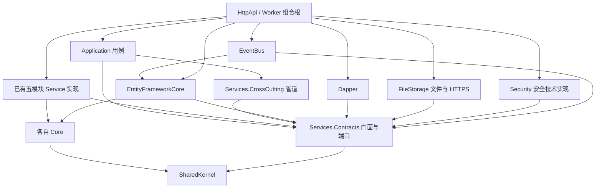
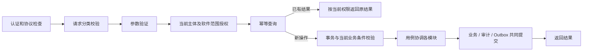
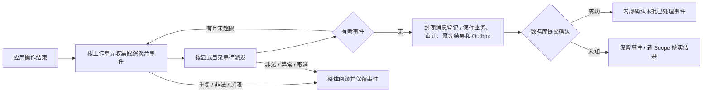
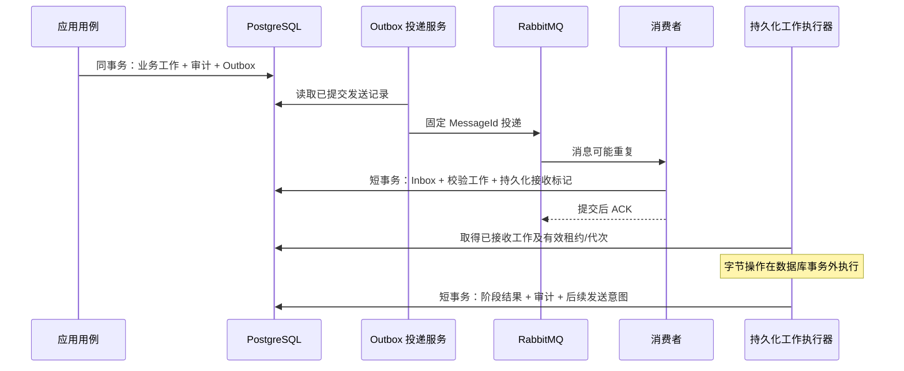

# 制造业软件版本管控平台软件框架设计

> 状态：设计已审阅，本次版本与安装包修订待复核。人员、软件授权、台账/目录/映射、实例登记/恢复、独立凭据、报告流/快照/安装履历及 API/网页，以及 PostgreSQL、幂等、领域事件和消息发送/消费事务基础已有实现，覆盖见第 11 节。开放范围为第 6.4～6.8 节封闭用例；版本登记/包双副本/测试下载和一个正式包消费者已有实现；管理系统凭据、发布/兼容声明、任务、清理和完整观测仍待实现。PLC 仅保留后续备份归档方向；完整框架、系统及生产验收未完成。

## 1. 作用、规则来源与实施顺序

本文回答组件如何选择、实现放在哪里、谁可以引用谁、基础契约如何工作，以及怎样证明框架符合设计。采用 Linux / .NET 8 模块化单体，API 和 Worker 可分别运行多个副本；六个业务模块不因此拆成六个网络服务。

| 内容 | 唯一规则正文 |
|---|---|
| 业务范围、人员规则、版本、上报、任务及现场责任 | [需求规格说明](./需求规格说明.md) |
| 厂区拓扑、容量预算、系统故障边界 | [总体架构](./总体架构.md) |
| 六个模块的职责、数据所有者、模块协作 | [模块设计](./模块设计.md) |
| 业务数据、状态、公共 API、错误码、网页行为 | [详细设计](./详细设计.md) |
| 厂家调用示例 | [厂家接入文档](./厂家接入文档.md) |
| 40 项需求的业务验收、52 个验收用例、现场待确认输入 | [架构测试与验收要求](./架构测试与验收要求.md) |
| 工程结构、依赖版本、基础接口、DI/CQRS/管道、消息实现约束 | 本文 |

实施顺序为：**设计审阅 → 分批实现基础框架 → 按契约验证 → 开发对应业务**。当前实现与证据统一见第 11 节；空类库或依赖还原不能代替框架验收。

Cloud 只提供固定的架构、目录组织、DDD、DI、CQRS 及编译约束参考。平台独立管理身份、工序、设备和映射，不对接、同步或复用 Cloud 或其他既有业务平台的数据。其业务实体、发布契约、状态投影及现场协议不作为输入；.NET 版本、依赖和许可按本项目基线执行。具体架构参考见第 12 节 R14。

## 2. 技术栈、许可与版本治理

### 2.1 选择原则与核对等级

所有必需组件须允许企业闭源商用且无需购买组件授权；许可证要求的版权、NOTICE、再分发及修改文件义务仍须履行。“无需组件授权费”不表示服务器、运维或可选厂商支持免费。依赖必须固定精确版本，不能把 `8.x`、`latest`、`^` 或 `~` 作为最终工程基线。

附录 A、B 已与首批真实 NuGet/npm 锁文件对账；已执行固定工具链校验、依赖还原、工程编译、既有架构/安全检查及包许可材料核对，具体范围见第 11 节。新增传递依赖须重新核对并同步本文和工程约束。生产数据库/MQ、完整 Linux 运行环境、SDK/原生资产 SBOM 及容器层仍待验证；容器摘要只证明镜像身份。

### 2.2 核心组件

| 能力 | 精确基线 | 许可与选型依据 | 维护和兼容约束 |
|---|---|---|---|
| SDK、运行时与语言 | .NET SDK `8.0.425`；.NET / ASP.NET Core Runtime `8.0.31`；C# `12.0` | .NET 主体 MIT；发行包第三方通知随交付保留；见 R01 | `net8.0`；SDK 使用 `global.json`，不自动滚入 .NET 9/10；.NET 8 已处维护期，支持截止 `2026-11-10`，上线时间须与升级安排一起评审 |
| IOC | ASP.NET Core 内置 Microsoft DI；扩展包精确版本见附录 A | MIT；构造函数注入 | 不引入 Autofac；运行期不扫描整个进程所有程序集 |
| CQRS、应用管道 | `MediatR 12.5.0`、`MediatR.Contracts 2.0.1` | Apache-2.0；R02 | 禁止进入 MediatR 13；旧版无新版支持承诺，安全问题须升级或替换，不得靠永久冻结规避 |
| 参数验证 | `FluentValidation 11.11.0`、DI 扩展 `11.11.0` | Apache-2.0；R03 | 使用显式异步验证管道，不添加旧 ASP.NET 自动验证包；11 系列兼容维护需在升级时重查 |
| 数据库 | `PostgreSQL 17.11` | PostgreSQL License；R04 | 17 系列支持到 `2029-11-08`；单一写入主节点；主备和仲裁仍须现场确认 |
| 写入、迁移 | EF Core / Relational / Design `8.0.31`；Npgsql EF Provider `8.0.11` | EF MIT，Provider PostgreSQL License；R05 | EF 包同补丁；Provider 的包版本不与 EF 补丁号强行相等；Design 仅迁移/开发私有资产 |
| 数据库驱动、查询 | `Npgsql 8.0.9`、`Dapper 2.1.72` | PostgreSQL License、Apache-2.0；R05 | Dapper 只承接模块读接口；权限和开始许可不读延迟副本 |
| 事件总线 | `MassTransit`、`MassTransit.RabbitMQ`、`MassTransit.EntityFrameworkCore` 均为 `8.3.6`；Abstractions 同版 | Apache-2.0；R06 | 禁止进入 9；三个适配包一起锁定，使用其 .NET 8 依赖组；当前新版文档中的 v9 专有 API 不得照搬 |
| 消息服务器 | 开源 `RabbitMQ 4.3.6` | MPL-2.0；R07 | 开源服务器可闭源商用；生产采用持久化 quorum queues；Erlang 与镜像组成见附录 C，AMQP 客户端互通待实测 |
| 日志 | `Serilog.AspNetCore 8.0.3`、`Serilog.Sinks.File 7.0.0`，其余见附录 A | Apache-2.0；R08 | 结构化控制台/文件；文件滚动与空间限额配置化；不附带必须购买的日志服务 |
| 追踪、指标 | OTel Hosting / OTLP `1.15.3`；AspNetCore instrumentation `1.15.2`；Http / Runtime instrumentation `1.15.1` | Apache-2.0；R09 | 各子包有独立发布节奏，不强行同号；OTLP 接收地址可配置，不依赖外网 SaaS 才能启动 |
| Cookie 多节点密钥 | `Microsoft.AspNetCore.DataProtection.EntityFrameworkCore 8.0.31` | MIT；R05 | 权威会话与撤销在数据库；密钥另行加密保护，密钥表不等于可明文存储 |
| API 描述 | `Swashbuckle.AspNetCore 10.2.3`、`Microsoft.OpenApi 2.7.5` | MIT；R10 | 包声明支持 net8；不同时引入依赖 OpenAPI 1 模型的另一套生成器；文档生成结果须符合详细设计，默认不公开管理 Swagger UI |
| 映射、断言 | 显式 C# 映射；`xunit 2.9.3` 原生断言 | 应用映射自有代码；xUnit Apache-2.0 | 不引入 AutoMapper 和 FluentAssertions；不依赖 Cloud 对相关新版的授权 |
| 测试基础 | `Microsoft.NET.Test.Sdk 17.14.1`、`xunit.runner.visualstudio 3.1.4`、`Microsoft.AspNetCore.Mvc.Testing 8.0.31` | MIT / Apache-2.0 | 测试项目资产不进入生产；真实 PG/Rabbit 验证由受控测试环境提供，不使用内存替身冒充 |
| 编译期约束 | Roslyn `4.11.0`；`Svm.Analyzers` 目标 `netstandard2.0` | MIT；R11 | 与 SDK 8.0.4xx 编译器代际匹配；不复制 Cloud 的 Roslyn 5.6；加载及诊断效果待编译验证 |
| 前端工具链 | Node `24.21.0`、npm `11.19.0`；前端精确包见附录 B | Node MIT 含第三方组件，npm Artistic-2.0；R12 | Node 24 LTS；Vite 的 Node 范围满足；Node/npm 仅构建工具，不在浏览器运行 |
| 入口和包下载 | 开源 `Nginx 1.30.5` | BSD-2-Clause；R13 | 使用开源版 `auth_request`、Range、TLS；须验证模块已编入。入口切换由厂区部署方案提供，不暗含 Nginx Plus 授权 |

RabbitMQ 的文件级 MPL 义务与自有应用闭源可并存；修改并分发其 MPL 文件时应提供相应修改源码。Apache-2.0、MIT、BSD、ISC、PostgreSQL、OFL 等的声明和第三方材料随交付保存。上述是选型许可记录，交付时仍需对**实际取得的版本和文件**核对，不能仅凭仓库首页的当前许可证替代旧包许可证。

### 2.3 前端范围与不引入的额外基础设施

沿用 Vue 3、TypeScript、Vite、Pinia、Vue Router、Reka UI、Tailwind CSS 的技术组合，精确版本及辅助 UI/测试包见附录 B。路由和按钮权限只用于展示，服务端重新授权；Cookie 与 CSRF 按详细设计，浏览器不保存实例凭据。使用显式 TypeScript DTO 与接口描述静态比对，不把 C# 实体直接生成给网页。

首期不增加 Redis、TimescaleDB、Elasticsearch、独立商业网关、Aspire 或必须收费的日志平台。普通展示可使用受限的进程内缓存；身份吊销、权限、幂等、批次条件、开始许可及清理资格必须读权威状态。PostgreSQL 主备管理、入口地址切换和现场监控接收端由验收输入 IN-01、IN-09、IN-11 落实；在确定其软件清单和许可证前不能宣称完整生产部署方案已验收。

服务器部署基线使用 Linux 上的开源 Moby Engine 与 Compose 插件，精确版本见附录 C。本批按已确认安排，使用这台 Mac 已有并获授权使用的 Docker Desktop 引擎进行本地数据库验证；实测 Engine 为 `29.4.3`、容器平台为 `linux/arm64`。这项本机环境记录不替换附录 C 的生产部署基线，也不新增 Aspire 编排依赖。

### 2.4 工程中的版本约束与升级

工程根目录 `global.json` 固定 SDK 并使用 `rollForward: disable`；`Directory.Build.props` 固定 `TargetFramework=net8.0`、`LangVersion=12.0`、Nullable、分析器门禁。分析器项目单独目标 netstandard2.0，不继承 net8 的目标值。采用 SDK 8 可用的 `.sln`，不使用 `.slnx`。

`Directory.Packages.props` 启用中央 NuGet 管理与传递版本固定；每个直接引用仍只放在使用它的项目中。提交逐项目 `packages.lock.json`，后续 CI 使用 locked restore；拒绝降级、版本漂移和未经批准的新许可证。Design、测试及 Analyzer 包设置相应私有资产。`dotnet-ef` 工具固定 `8.0.31`，仅迁移开发使用，不让 API 进程运行迁移。

前端 `package.json` 使用精确版本，提交 npm v3 锁文件并使用 `npm ci`；锁文件来源使用官方 registry 或经批准的内部镜像，不直接复制 Cloud 的镜像地址与范围。所有 override 必须记录原因、被覆盖范围与验证结果。容器用完整 `repository@sha256`，平台摘要与架构同时记录，禁止部署时把同名 tag 重新解释成另一份字节。

升级是一次受控修改：核对发布说明、许可证及间接依赖 → 安全检查 → 依赖图与分析器 → 受影响契约及真实基础设施验证 → 更新本文、锁文件和镜像清单。MediatR 13、MassTransit 9 等许可边界必须先重新选型，不能由自动更新越过。发现漏洞或停止维护导致风险无法接受时，应选择合规补丁或替代实现；旧版免费不是忽略漏洞的理由。

## 3. 目录、类库和完整引用关系

### 3.1 工程目录

当前解决方案包含 27 个 C# 项目、92 条普通项目引用及独立网页工程。已实现模块的 Core 与 Service 同放模块目录，保留独立程序集、命名空间和依赖边界；应用编排与公共契约/管道各有明确入口。此前删除 PKG/TSK 四个空工程；本批建立实际 Core.Packages、PackageService 与 FileStorage，TSK 未重建空工程，逻辑职责保留。工程支持文件另包括 `build/Architecture.xml`、依赖/工具链校验清单及 `eng/` 工具入口。

```text
SoftwareVersionManagement/
  docs/                          现有设计和本文
  SoftwareVersionManagement.sln
  global.json
  Directory.Build.props
  Directory.Packages.props
  .config/dotnet-tools.json       dotnet-ef 的精确版本
  src/
    shared/
      Svm.SharedKernel/
      Svm.Services.Contracts/
      Svm.Services.CrossCutting/
    application/Svm.Application/
    modules/
      Identity/
        Svm.Core.Identity/
        Svm.IdentityService/
      Releases/
        Svm.Core.Releases/
        Svm.ReleaseService/
      Packages/
        Svm.Core.Packages/
        Svm.PackageService/
      Instances/
        Svm.Core.Instances/
        Svm.InstanceService/
      Audit/
        Svm.Core.Audit/
        Svm.AuditService/
    infrastructure/
      Svm.EntityFrameworkCore/
      Svm.Dapper/
      Svm.EventBus/
      Svm.Security/
      Svm.FileStorage/
    hosts/
      Svm.HttpApi/
      Svm.Worker/
      Svm.Migration/
      Svm.ServiceDefaults/
    ui/svm-web/
    analyzers/Svm.Analyzers/
    tests/
      Svm.ArchitectureTests/
      Svm.SecurityTests/
      Svm.FrameworkTests/
```

### 3.2 责任与直接 ProjectReference 白名单

表中每项都是直接项目引用，未列出即禁止；外部 PackageReference 另按第 2 节及附录管理。传递引用不构成访问某类型的授权，分析器还检查实际符号使用。测试专用授权不传入生产项目。

| 项目 | 职责 | 允许的直接项目引用 |
|---|---|---|
| `Svm.SharedKernel` | 聚合/实体/值对象基类、领域事件接口、强类型标识基础、领域错误 | 无 |
| `Svm.Core.Identity` | 身份聚合、授权规则及所属仓储接口 | Svm.SharedKernel |
| `Svm.Core.Releases` | 上位机/视觉软件分类、产品共用版本、发布与兼容声明领域模型及仓储接口 | Svm.SharedKernel |
| `Svm.Core.Instances` | 工序/设备台账与软件映射、实例、上报顺序和安装履历/证据规则及所属端口 | Svm.SharedKernel |
| `Svm.Core.Audit` | 审计事实结构与去重规则 | Svm.SharedKernel |
| `Svm.Services.Contracts` | 按六模块分区的门面、DTO、读/快照/审计存储端口；应用请求与框架端口；版本化消息契约 | Svm.SharedKernel |
| `Svm.Services.CrossCutting` | CQRS 管道、请求分类、授权和事务协调机制、领域事件分派机制 | Svm.SharedKernel、Svm.Services.Contracts |
| `Svm.Application` | 唯一应用 Command/Query Handler 集合；跨模块用例协调、结果映射、用例验证器 | Svm.SharedKernel、Svm.Services.Contracts、Svm.Services.CrossCutting |
| `Svm.IdentityService` | IAM 门面，调用自己的 Core/存储端口 | Svm.SharedKernel、Svm.Services.Contracts、Svm.Core.Identity |
| `Svm.ReleaseService` | REL 门面 | Svm.SharedKernel、Svm.Services.Contracts、Svm.Core.Releases |
| `Svm.InstanceService` | INS 门面，本地台账/映射、设备详情、快照与安装履历/证据 | Svm.SharedKernel、Svm.Services.Contracts、Svm.Core.Instances |
| `Svm.AuditService` | AUD 门面，结构化事实追加与查询 | Svm.SharedKernel、Svm.Services.Contracts、Svm.Core.Audit |
| `Svm.EntityFrameworkCore` | 六模块仓储/快照/审计/幂等实现，统一工作单元、模型及迁移，框架 Outbox 表映射 | Svm.SharedKernel、Svm.Services.Contracts、Svm.Core.Identity、Svm.Core.Releases、Svm.Core.Instances、Svm.Core.Audit、Svm.Core.Packages |
| `Svm.Dapper` | 六模块分页、汇总和批量读取接口的 SQL 实现 | Svm.SharedKernel、Svm.Services.Contracts |
| `Svm.EventBus` | MassTransit 注册、版本化消息映射、Outbox 发送适配、消费者与 Inbox 配置 | Svm.SharedKernel、Svm.Services.Contracts、Svm.EntityFrameworkCore |
| `Svm.Security` | 密码哈希、随机凭据及校验摘要、密钥保护证书加载；实现内层安全端口，不承载 IAM 权限规则 | Svm.SharedKernel、Svm.Services.Contracts |
| `Svm.ServiceDefaults` | 日志、追踪、指标、健康及公共启动选项；无业务用例 | Svm.Services.Contracts |
| `Svm.HttpApi` | HTTP 协议适配、Cookie/API 认证、CSRF、下载内部入口；API 组合根 | Svm.SharedKernel、Svm.Services.Contracts、Svm.Services.CrossCutting、Svm.Application、Svm.IdentityService、Svm.ReleaseService、Svm.InstanceService、Svm.AuditService、Svm.EntityFrameworkCore、Svm.Dapper、Svm.EventBus、Svm.Security、Svm.ServiceDefaults、Svm.PackageService、Svm.FileStorage |
| `Svm.Worker` | MQ 消费和持久化工作执行、批次时钟扫描；Worker 组合根 | Svm.SharedKernel、Svm.Services.Contracts、Svm.Services.CrossCutting、Svm.Application、Svm.IdentityService、Svm.ReleaseService、Svm.InstanceService、Svm.AuditService、Svm.EntityFrameworkCore、Svm.Dapper、Svm.EventBus、Svm.Security、Svm.ServiceDefaults、Svm.PackageService、Svm.FileStorage |
| `Svm.Migration` | 独立迁移及显式人员播种组合根；不托管业务 API 或消费者 | Svm.Services.Contracts、Svm.Services.CrossCutting、Svm.Application、Svm.IdentityService、Svm.AuditService、Svm.Security、Svm.EntityFrameworkCore、Svm.ServiceDefaults |
| `Svm.Analyzers` | 编译期 Architecture/Security 诊断 | 无 |
| `Svm.ArchitectureTests` | 项目图/符号归属、分析器正反例、生产资产检查 | Svm.Analyzers |
| `Svm.SecurityTests` | HTTP/应用管道、越权、凭据、CSRF、安全日志验证 | Svm.HttpApi、Svm.Application、Svm.Services.Contracts、Svm.Services.CrossCutting |
| `Svm.FrameworkTests` | Scope、事务、真实 PG/Rabbit、文件工作及重启恢复验证 | Svm.HttpApi、Svm.Worker、Svm.EntityFrameworkCore、Svm.EventBus、Svm.Security、Svm.Services.Contracts、Svm.Services.CrossCutting |
| `Svm.Core.Packages` | 包内容、接收/派发/租约、副本及下载事实领域模型与所属仓储接口 | Svm.SharedKernel |
| `Svm.PackageService` | PKG 门面，封闭接收、工作、修复、下载规则 | Svm.SharedKernel、Svm.Services.Contracts、Svm.Core.Packages |
| `Svm.FileStorage` | 流式接收/校验、节点文件互斥、mTLS 副本通道及可信下载日志采集；实现 Contracts 文件端口 | Svm.Services.Contracts |
| `svm-web` | 网页路由、表单、分页与 API 适配；独立 npm 工程 | 无 .NET 项目引用 |

所有生产 C# 项目另以 **Analyzer 类型引用** `Svm.Analyzers`，设置 `OutputItemType=Analyzer`、`ReferenceOutputAssembly=false`；它不是运行时依赖。分析器自身和测试项目不套用这一导入，避免自引用与测试夹具误报。ArchitectureTests 通过 Roslyn 编译正反例，测试项目不成为生产引用的目标。



图表示编译引用，调用依赖通过接口注入反转。`EventBus → EntityFrameworkCore` 只用于同一 DbContext 的事务 Outbox 注册和映射联结，是明确限定的基础设施内部边；消费者不能由此直接写业务实体。生产控制器和 Worker 入口也不能凭组合根的引用访问仓储或 DbContext。


### 3.3 文件归属与程序集边界

| 位置 | 必须放置的内容 | 禁止事项 |
|---|---|---|
| `Core.<模块>/Aggregates、Entities、ValueObjects、Events、Repositories` | 聚合与本模块领域端口 | EF 特性、SQL、HTTP DTO、Rabbit 类型、其他模块实体 |
| `Services.Contracts/<模块>/Facades、Models、Reads、Stores` | 不泄露实体的门面 DTO；有 owner 的存储端口 | 返回 DbSet、IQueryable、DbConnection 或通用跨表操作器 |
| `Services.Contracts/Framework、Requests、Messaging/V1` | 请求元数据、UoW/上下文/消息端口、版本化消息 | 接收反射类型名、数据库实体或凭据正文 |
| `Svm.<模块>Service` | 本模块门面、领域事件处理、领域与 DTO 显式映射 | 引用另一 Service 实现，或直接取得另一模块仓储 |
| `Application/<用例>/Commands、Queries、Handlers、Validators` | 唯一应用处理器，跨模块门面协调 | 跨表 SQL、直接构造基础设施、通过 nested Send 偷开第二事务 |
| `EntityFrameworkCore/<模块>/Mappings、Repositories、Stores` | owner 对应表映射与写入；内部模块会话 | 跨模块 repository 注入、公共任意 `Save<T>` |
| `EntityFrameworkCore/Framework、Migrations` | 技术表、统一事务、集中迁移序列 | 把业务表所有权改成 Framework |
| `Dapper/<模块>` | 所属查询端口的固定投影；台账/映射可显式关联 INS/REL 与 IAM 当前授权 | DML、任意跨表查询、绕过软件范围过滤或使用读结果代替事务内写条件 |
| `EventBus/Consumers、Outbox、Serialization` | 传输适配与短消息接收用例 | 在消息回调中执行大文件复制或本机安装 |

Core 模型可供所属 Service 和 EF 映射使用；仓储实现、DbContext、可写模块会话保持 internal。EF 的 `InternalsVisibleTo` 仅向 FrameworkTests 开放验证；EventBus 通过 EF 专用注册桥接组合 Outbox，不取得业务 DbContext 或扩大友元权限。SharedKernel 只向 EF 开放内部事件确认能力；Contracts 仅向 CrossCutting 开放内部操作身份构造，CrossCutting 仅向 FrameworkTests 开放内部验证。分析器仍按类型与命名空间检查使用位置，友元不作为全库写权限。数据访问按 `iam/rel/pkg/ins/tsk/aud` schema 分区，技术表用 `framework`；同一应用数据库角色不提供模块间硬安全隔离，隔离由端口、internal 可见性、分析器及测试共同保证。

### 3.4 外部包的使用位置

以下为直接外部依赖的归属；精确版本全部引用第 2 节及附录 A，中央声明不会自动给每个项目添加引用。共享 ASP.NET Core 框架由 `Microsoft.AspNetCore.App 8.0.31` 提供，不把整套 Web 依赖传播到 Core。

| 项目或边界 | 可直接使用的外部能力 |
|---|---|
| SharedKernel、六个 Core | .NET 基础库，无第三方包 |
| Services.Contracts | MediatR.Contracts；其余为自有接口/DTO |
| Services.CrossCutting | MediatR、FluentValidation、Microsoft DI/Options 抽象 |
| Application | MediatR、FluentValidation 及其 DI 扩展、Microsoft DI 抽象 |
| 六个模块 Service | Microsoft DI 抽象用于显式注册；不取得 CQRS 总线以回调其他模块 |
| EntityFrameworkCore | EF Core、Relational、Npgsql Provider、Npgsql；MassTransit EF 包仅在 Framework 下映射技术表；DataProtection EF 包仅用于密钥持久化 |
| Dapper | Dapper、Npgsql、Microsoft DI 抽象 |
| EventBus | 三个锁定的 MassTransit 包、MediatR、Microsoft DI/Options 抽象；RabbitMQ.Client 作为传递依赖锁定，不在业务层使用 |
| FileStorage | Microsoft DI 抽象；.NET 文件/加密/HTTPS，构造函数注入文件与事务端口 |
| Security | Microsoft DI/Options；受控使用 ASP.NET Core 共享框架的密码哈希及平台加密/证书能力；不直接依赖内存缓存 |
| ServiceDefaults | Serilog.AspNetCore、文件 sink、五个 OpenTelemetry 包；ASP.NET Core 共享框架的健康与配置能力 |
| HttpApi | Web SDK/ASP.NET Core 共享框架、MediatR、Swashbuckle.AspNetCore、Microsoft.OpenApi；仅组合代码可访问框架注册接口 |
| Worker | Microsoft.Extensions.Hosting、MediatR；消费注册由 EventBus 封装 |
| Migration | Microsoft.Extensions.Hosting、EF Core.Design；Design 与其 Roslyn/模板依赖设为 PrivateAssets |
| Analyzers | Microsoft.CodeAnalysis.CSharp / Common / Analyzers；netstandard2.0 编译依赖全部私有 |
| ArchitectureTests | xUnit、Test SDK、runner、Roslyn CSharp；读取 csproj 与源文件，不把产品测试写入生产代码 |
| SecurityTests、FrameworkTests | xUnit、Test SDK、runner、Mvc.Testing；FrameworkTests 可用 EF/Npgsql 与 MassTransit 查询技术状态和故障注入，不影响生产引用白名单 |

Roslyn Workspaces 仅供 EF Design 的开发依赖统一到 `4.11.0`，分析器不依赖 Workspaces；不得因迁移工具传递依赖而把编译工作区服务加载到 HttpApi。未经本表允许的直接引用先修改设计再进入工程。

### 3.5 当前基础设施实现边界

第 3.2 节定义目标职责和允许引用；工程存在或包已引用不能代表该能力已实现。当前代码落点如下，验证范围统一见第 11 节。

| 项目 | 已有实现 | 尚未实现 |
|---|---|---|
| `Svm.EntityFrameworkCore` | 内部 DbContext、工作单元/领域事件、迁移、人员/权限与台账/目录、IAM 接入身份/凭据/许可/登记事实、INS 实例/快照/履历、审计、密钥、六模块幂等；原生 Bus/Consumer Outbox 与独立技术表上下文；REL/PKG 版本、包、派发/接收/租约、副本与下载事实 | TSK、正式发布及清理持久化 |
| `Svm.Dapper` | 只读连接、安全人员查询；固定台账/软件/映射/库存及实例/履历/许可/凭据安全投影，授权过滤、字面筛选与键集分页；版本/包/证据与下载记录的固定安全投影 | TSK 及通用审计检索 |
| `Svm.Security` | `PersonnelCrypto`、`ProtectionCertificate`；构造函数注入内层端口，注册由 Hosts 调用 | 管理系统等后续安全适配 |
| `Svm.EventBus` | 三类固定消息的 Scoped Outbox 适配器、原始契约校验、显式消费者适配、原生 Inbox/Consumer Outbox、当前授权先于去重、有界重试、错误隔离及恢复、私有类型化配置；条件启用 PackageWorkAvailableV1 唯一包消费者 | TSK 业务消费及完整观测 |
| `Svm.FileStorage` | 流式接收/独立摘要、包级跨进程锁、mTLS 双副本复制/实际核对、可信结束日志持久游标 | 已确认内容清理及生产故障域验收 |
| `Svm.ServiceDefaults` | 人员、持久化、显式厂区与实例许可上限配置加载 | 日志、指标、追踪和健康检查完整接入 |
| `Svm.HttpApi` 与 `svm-web` | 固定端点分类、人员与软件授权、台账/目录/映射、登记/恢复/报告 API、权限修订绑定游标、同源 HTTPS 网页与现场/实例管理；版本包登记、测试视图、双副本/下载/停用及关联证据 | 管理系统凭据、正式发布、任务及清理 |
| `Svm.Worker` | 宿主及基础服务注册；显式启用后运行原生 Bus Outbox 投递服务；条件启用包消费者、原生 Inbox 清理、持久工作租约执行、副本修复及可信日志采集 | TSK 批次调度及生产观测 |

安全接口仍归 Contracts，账号状态、权限和授权规则归 IAM；`Svm.Security` 不引用 EF、Dapper 或模块 Service，也不读写 IAM 表。Data Protection 数据库存储归 EF，Cookie/CSRF 与密钥配置组合归 HttpApi。文件存储、展示缓存、节点能力在对应批次确定实现项目并更新引用白名单，不纳入安全类库，也不为尚无实现的能力增加空类库。


## 4. DDD、数据归属与依赖倒置

聚合只负责自身不变量和状态变化。应用层从其他模块取得不可变事实 DTO，交给所属模块检查，不能把另一个模块的实体纳入当前聚合。六个 Core 互不引用，跨模块引用用标识；数据库外键可以约束身份存在，但不允许跨 owner 级联删除历史。

| 所属模块 | 聚合/领域边界 | 专用端口，不强塞进通用聚合仓储 |
|---|---|---|
| IAM | 人员/系统主体、凭据、登记与恢复授权 | 权限读接口、会话撤销查询、登记幂等结果 |
| REL | 软件分类、产品共用版本编号、Release 与兼容声明 | 发布证据引用、软件发布历史查询；PLC 后续备份资料语义待确认 |
| PKG | Package、副本和可恢复文件工作 | DownloadSession、文件系统端口、清理条件快照 |
| INS | 工序/设备台账、Device、Instance 及稳定关联规则 | 工序/设备维护、设备软件映射、设备综合查询、安装履历、InstanceSnapshot 条件 upsert 与报告顺序检查 |
| TSK | Deployment、Batch、InstanceTask/ExecutionAttempt | 执行占用、租约、目标成员、分块准入和回执去重 |
| AUD | 不可变 AuditEvent 的规则 | 只追加和按权限查询的审计存储 |

大量目标不作为一个装载十万子实体的内存聚合。Deployment 保存控制规则和进度引用，Batch、InstanceTask 分别持久化；跨记录不变量依详细设计的短事务、锁顺序和唯一约束保证。数据库快照、审计追加、Inbox/Outbox、租约和操作幂等使用专用接口，不要求实现 `IAggregateRoot`。

聚合仓储在所属 Core 定义；面向应用的读、快照、审计、安全、文件、事务等端口在 Contracts 相应模块或 Framework 定义；已明确的技术实现分别归 EF、Dapper、Security、EventBus，文件端口由本批 Svm.FileStorage 实现。接口签名使用自有类型和 `CancellationToken`。DI 将端口绑定到实现，内层不认识连接串、ORM 或消息服务器。

当前 `SharedKernel/Domain` 已提供 `IStrongId`、`StrongId<TTag>`、`Entity<TId>`、`ValueObject`、`IAggregateRoot`、`AggregateRoot<TId>`、`IDomainEvent`、`DomainEvent`、`DomainError` 和 `DomainException`。标识采用 UUID；实体拒绝空标识（含值类型 default），实体相等性同时比较具体类型与标识，值对象按具体类型及有序组成值比较，派生类型须保持这些组成值不可变。领域事件由调用方给定稳定事件标识和明确的 UTC 时间，聚合拒绝重复标识，并以只读集合公开待处理事件。第 7.2 节已接通进程内派发及数据库提交确认；内部确认只移除本次已处理的事件对象，没有会丢弃未提交事件的公开清空操作。Core.Identity 已加入人员聚合、会话和所属存储接口；Core.Audit 已加入审计记录和追加接口。仓储实现仍仅位于基础设施，本批未增加具体业务事件。

Application 只能调用模块门面。若用例涉及跨模块条件，由应用用例安排查询和提交顺序；模块门面不互调、不回调另一个模块，也不能把跨模块动作隐藏在领域事件处理器中。涉及强一致的发布、人工关闭、回执和快照更新按详细设计完成一次本地提交，不使用最终一致消息替代。

## 5. IOC 与 CQRS 基础契约

### 5.1 IOC 注册和生命周期

Hosts 是唯一组合根，分别调用显式 `AddSvmApplication`、六模块注册、存储注册、基础设施注册与消息注册。注册方法可以放在提供程序集内部，但只有组合根有权选择具体实现和配置。禁止业务代码调用 `BuildServiceProvider`、静态容器或任意 `IServiceProvider.GetService`。

MediatR Handler 扫描仅限 `Svm.Application` 的已知标记程序集；Validator 仅扫描该程序集的用例验证器。领域事件处理器按 owner 显式登记；消息消费者使用 EventBus 中的明确白名单。发现多个同请求 Handler、同端口多个默认实现、未归类请求或缺少 Validator 策略时启动失败；多领域事件订阅者必须显式声明为集合注册，不靠最后一次注册覆盖。

| 服务 | 生命周期 | 约束 |
|---|---|---|
| 调用上下文、模块门面、Handlers、管道 | Scoped | 一个 HTTP 请求、消费消息或工作步骤一个 Scope |
| DbContext、UoW、仓储、Outbox 端点 | Scoped | 同次原子操作共享上下文，不跨请求、不并行使用 DbContext |
| Dapper 查询会话 | Scoped，连接按操作打开/关闭 | 只读角色；取消/异常也释放；需要事务中权威写条件时走模块的事务存储端口 |
| NpgsqlDataSource/连接池、TimeProvider、无状态加密服务 | Singleton | 只持有线程安全状态；密钥轮换由提供器管理，不捕获 Scoped |
| 无状态纯 Validator / Mapper | Scoped 或显式 Transient | 默认 Scoped，避免依赖层改变引入隐性生命周期问题 |
| HostedService、MQ 基础连接 | Singleton | 每次执行显式创建异步 Scope；不注入仓储或 DbContext 到构造函数 |

所有环境启用 `ValidateScopes` 与 `ValidateOnBuild`；工厂委托、后台闭包和框架内部注入还须用 FND-02 验证，不能只依赖容器自动检查。取消与异常路径必须释放 Scope、连接和流；停止工作时不能向已释放 Scope 发回调。

### 5.2 Command、Query、结果和处理器

Contracts 定义 `ICommand<T> : IRequest<OperationResult<T>>`、`IQuery<T> : IRequest<T>` 及请求元数据；MediatR.Contracts 不进入 SharedKernel/Core。请求实现必须归类并声明允许主体、软件范围取得方式、权限、事务策略、幂等策略；不能用默认“允许匿名”填补缺失配置。

| 契约 | 要求 |
|---|---|
| Command | 表达一次意图；处理器在 Application；领域校验由模块门面和 Core 完成；HTTP、网页、消息适配复用同一用例 |
| Query | 仅读模块读接口、返回不可变 DTO；不修改业务状态、不发消息。须记录访问事实时由授权后的入口协调单独 AUD 用例，Query Handler 本身不取得审计写入或业务写入能力 |
| OperationResult | 保留持久化操作关联、资源/工作结果引用；区别 Accepted 与 Completed；禁止把 202 映射为成功安装 |
| 失败 | 领域错误映射为详细设计第 8.7 节已定义错误；技术异常脱敏为可追踪失败；不新造公共错误码 |
| 取消 | HTTP RequestAborted、消息取消和停止信号贯穿到端口；已提交后取消不撤销事实；提交结果不明时按原幂等关联查询 |

框架端口固定归 `Services.Contracts/Framework`：`ICallContext` 提供不可变主体、入口分类、软件范围和关联标识；`IUnitOfWork` 提供加入/执行当前原子操作能力；`IOperationResultStore` 只按请求元数据固定的 owner、主体和操作键存取幂等结果，调用者不能任意传入其他 owner；`IIntegrationEventOutbox` 只登记受控消息；`IDomainEventDispatcher` 只向显式 owner 处理器分派。各端口不暴露具体 ORM 事务、连接或消息框架类型，异步方法必须接受 CancellationToken。持久化与文件端口仍按模块 owner 定义，不能以这些框架接口作为任意跨表写入通道。

Command 的幂等策略必须明确为通用操作结果、报告顺序、回执顺序、登记协议或确实无需幂等；不同协议不能被一个通用缓存替代。事务策略区分数据库原子命令、只读查询和分阶段文件用例。长文件处理拆为“登记工作/阶段提交”数据库命令及事务外字节操作；管道不会把整段上传流包进事务。文件流程的非事务编排通过框架 `ICommandScopeExecutor` 调度明确的阶段命令，每阶段新 Scope 并重新经过授权管道；执行器在 CrossCutting 的限定基础机制中使用 ScopeFactory，业务 Handler 不直接操作容器。外层不可持有活动数据库事务，调用上下文由受信上下文工厂传入，不能让调用者自报高权限身份。

### 5.3 当前内核实现与启用检查

| 位置 | 当前实现 |
|---|---|
| `Services.Contracts/Framework` | Command/Query、不可变结果、请求元数据、调用上下文和授权接口；不暴露 ORM 的工作单元；幂等存储、只读操作上下文、显式语义字段投影及结果引用契约；脱敏异常与已有错误语义 |
| `Services.CrossCutting/Registration` | 显式绑定、不可变请求目录、IOC 注册及最终注册检查 |
| `Services.CrossCutting/Pipeline` 与 `Idempotency` | 分类 → 验证 → 授权 → 幂等 → 人员事务；每 Scope 固定的可信上下文；原子操作协调、提交结果不明时的新 Scope 核实及后台 Scope 执行器 |
| `Application` 与 Hosts | 固定扫描已知 Handler/Validator；HttpApi 使用 `AddSvmInstanceApplication` 扩展会话、人员管理、台账/软件目录/映射及接入闭包。原 SiteCatalog 组合保留原能力。`AddSvmPersonnelManagementApplication` 保留原人员闭包，Session/Seed 组合仅启用会话/播种；Worker 暂无活动业务请求。各组合根在 Build 前执行 `ValidateSvmFoundation` |

请求通过 `RequestPolicyAttribute` 显式声明稳定操作键、owner、入口分类、范围、允许主体、权限、验证、事务及幂等策略，注册时复制为不可变策略。验证策略为 Required 或 ExplicitlyNone；前者必须登记验证器，后者必须填写理由且不能另带验证器。未分类、错误分类、重复操作键、多个/缺失 Handler、接口不匹配、未登记的 Handler/Validator、替换管道顺序、冲突的默认端口及替换框架能力的 keyed 注册均拒绝启用。生产扫描范围不包含测试程序集。

Query 仍须声明 ReadOnly/None。会话/初始化保留 Login、Logout、ChangePassword、Seed 四个 DatabaseAtomic/None 具体类型；四类人员管理与本批八类目录/台账/映射 Command 为 DatabaseAtomic/OperationResult。新增类型为 Create/UpdateSoftware、Create/UpdateProcess、Create/UpdateDevice、Create/RevokeBinding，复制元数据不能取得能力。每类写请求必须唯一登记具体 Scoped 幂等适配器，缺失、重复、factory、Singleton 或 keyed 绕过拒绝。本批另外精确启用十类接入 Command、六类 Query；RegisterInstance/RecoverInstance 使用 EnrollmentProtocol，SubmitStatusReport 使用 ReportSequence，其他接入管理与 OpenReportStream 使用 OperationResult。各类必须唯一登记具体 Scoped 协议/幂等适配器；版本包本批精确能力见 6.8；其他 Command 和流式请求继续禁用。Dapper 人员及台账/实例安全投影已实现，其他业务的权威并发条件仍待 FND-07 完整验证；内部结果不含密码、会话校验值或完整敏感响应。

`ICallContext.Current` 是每 Scope 固定的不可变主体、入口和关联快照，由受信宿主提供身份。启用写用例要求 Scoped 工作单元、人员/审计门面与会话证明。人员授权通过 IAM 当前账号、会话、权限核验首次改密限制；软件操作通过 REL 端口取得权威引用，映射再由 INS 核对设备归属。正文 ID 只表示目标，不能授予权限；未实现资源请求仍拒绝。实例/登记/恢复入口先由 IAM 校验独立证明取得绑定范围，Application 比对可信身份并核验权威资源；管理系统和正式工作身份仍待接入，身份来源不明不能运行 Handler。

测试身份提供器仅在测试工程登记。人员 Cookie、数据库当前权限及 HTTP 问题响应已接通；独立实例/Grant Bearer 已接通；管理系统与正式后台工作身份仍待实现。取消信号贯穿验证器、授权接口、Handler 与持久化操作。

`ScopedRequestExecutor` 仅供 Host 的一次后台调用及提交结果核实使用：新建异步 Scope，从该 Scope 的身份来源获得上下文，经对应管道处理或只读核实，并在正常、异常、取消后释放。它不复制调用者自报角色；业务代码不得注入或调用该执行器。数据库工作单元的同操作加入、独立事务拒绝及第 8.3 节消费事务桥接已实现；人员根 Command 已加入事务管道。文件阶段执行器、正式工作身份/授权适配及工作门面仍待实现。当前登记 IAM/AUD 及 REL 目录、INS 台账/映射门面。

## 6. 身份认证、请求分类与鉴权管道

### 6.1 HTTP 与应用层分工

HTTP 适配层负责 TLS/可信代理边界、请求大小、路由、格式解析、认证方案和 CSRF，再进入应用管道。人员使用 Cookie，管理系统、实例、登记/恢复授权使用详细设计定义的凭据；凭据始终绑定允许的主体类型和范围。多种认证材料冲突时拒绝请求，不能任选较高权限者。ForwardedHeaders 只接受受信入口，不把自报 IP、工号或 `X-Role` 当成身份。

应用层再次校验主体、软件、实例和操作；不能以“已通过 HTTP 认证”省略资源授权。Worker 没有 HttpContext 也必须具有显式内部上下文；缺少上下文时拒绝。内部下载通道按详细设计第 8.6 节使用服务间身份，不能只看内网 IP。

| 入口分类 | 允许的主体 | 额外限制 |
|---|---|---|
| Session | 登录的 Anonymous、登出的 Human | 仅显式列入的会话用例可匿名；登录限流、密码校验和防伪造独立配置 |
| Manage | Human 或 ManagementSystem | 公共管理能力按操作权限；人工发布、人工关闭等 HumanOnly 用例不能由系统凭据调用 |
| Client | Instance | instanceId/softwareId 取自受信上下文；路径对象必须匹配，不接受客户端替换身份 |
| Enrollment / Recovery | EnrollmentGrant / RecoveryGrant | 仅登记或固定实例恢复操作，范围、有效期、次数按详细设计 |
| Internal | Service | 限定包处理、调度、下载内部操作；调用来源、工作 owner 与操作白名单都校验 |

“入口分类”与“主体种类”是两个维度，不为同一管理命令复制 Human/System 两套业务处理器。已有 `Subject.kind` 业务字段不因内部分类扩大；Grant、Service 是调用上下文类型，不新增公共账号类型。

### 6.2 管道顺序及失败语义



实现注册顺序为 `RequestKindBehavior → ValidationBehavior → AuthorizationBehavior → IdempotencyBehavior → TransactionBehavior`。最外层异常/追踪适配不吞掉失败，也不改变权限顺序。Validator 负责结构、必填、大小及本地格式；授权和数据库业务事实校验不塞进纯参数验证器。

1. 分类错误或未认证在到达 Handler 前拒绝；未知 JSON 字段按详细设计拒绝。
2. 当前权限、主体启用状态、凭据撤销和资源范围在幂等重放**之前**检查。原结果属于该主体且当前仍有权访问才返回；缓存命中不能恢复已吊销权限。
3. 幂等键范围、正文摘要、报告/回执序号均引用详细设计第 8.1 节。并发新请求依数据库唯一约束仲裁，失败事务不留下成功结果。
4. `expectedRevision` 的存在和类型在参数验证阶段检查；比较当前 revision 是新操作的事务校验。相同已完成幂等请求先取回原结果，不能因为操作本身推进 revision 而错误拒绝重试。
5. 事务内重新检查易变的业务条件和并发修订。新写操作在取得业务锁前由 IAM 对当前主体/权限修订做受保护的再校验：权限更改与授权校验共用 IAM 的主体授权修订行，固定先取得该保护再遵循详细设计的业务锁顺序，使撤销与提交有确定先后。长文件阶段不持有这把锁，每次阶段提交和新副作用前重新授权，不能永久沿用创建时权限。
6. 401/403/404/409/422/429/503 及问题正文全部由详细设计映射；人员认证失败不重定向到登录 HTML。仅安全日志可记录未授权失败，不能为被拒绝请求生成成功业务审计。

后台上下文由受信执行器根据数据库工作记录构造：包含原发起主体、当前授权承接主体、软件和 workId。执行前读取当前权限及工作状态；不从 MQ 消息中的自报角色获得权限。授权接管和人工操作沿用详细设计，不增加公共管理 API。维护包副本等系统工作使用限定 Service 操作清单，不能代替人员转正式或人工关闭。

### 6.3 授权与撤销的并发保护

授权保护由 IAM 持有内部 `SubjectAuthorizationGuard(subjectId, revision)`，subjectId 唯一；账号启停、权限更改及凭据/会话撤销与相应 guard 修订共同提交。新业务写操作在业务锁之前取得所需主体 guard 的 `FOR SHARE` 锁，并重新读取启用、撤销与授权事实；改变授权的用例取得相同 guard 的 `FOR UPDATE` 锁。涉及调用人及多个被修改主体时先按 subjectId 排序取得全部所需锁，写入所需的排他锁须一开始就声明，不能在持有业务锁后反向申请 IAM 锁。

原子提交只允许“撤销先完成则新操作拒绝”或“已授权操作先提交、撤销随后完成”的顺序。不能只比较 revision 然后沿用旧权限缓存。Grant 登记与恢复仍使用详细设计规定的授权行保护和单次消费协议。该 guard 是 IAM 内部存储，不新增客户端字段，也不改变现有 expectedRevision 语义；长文件步骤不跨字节传输持锁。

### 6.4 当前人员会话与显式初始化

- **数据归属**：IAM 管理 `iam.users`、`sessions`、`subject_guards`、`permission_catalog`、`permissions`、`seed_markers` 和 `login_limits`；AUD 管理 `aud.events`。用户聚合与会话归 Core.Identity，审计记录归 Core.Audit；各模块通过自身仓储写入，Application 协调人员门面与审计门面。人员关联外键在事务提交时检查，避免无关联的孤儿记录；权限 `(subjectId, softwareId, operation)` 使用 PostgreSQL NULLS NOT DISTINCT 唯一约束，厂级空软件授权不能重复。
- **密码策略**：Security 使用 ASP.NET Core 8.0.31 内置 PasswordHasher、IdentityV3；本机配置明确为会话 8 小时、密码 15～128 字符、600,000 次迭代。首次登录返回 mustChangePassword=true，只能查询本人、改密和退出。新密码不能等于当前密码；核对旧密码后撤销全部旧会话，再签发新会话。
- **会话证明**：Cookie 内为经过 Data Protection 保护的主体 ID、会话 ID 和 256 位随机校验材料；数据库只存后者摘要。Cookie 为 `__Host-Svm.Session`、Path=/、Secure、HttpOnly、SameSite=Strict，无滑动续期。每个带 Cookie 的 API 请求读取数据库当前账号、会话启停/撤销/过期状态，不从 Cookie 的角色或权限副本授权。伪造 Cookie、冲突的 Authorization 材料均拒绝；失效 Cookie 从响应清除。网页文件不取得业务身份，先加载后由会话接口判断登录状态，避免撤销会话后整页导航只显示错误 JSON。当前本机入口直接 HTTPS，未启用 ForwardedHeaders；生产 Nginx 可信代理配置须另行验收。
- **HTTP 契约**：实现详细设计第 8.2 节四个会话及六项人员管理方法/路径组合。会话 GET 可匿名；写请求用 `X-CSRF-TOKEN` 验证。登录与改密签发新身份后再生成对应 CSRF 令牌；所有 API 响应禁止缓存。固定端点元数据决定 Session/Manage 分类，正文不能选择入口或操作者。写入 JSON 拒绝未知、重复或缺失字段，最大请求体 8 KiB；管理修改另检查 expectedRevision 存在、整数类型及正值。统一 400/401/403/404/409/413/422/429/503 问题格式，不重定向到 HTML，不记录密码或会话响应。
- **共享限流**：账号 5 次/900 秒、来源 IP 30 次/300 秒，全部配置化。使用数据库时间和共享行锁；账号、IP 键为摘要，失败次数由首次失败开启的固定观察窗口累计，窗口结束后重置，成功登录不清空未到期失败计数。达到任一阈值返回 429 与剩余 Retry-After；不同账号共享来源 IP 限制。无账号与密码错误使用相同失败语义，并执行同等密码哈希校验工作。失败结果作为事务结果提交计数及拒绝审计，再映射 HTTP 错误，不能抛异常后回滚掉计数。
- **原子写入**：人员管道为分类 → 参数验证 → 授权 → 专用事务/授权再检查 → Handler → 保存并提交。改密、退出在事务内先取得主体 guard 排他锁并重新核验；撤销和 revision 同步提交。登录在已知账号 guard 之后按账号、IP 顺序锁限流行。人员写操作与必要审计共用 SvmDbContext；审计失败全部回滚。提交确认丢失返回 503 且 retryable=false，不自动执行第二次。会话写用例不缓存密码或 SessionView；调用方响应丢失后先查当前会话，改密后旧会话失效时使用新密码重新登录。
- **密钥存储**：`framework.data_protection_keys` 保存经过独立 RSA 证书加密的 Data Protection XML。内部 KeyRingContext 只处理技术密钥表，独立短事务，不具有模块实体或迁移职责；模块工作单元保持唯一保存入口。API 节点共享数据库、ApplicationName 与证书。macOS 使用平台支持的临时密钥加载方式，Linux 使用 EphemeralKeySet；本机脚本不会安装系统信任证书。证书备份、轮换和生产托管方式仍需生产部署审阅。
- **显式 seed**：Migration 组合根读取私有配置中的工号、显示名、临时密码及运行写连接；固定受信初始化 Service 身份不接受 API 自报。与迁移使用同一 advisory lock 键，并在一个事务写入权限目录、初始管理员、仅两项厂级授权 `identity.manage`/`software.create`、初始化标记和审计。首次失败全部回滚；并发只有一方创建；标记存在时直接返回未变更，绝不覆盖密码、重新授予权限或启用管理员。API/Worker 启动不播种；初始化不开放 HTTP 接口。

以上仅是本机验证策略。长期失败计数清理、生产限流容量/密码策略、证书轮换、管理系统凭据及生产运行指标仍待实现或生产验收；已实现的软件归属授权及人员/实例管理边界见第 6.5～6.7 节。

### 6.5 当前人员管理 API 与网页

- **内层端口与组合**：Contracts 定义安全 UserView、类型化管理/查询请求、`IPersonnelAdministration` 与 `IUserQueries`；Application 协调 IAM 规则和 AUD 必要审计，EF 仅通过工作单元保存，Dapper 独立只读账号查询。管理门面在有效原子操作之外拒绝写入，不向内层暴露 EF/连接/事务。所有新增处理器、门面、仓储及适配器为 Scoped，Hosts 组合，未新增工程或普通引用。
- **当前授权与并发**：仅首次改密完成且当前有厂级 identity.manage 的人员可操作；事务内先取得 IAM 专用 advisory lock，再按 ID 排序锁操作人/目标 guard，重新核验当前会话及权限，然后仲裁幂等键。禁用或撤权须保留至少一个启用且拥有厂级 identity.manage 的人员，两个管理员并发自停用/撤权也不能清空管理入口。工号唯一不可改，无删除历史主体用例。
- **写入与审计**：新建/重置要求下次改密，停用/重置同事务撤销全部旧会话，重新启用不复活会话。四项管理 Command 由持久化幂等协调器持有根事务；账号、权限、revision、会话、必要审计与安全结果引用一起提交/回滚。创建审计原因固定为创建人员账号，其余修改必填原因；真实操作人及其工号/名称快照与目标账号分开记录。临时密码仅参与哈希/语义摘要，不入审计、结果、响应或日志。提交未知沿用新 Scope 重新授权及核实，不自动重执行。
- **授权范围**：可编辑四项厂级权限与目录中的软件操作；新增软件条目由 Application 经 REL 端口确认真实软件。IAM 只负责授权和 revision，完整保留未修改的历史条目，允许明确撤销；旧人员专用组合保持原闭包。UserView 仍只含安全资料，既有资产权限定义不自动给账号加权；enrollment.manage 由管理员明确分配，不因创建软件取得。
- **只读分页**：人员列表默认 50、最大 200，按工号（固定 C 排序）及 ID 的键集分页，按工号前缀/启用状态筛选并转义 LIKE 通配符。Data Protection 游标绑定主体、部署 ApplicationName、筛选、页长及排序位置；默认 15 分钟，配置上限 60。只投影安全列，密码材料不进入 Dapper 返回值。
- **网页**：既有 Vue 依赖实现会话、人员管理和软件授权编辑；授权候选由有界 permission-options 返回基础信息，逐项选择软件与操作，不自动勾选所有权限。HttpApi 同源 HTTPS 托管，未知 API 返回 JSON。首次改密只提供改密/退出；密码、CSRF 和待核实请求仅留内存。未知结果保留原正文/原键，禁止自动重发和正常离页，人工核实；revision 冲突重新读取后由人员决定。空/失败列表和撤权不使用示例数据。
- **配置**：人员私有 JSON 可选 management 对应 `PersonnelManagementOptions`；defaultPageSize=50、maximumPageSize=200、cursorMinutes=15，启动验证页长与窗口上下界。省略使用默认值，不改变既有密码/会话策略。

### 6.6 当前现场台账、软件目录与映射

- **归属和组合**：Core.Releases/ReleaseService 维护软件代码、UpperComputer/Vision、名称与说明；Core.Instances/InstanceService 维护厂区标识、工序、设备和映射。Contracts/Catalog 定义安全 DTO、owner 端口与封闭请求；Application 调用所属模块协调 IAM 授权、AUD 审计，模块门面不互调。EF 仓储保持 internal，Dapper 通过只读角色执行固定关联及当前授权过滤，无新增工程、引用或技术依赖。
- **厂区配置**：`SVM_SITE_CONFIG_FILE` 指向私有 SiteCatalogOptions JSON，稳定 UUID、名称和 IANA 时区必须显式提供。未配置保留人员运行方式，现场能力返回 503 CONFIGURATION_INVALID；显式无效配置启动失败。首个相关写事务登记 INS 单行 site_identity，配置与数据库标识不一致时拒绝读写，绝不生成示例台账。
- **权限**：asset.read 查看台账，asset.manage 维护；软件清单按 software.read 过滤，设备汇总另需 instance.read。映射维护另核对目标软件 instance.manage，资料修改沿用 release.upload。软件创建与三项初始授权共同提交，不授予上传/发布/投放等其他权限；这些权限在目录中存在也不开放对应未实现 Command。
- **事务和保护**：先保护 IAM 当前权限；人员软件授权和软件创建先取得 IAM 专用锁及主体排他保护，再按 ID 保护 REL 软件，最后保护 INS 工序/设备/映射。其余目录写持有操作人 guard 共享保护。业务、授权、审计及安全幂等结果共用根事务。自然键锁加唯一约束仲裁并发，更新/撤销检查 revision，合法重放先于旧 revision，提交未知只新 Scope 核实。
- **映射和实例边界**：逻辑撤销保留稳定 ID，同一组合重新建立继续 revision；旧创建/删除键只核实结果引用，不改变现有映射。内部 ConfirmInstanceReferenceAsync 必须处于当前事务并锁设备/映射，确认后不可撤销；实际登记同事务确认引用，数据库复合外键防止悬空关联，登记/撤销竞争已验证。库存每行一个真实实例，未登记映射 instance=null，注册后无快照显示尚未上报，报告后显示真实版本/IP/接入/运行/时间；正式更新及任务仍为空。
- **分页和网页**：默认 50、最大 200，以代码/编号和 ID 固定 C 排序，过滤当前软件授权后分页；数量为本页可见对象数。游标绑定主体、部署、路由/设备、筛选、页长、位置及权限 revision，默认 15 分钟、上限 60。网页现场导航、搜索、详情、创建/修改、关联/撤销、辅助软件目录与人员授权均调用真实 API，处理配置错误、空列表、撤权、revision 冲突和原键人工核实。

### 6.7 当前实例接入与状态上报

- **职责与组合**：Contracts/Instances 定义类型化请求、只读证明、安全 DTO 及 IAM IInstanceAccess、INS IManagedInstances、Dapper IInstanceQueries。Application 协调所属模块端口及必要审计；IAM 管理受限许可、身份、独立凭据和原登记/恢复结果，INS 维护实例、报告流、当前快照及安装履历。接入批次未新增类库；本批新增版本关联由 Application 调用 REL 端口，INS 无跨模块程序集引用。
- **封闭入口**：十类新增 Command 为 Create/RevokeEnrollmentGrant、Create/RevokeRecoveryGrant、RevokeInstanceCredential、UpdateInstanceLifecycle、RegisterInstance、RecoverInstance、OpenReportStream、SubmitStatusReport。管理动作只允许完成首次改密的人员和当前软件 enrollment.manage（接入启停为 instance.manage）；实例/履历查看为 instance.read，设备库存另要求 asset.read、software.read。机器接口固定分类，HTTPS/Bearer/原始未知字段和类型验证后建立可信身份，不从正文、Cookie 或自定义头授权。
- **显式限额**：SVM_INSTANCE_ACCESS_CONFIG_FILE 私有 JSON 提供 enrollmentMaxLifetimeSeconds、enrollmentMaxCount、recoveryMaxLifetimeSeconds；正整数秒及 1～100000 数量，不设生产默认值。无配置仅拒绝新签发，显式无效配置拒绝启动；具体 expiresAt 必须在未来且不超过当前上限。登记设备范围去重、非空、最多 200、全部存在且已映射，签发不提前标记永久实例引用。
- **登记原子性和撤销后核实**：当前许可锁保护名额，软件/安装标识 advisory lock 及唯一约束仲裁并发；REL/INS 引用经端口核验。身份/凭据/实例/映射引用/名额/登记结果/审计共同提交或回滚。许可到期、耗尽或撤销后，原许可证明、原键、相同语义请求及有效原实例秘密仅核实原成功结果；不同许可/绑定/秘密冲突，原凭据已吊销则拒绝，不重复创建或占名额。
- **恢复与撤销**：IAM 实例主体保护先于凭据/恢复许可及 INS 行锁，每次请求查数据库当前状态，不缓存节点授权。恢复只消费一次，吊销旧凭据、生成新凭据、关闭并递增旧报告流、保存结果及审计同事务；实例/设备/软件/履历不变。原键/秘密只返回仍有效的新凭据对应结果，不二次恢复、不解除接入暂停。签发/撤销使用通用幂等，撤销及接入修改要求 expectedRevision，当前授权先于重放。
- **报告协议**：Scoped ProtocolCoordinator 持有根工作单元；授权先于结果查询，事务内再验当前凭据并锁快照。报告以实例/代次/序号处理，当前同内容返回原结果/时间，同序号改内容 REPORT_CONFLICT，旧流/旧序号 applied=false。快照一行，不向 operation_results 追加每分钟心跳；首次报告或安装事实变化追加不可变履历，普通 IP/运行变化只更新快照。建立流用通用幂等及不可变原代次结果，不刷新 lastAcceptedAt。
- **提交未知与展示**：保存、审计失败或取消共同回滚；提交确认丢失在新 Scope 重新验证身份及自然结果，不自动重跑 Handler。服务端接收时间决定新鲜度：从未上报 NeverReported，严格超过五分钟 Unknown，保留最后事实/时间。现场版本允许未关联，非空 installedReleaseId 在 Application 核对同软件真实版本及精确版本号，有效安装形成履历/证据；可用正式更新及任务为空。暂停 API 不控制现场软件；接入方至少每分钟调用。
- **查询与网页**：只读角色不可读 IAM 秘密及登记/恢复核实摘要，实例投影不返回内部报告摘要，实例按 ID、履历按 receivedAt/ID、许可/凭据按 ID 有界分页；游标绑定人员、厂区、路由/对象、筛选、页长及权限 revision。网页提供登记许可、设备真实库存、实例筛选/详情/履历/凭据/单次恢复及启停；秘密仅在当前表单内存，完成/离页清除。未知写保留原键/请求供人工核实；未登记/未上报/当前状态未知分别显示，发布历史仍待实现。

### 6.8 当前版本与安装包

- **模块与端口**：REL 分配版本编号、说明、Staging/Test/Disabled 及 revision；PKG 保存 package/work/replica/download/dispatch/receive-attempt。Application 协调 REL/PKG/AUD 及 Outbox，INS 通过 Application 关联版本，内层只认识 Contracts 的 IReleases/IPackages/IPackageFiles。新增三个实际工程，当前 27 项目/92 引用；不恢复空 TSK 工程。
- **权限与目录**：CreateRelease、DisableRelease、RetryPackage 是人员 OperationResult 写入，权限为 release.upload、release.disable、release.upload；上传流需 release.upload，读取/人员下载需 software.read，下载记录需 audit.read。UploadContent 为 PhasedFile/None；Begin/Finish/FailUpload 是封闭短事务阶段。内部仅启用 Claim/Renew/Complete/FailWork、CheckReplicas、AuthorizeDownload、RecordDownloadEnd，固定服务角色及工作/节点核验，不开放测试 API。发布、任务、兼容声明、清理 Command 未启用。
- **编号及文件事务**：软件行锁和唯一约束串行分配 1.0.0/Patch/Minor/Major；expectedVersion 不符拒绝，失败编号保留。阶段桥接为框架 Singleton，通过构造函数注入 IServiceScopeFactory，只执行三个接收阶段及只读 CheckUpload；业务不能取得容器、任意 Handler 或现有 Scope。先保护当前 IAM，再锁 REL 软件/版本，最后 PKG 工作/包；字节流、摘要和 mTLS 不占用数据库事务。工作/审计/Outbox 同事务，提交未知在新 Scope 核实，不自动执行阶段。
- **持续事实与执行**：PackageWorkAvailableV1 唯一正式消费者，原生 Consumer Outbox 保存工作接收事实后确认；原始版本/标识/MessageId 和当前发起人 release.upload 先于去重。不可变 dispatch 与 accepted 工作事实在原生 Inbox 清理后保留，旧/重复代次不推进新工作。执行器领取可接收且待处理/过期工作，租约 token/代次保护续约与完成；租约默认 60 秒、轮询 5 秒、副本检查 60 秒、每批 20，可配置且校验范围。ACK 后退出或复制中断从持久化工作/文件实际摘要恢复，双执行器不能重复完成。
- **副本与下载**：固定两节点 mTLS HTTPS，Peer/Gateway/Collector 角色及证书指纹显式绑定。文件名只展示，UUID 生成暂存/副本路径；拒绝目录链接，包级跨进程锁保护核对及最终换名，确认内容不可覆盖。首次 Test 须两副本实测大小和摘要，运行中一份坏可从另一份供包并登记修复；全部不可用拒绝。Nginx 提供 GET/HEAD/Range/If-Range；原证明当前授权先于文件探测，授权后 GET 会话/AUD 共同提交，HEAD 不生成下载事实。结束采集以 requestId/节点/网关代次去重，毫秒时间精度；未知提交只读核实，日志不输出秘密或完整请求。
- **查询与网页**：只读账号固定投影，版本按数值三段/ID 排序，默认 50/最大 200，当前权限/实例软件范围过滤后分页。游标绑定身份、部署、筛选、权限/凭据修订；证据和下载记录受相应权限。网页 Web Worker 使用 hash-wasm 4.12.0 按 1 MiB 摘要/取消，服务端独立复核；未知登记/上传保留原键/ID，人工核实，不自动重发。正式视图为空；版本登记历史、设备安装履历和下载事实分别展示。
- **配置与保存**：私有 SVM_PACKAGE_CONFIG_FILE 的字段为 nodeId、rootPath、serviceSubjectId、internalListenAddress/Port、serverCertificatePath/Password、clientCertificatePath/Password、trustCertificatePath、collectorCertificatePath/Password、downloadLogDirectory、limits、execution、nodes、peers。limits 显式 maxPackageBytes（1 字节～1 TiB）、uploadIdleSeconds（5～600）；execution 为 leaseSeconds（15～600）、pollSeconds（1～60）、replicaCheckSeconds（5～3600）、workBatchSize（1～100）。nodes 固定两项 nodeId/internalBaseUri/serverCertificateSha256；peers 为 certificateSha256/nodeId/subjectId/role。绝对文件路径、HTTPS 根地址、证书/角色、private 文件权限须有效，日志诊断脱敏；缺配置保留既有入口并拒绝包能力，无效配置启动失败。须匹配厂区和消息配置，消费运行账号显式 enableInboxWrites，API/Worker 不执行迁移。
- **网关及迁移**：eng/packages/nginx.mjs 私有输入含 workerUser、certificateDirectory、两个 gatewayFingerprints（Nginx SHA-1 指纹格式，仅用于其固定证书表）、nodes 中 nodeId/generation/publicPort/privatePort/apiPublicPort/apiInternalPort/rootPath/logDirectory/maxPackageBytes/uploadIdleSeconds。服务器应用仍使用 SHA-256 证书绑定与 CA 链。七份旧迁移不改，追加 20261010000100_ReleasesAndPackages 与冻结模型/快照，七张 REL/PKG 表，复合外键/索引/唯一约束；运行角色无删除历史或修改不可变派发/接收事实权限。仅一次性库执行，开发库未升级。

## 7. 数据库事务、审计与领域事件

### 7.1 统一事务和存储端口

EF 基础设施提供一个 Scoped `SvmDbContext` 和 `IUnitOfWork` 实现。模块门面只取得自身仓储/专用存储接口，所有模块写入加入同一个本地 PostgreSQL 事务；模块不得自行提交。默认隔离级别、锁顺序、唯一约束及租约代次直接引用详细设计第 7.1 节，筛选目标快照等特殊隔离按其用例明确设置。

`IUnitOfWork.ExecuteAsync` 表达一项数据库原子操作；活动事务存在时只允许加入同一操作，不得创建独立提交。每次用例只有一个根事务协调者：人员事务管道、持久化幂等/协议协调器或原生 Consumer Outbox。消费工作单元只加入 EF 内部桥接确认的当前消费事务，完成领域事件、业务保存及提交前检查后，由原生组件提交；普通外部事务仍拒绝。活动数据库原子命令内嵌套 `Send` 启动另一根命令被拒绝，模块门面普通调用共享原事务。第 5.2 节非事务文件编排依次执行的阶段命令各自提交，阶段之间以持久化工作记录恢复，不冒充一个跨文件原子事务。

审计由 AUD 门面在业务用例中追加，保存经过认证的主体快照、原因、结果和关联标识，任何必要审计失败使业务一起回滚。OperationResult、需要发送的消息也在这次提交内。不得先落业务再靠异步审计补齐；技术日志不代替审计。

针对死锁、临时网络错误的重试以**整个原子用例**为单位，重新建 Scope/清除跟踪状态，保留 operationId、业务标识和事件标识。不能仅重试最后一次 SaveChanges。提交结果不明时先按持久化关联核实，再决定重试；消息发送和文件副作用不置于 EF 自动重试委托中。

#### 7.1.1 当前 PostgreSQL 基础实现

- `Contracts/Framework/IUnitOfWork` 定义 `ExecuteAsync<T>(Guid operationId, Func<CancellationToken, Task<T>>, CancellationToken)` 和只读的当前操作标识，接口不暴露 EF/Npgsql 类型。`EntityFrameworkCore/Framework` 的内部 `SvmDbContext`、`PostgresUnitOfWork` 实现该能力；Hosts 通过注册扩展绑定实现。
- 写入数据源为容器管理的 Singleton，DbContext 与工作单元为 Scoped。同一 Scope 完成一项根原子操作后即不可复用；下一项操作必须创建新 Scope。根操作使用真实 PostgreSQL `READ COMMITTED`，共享该 DbContext 的调用使用同一连接和事务；同 operationId 的顺序、已等待嵌套调用可以加入。不同操作嵌套或并行共用 Scope 被拒绝，提交封口前检测到的违规使当前操作只能回滚；已经开始提交时不再接受加入。没有独立的内层提交。
- 只有工作单元能调用 SvmDbContext 的内部保存入口；公开 `SaveChanges`/`SaveChangesAsync` 被拒绝。当前已加入 IAM/AUD、REL 软件目录、INS 台账/映射及实例/快照/安装履历、IAM 接入许可/凭据/登记模型；技术 KeyRingContext 的独立职责见该节。DbContext 持有从共享数据源取得的独立连接，并负责释放；不将每个数据源实例作为 EF 内部服务缓存键。正常提交后清理上下文；异常或提交前取消触发有界回滚并释放事务/连接。注册拒绝重复数据源/工作单元，容器生命周期检查保持启用。
- 不启用 EF 自动执行重试，也不在连接中断后重放委托。提交已尝试但未获得可靠确认时返回内部 `CommitOutcomeUnknown`，保留原 operationId。第 7.1.3 节的幂等协调器可在新 Scope 核实结果；查不到确定结果时保留既有依赖失败语义，不自动重执行。会话用例继续使用原处理方式；其余业务 Command 仍禁止启用。
- Dapper 的 `ReadQuerySession`、数据源和 SQL 执行能力均为基础设施内部类型；当前由 IUserQueries 实现安全人员详情及分页。每次查询从独立只读账号打开连接，在短的只读事务中执行并关闭连接；异常与取消同样释放。数据库角色校验拒绝所有者、超级用户、建库/建角色权限、schema 建结构权限和具备受管表写权限的查询账号。禁用详细错误数据、参数日志、无连接重置及 multiplexing 配置；异常只保留安全失败分类、操作标识和 SQLSTATE，不保留带连接信息的原始内层异常。
- 工作单元拒绝普通外部事务；仅允许内部确认的原生消费事务加入。人员、发送及消费基础的业务、审计、操作结果、Outbox 原子性已验证，正式业务事务仍待验收，FND-06 保持部分通过。EF 测试友元仅开放给 `Svm.FrameworkTests`；生产 DbContext 与读查询会话没有公开给 Hosts 或内层。

#### 7.1.2 迁移、账号和本机环境

`Svm.Migration` 接受显式 `status`、`script`、`apply`、`seed` 和私有配置路径；API/Worker 不执行这些操作。本批保留 InitialSchemas、PersonnelSessions、OperationResults、BusOutbox、PersonnelAdministrationPermissions、SiteCatalog 六份旧迁移，追加 `20261009000100_InstanceAccess`；建立 IAM instance_subjects/instance_credentials/enrollment_grants/registrations/recovery_grants 与 INS instances/instance_snapshots/installation_evidence/report_stream_receipts 九张表，同步冻结模型及快照，不生成默认身份/许可。INS 保持不引用 REL 的 Core 实体，跨模块软件 GUID 的限制性外键在集中 SQL 迁移显式安装；其他实体关系按强类型 ID 映射。无默认台账或额外授权，仅一次性测试库升级；开发库仍只应用前两份，其余五份待确认执行。

| 账号用途 | 权限与使用边界 |
|---|---|
| 本机引导账号 | 仅专用脚本创建开发库/角色，或测试建立、清理本次随机测试库；不传入 API/Worker |
| 迁移账号 | 独立数据库所有者、可登录，但没有超级用户、建库、建角色、复制或绕过 RLS 权限；仅 Migration 使用 |
| 运行读写账号 | 普通模块表读写；AUD 审计表只追加、读取。新登记结果、安装履历和报告流结果只追加/读取，运行角色不能删除接入身份/历史；凭据、许可、实例及快照只允许所需更新。六模块 operation_results 只可插入、读取及一次性填写结果列，不能删除或修改键、摘要和已完成结果；无 DDL、临时表及迁移历史写权限。共享密钥表只允许 SELECT/INSERT 与 ID 序列使用。默认发送端只增加 OutboxMessage/OutboxState 读写及消息序列权限；迁移配置显式 `enableInboxWrites:true` 才补充 InboxState 读写及 ID 序列权限。默认 false 撤销该消费权限，不删除已保存事实 |
| 只读账号 | 可连接、使用 schema、读取安全受管列；新凭据/许可的 SecretHash、恢复 RequestDigest 和登记原始核实表不可读；默认只读；即使关闭会话默认只读也不能获得表写入或 DDL 权限 |

apply 使用专用、不入池的连接持有数据库级会话 advisory lock，另一迁移直接返回 `MIGRATION_BUSY`；连接关闭释放锁，取消/失败后可重新执行。schema 迁移与权限重申分阶段进行，全部完成后才返回成功；如果权限阶段失败，重新 apply 会继续核对授权，不重复建结构。生成脚本包含相同角色检查和互斥锁，人工执行须使用专用连接、遇错停止并关闭连接；重复执行可恢复。没有自动降级/删除 schema 操作。API 与 Worker 只注册运行连接，启动时不打开迁移入口、不建结构。

`build/postgres.local.json` 固定 PostgreSQL `17.11` 与附录 C 的 arm64 摘要；`eng/postgres up|status|stop` 只管理工作区指纹命名并带归属标签的本机容器/卷，绑定 `127.0.0.1` 的动态端口。stop 保留卷；up 核对镜像、平台、版本和归属并更新连接端口。每次自动化数据库验证创建随机数据库及三种随机角色，结束后只清理本次创建的资源；不在开发库建立探针，不修改 Cloud 的容器或数据库。

私有材料写入已忽略的 `.cache/postgres-local/`，目录权限 0700、文件 0600；引导密码通过只读文件挂载传入容器，不出现在 Docker 参数中。运行配置只含读写/只读连接，迁移配置和测试管理配置分别存放。API/Worker 必须通过 `SVM_PERSISTENCE_CONFIG_FILE` 指定运行配置；启动时校验配置结构，首次持久化操作时验证数据库认证和角色。缺失/无效配置及错误凭据明确失败，秘密不写进 appsettings、源码、命令行或日志。当前尚无 readiness 接口，Host 启动不代表数据库或完整框架已就绪。已存在数据库但本地凭据丢失时脚本拒绝自动重置或轮换。

#### 7.1.3 持久化幂等基础

业务规则引用详细设计第 8.1 节，管道顺序引用本文第 6.2 节。下列基础机制已接入第 6.5～6.7 节封闭管理/接入 HTTP；版本包任务仍未开放，无生产探针或测试专用公共入口。

| 位置 | 实现约束 |
|---|---|
| Contracts | `IOperationResultStore` 不接受任意模块或主体；`IOperationContext` 只读。`OperationIdentity` 无公共构造入口，CrossCutting 根据固定策略和可信主体绑定一次。`IIdempotencyRequestAdapter` 显式投影已解析字段、路由对象，并从安全结果引用恢复响应 |
| CrossCutting | 协调器先校验当前权限，再查原结果；新操作在同一短事务中再次授权、取得唯一键，然后执行用例。数据库唯一约束仲裁等待方；等待受数据库超时和取消控制。合法重放不执行 Handler 或旧 revision 校验 |
| EF | `iam/rel/pkg/ins/tsk/aud.operation_results` 各自归所属模块；主键为主体种类、主体标识、稳定操作名、幂等键，模块由 schema 确定。保存 SHA-256 摘要、operationId、Accepted/Completed、资源或工作引用及时间；不保存请求正文、密码、凭据、Cookie 或整个响应 |
| 数据库保护 | 业务、必要审计与结果共同提交；未完成保留行由工作单元和延迟约束阻止提交。角色权限及触发器阻止覆盖已提交结果，不设置到期删除操作键的机制 |
| 确认丢失 | 新 Scope 重新取得可信身份、校验当前权限并按原关联查询。找到结果返回该键已提交引用；另一同键调用已提交时，不返回原未提交响应。查不到或依赖不可用保留原提交未知语义，不重执行；身份改变或权限撤销仍拒绝 |

摘要使用带版本标识的语义编码：对象字段按名称排序，数组保留顺序，类型分别编码；长度分隔避免拼接歧义，时间统一 UTC。不序列化原 JSON 或整个请求对象。同键不同摘要使用既有 `409 IDEMPOTENCY_CONFLICT`。后续各业务适配器必须显式声明参与字段；登录、退出和本人改密保持豁免。

协调器及 Scope 绑定为内部类型；存储实现保持 EF 内部可见。框架测试直接验证协调器/存储，使用测试友元；生产目录只按第 6.4～6.7 节精确类型启用，不设绕过开关。Outbox 原子提交、重放不新增消息及提交核实不重新登记已验证；人员/台账及本批实例 HTTP 重放已有对应验证，版本包任务与管理系统协议仍待验收。

### 7.2 领域事件

本批实现进程内领域事件基础；未增加业务事件、业务 Command 或公共 HTTP 接口。`IDomainEvent` 定义在 SharedKernel，仅含稳定 eventId、UTC 发生时间及领域事实；Core 不引用 MediatR 或 MassTransit。`AggregateRoot<TId>` 通过只读集合公开待处理事件，其内部确认接口只向 EF 开放。

Contracts 定义 `IDomainEventHandler<TEvent>.HandleAsync` 与 `IDomainEventDispatcher.DispatchAsync`，均显式传递取消令牌，不包含消息组件类型。CrossCutting 实现 Scoped 派发器及类型化订阅适配器，处理器通过构造函数注入，不从容器按事件类型取服务。`DomainEventBinding` 为每个事件提供一份显式订阅列表，固定所属模块、事件类型、处理器及唯一执行顺序；多个订阅者必须在同一列表中声明。事件必须位于 `Svm.Core.<owner>`，处理器必须位于对应模块 Service，派发时还校验跟踪聚合的所属模块。

`AddSvmRequestPipeline` 接受显式事件目录与 `DomainEventOptions`，并组合 `AddSvmDomainEvents`；当前 Hosts 使用空目录。`ValidateSvmFoundation` 同时核对事件注册：目录及不可变选项为 Singleton，派发器、处理器与订阅适配器为 Scoped；拒绝重复、缺失、非法归属、错误生命周期、替换或绕过目录的注册。没有待处理事件时允许空目录；出现待处理事件却无合法处理器时拒绝提交。

根工作单元在应用操作完成后、保存前收集当前 DbContext 跟踪的聚合事件，包括 Unchanged 与 Deleted 聚合。每个事件按目录顺序串行等待全部订阅者完成，再继续处理；处理器产生的新事件或新跟踪聚合继续收集，已处理对象仍保留在待处理集合。嵌套同一操作不自行派发或提交。每事务处理上限默认为 **1000 个事件**，由不可变 `DomainEventOptions.MaximumEventsPerTransaction` 调整；多个订阅者不增加事件计数。重复事件标识、标识/时间变化、非法归属、缺失处理器、循环超限、异常或取消使业务、必要审计、幂等结果及已登记 Outbox 整体回滚。事件派发结束后封闭消息登记，保存拦截器等不能在操作结束后追加发送意图。

派发结束确认没有未处理事件，保存后再次检查没有遗漏的新事件；处理期间移除带事件的跟踪聚合或保存阶段追加未处理事件同样拒绝提交。数据库确认提交成功后，内部确认仅移除本次成功派发的事件对象；删除聚合在保存后脱离跟踪也能完成确认。回滚或提交结果未知时不确认、不自动重执行，即使第 7.1.3 节的新 Scope 核实找到已提交结果，也不重新派发旧 Scope 的事件。

处理器位于所属模块 Service，只处理本模块规则，不执行文件、网络或 MQ 操作，也不调用其他模块门面或 Outbox 端口。跨模块强一致操作仍由 Application 明确协调。跨进程通知由应用把领域事实转换为版本化集成消息，在提交前登记 Outbox 并共同提交；当前包接收与修复由 Application 登记包工作 Outbox，其他实际业务编排待实现。领域类型只在进程内使用，不直接序列化成 MQ 消息。



## 8. 事件总线、MQ 和持久化工作

### 8.1 组件落点和原子提交

现有 Consumer Outbox、Inbox 与消费事务基础支持接收后同事务保存处理事实/后续消息、提交后确认和重启恢复；本批保持回归。包配置完整时已实现包接收/修复 Outbox、唯一 PackageWorkAvailableV1 消费者、持久接收/派发事实和租约文件执行；无公共测试 API。未配置包能力仍为空目录。TSK 工作、完整观测及生产验收待实现。

本平台选择 **MassTransit 8.3.6 的 EF Bus Outbox + Consumer Outbox/Inbox**。Contracts 定义类型化 `IIntegrationEventOutbox.EnqueueAsync<TEvent>(message, cancellationToken)`；EventBus 的 Scoped 适配器通过构造函数注入，使用原生 Outbox 在当前业务 DbContext 登记。只接受第 8.2 节三种自有 V1 DTO，固定所属模块和队列地址，不接受任意对象、传输地址或反射类型名。登记要求当前有效工作单元、活动数据库事务及可信操作上下文，模块归属必须一致；Query、领域事件处理器和业务模块不能登记或直接发送。Application 的显式 V1 集成处理器可编排后续消息，消费时登记到 Consumer Outbox 的 Inbox 关联，而不是独立 Bus Outbox。

传输实现由基础设施适配，业务规则、领域模型与厂家 HTTP 接口保持稳定。Kafka 仅作为未来适配方向，首期不实现第二种管道；未来适配工作集中在基础设施的实现、注册及积压迁移，并须通过相同的原子提交、重复处理、确认丢失与恢复断言。

EF 在 `framework` 中映射原生 `OutboxMessage`、`OutboxState`、`InboxState` 的字段、键和索引，并以冻结的 8.3.6 模型保存迁移目标。业务、必要审计、幂等结果和发送意图共同保存、提交或回滚。业务保存仅由工作单元执行，公开同步保存始终拒绝；原生消费的异步技术保存只允许三张消息技术表，应用操作期间拒绝公开保存，末端保存检查拒绝拦截器夹带业务变化或新事件。组件原生投递/清理服务使用独立的 internal `OutboxDeliveryContext`，模型只含三张技术表，无业务实体。EF 专用注册桥接原生 Bus/Consumer Outbox，不自写持久化算法、不公开业务 DbContext 或扩大友元权限。仅有合法非空消费目录时注册原生 Inbox 清理；包配置完整时只启动包消费者及原生 Inbox 清理，否则为空目录。

HttpApi 只登记消息，不启动总线或投递服务；Worker 显式启用后运行原生发送服务，包配置完整时注册唯一包工作消费者；不注册 TSK 或清理消费者。多个投递实例由组件 PostgreSQL 锁协调，发送失败保留积压；重试沿用原 MessageId 和正文，允许至少一次交付。提交结果未知继续按第 7.1.3 节的新 Scope 授权及幂等查询核实，不自动重新执行业务或登记发送意图。不能用内存 Outbox、Rabbit 自动恢复或 publisher confirm 代替原子提交。

通过私有 `SVM_MESSAGING_CONFIG_FILE` 显式启用，未设置时保留既有运行方式；无效配置启动失败，不回退到内存发送。JSON 必填 `host`、`virtualHost`、`username`、`password`、`siteId`，可配置 `port`、`useTls`、`tlsServerName` 及下表参数。默认 TLS/端口 5671，TLS 必须提供服务器名；明文仅允许回环验证地址。文件须限制读写权限，拒绝未知/重复字段、URI 形式 host、空凭据/厂区标识及越界值；日志不记录凭据或完整消息正文。

| 配置字段 | 默认值 | 允许范围 |
|---|---|---|
| `queryDelaySeconds` | 10 秒 | 1～60 秒 |
| `queryMessageLimit` | 100 条 | 1～1000 条 |
| `queryTimeoutSeconds` | 30 秒 | 1～120 秒 |
| `messageDeliveryLimit` | 100 条 | 1～1000 条 |
| `messageDeliveryTimeoutSeconds` | 10 秒 | 1～120 秒 |
| `consumerConcurrency` | 4 | 1～64 |
| `consumerPrefetch` | 16 | 不小于并发数，最大 256 |
| `inboxWindowMinutes` | 30 分钟 | 1～1440 分钟 |

每厂使用独立 vhost 和仅具该 vhost 权限、无管理标签的服务账号。专用 vhost 默认队列类型设为 quorum；三个工作队列按第 8.2 节稳定类型标识命名，适配器使用明确 `queue:` 地址声明持久队列，消费者尚未启动也可保留消息。MassTransit 临时总线队列显式 classic，避免 quorum 对临时队列的限制。vhost 默认类型只影响新声明的队列，不能用于更改既有队列类型；部署按 [RabbitMQ 默认队列类型说明](https://www.rabbitmq.com/docs/vhosts#default-queue-type)配置并核对。

### 8.2 首期消息目录和消息正文

RabbitMQ 用于包处理、投放准备及控制工作分发；每分钟状态上报直接写有效数据库快照。批次时钟扫描、失败计数和开始许可以数据库为准；RabbitMQ 不向上位机/视觉实例发送安装指令，客户端仍按既有 API 查询和领取。

| 契约及稳定类型标识 | 持久化工作归属 | 作用 |
|---|---|---|
| `PackageWorkAvailableV1` / `svm.package-work.available.v1` | PKG 的上传校验/复制、修复、清理工作 | 通知有指定包工作等待接收 |
| `TaskPreparationAvailableV1` / `svm.task-preparation.available.v1` | TSK 的 TargetSelection 或 Deployment 准备工作 | 通知按既有快照/游标生成目标或准入 |
| `TaskControlAvailableV1` / `svm.task-control.available.v1` | TSK 的 DeploymentControlWork | 通知按游标处理改期/取消 |

三类是服务端内部契约，不增加公共 API。消息只包含 `eventId:UUID`、`schemaVersion:1`、`messageType`、`occurredAt:UTC`、`correlationId`、`causationId?`、`siteId`、`softwareId`、`workKind`、`workId`、`dispatchSequence`。workKind 是各消息自己的封闭枚举，必须能解析为所属模块的持久化工作；不得携带十万目标列表、包字节、数据库实体、路径、连接串、密码或凭据。

MassTransit `MessageId` 与 eventId 一致；重发同一发送意图保持 eventId 和正文。CorrelationId 为稳定 UUID，HTTP traceId 另作为追踪上下文传递，不能混成业务幂等键。序列化只接受显式白名单 DTO，类型标识通过受控映射固定；禁止按消息内 `AssemblyQualifiedName` 或任意 `Type.GetType` 反序列化。

同 schemaVersion 只增加可选且有兼容默认值的字段；删除、改义或必填字段变化须新版本并同时评审生产者、消费者与退出条件。未知类型/版本进入错误处理，不降级猜测。软件标识和工作标识必须与数据库记录一致；消息正文不能改变当前授权。

### 8.3 接收消息与执行长工作的边界

消费事务基础已实现并由真实环境夹具验证；正式 PKG 工作记录、持久派发/接收、租约执行器和文件阶段已有实现；TSK 和清理仍待实现。

Contracts 定义 `IIntegrationEventHandler<TEvent>`、`IIntegrationEventDispatcher<TEvent>`、只读 `IntegrationConsumptionContext` 及可信工作授权端口；内层不引用 MassTransit、连接或数据库事务类型。`AddSvmConsumption` 与 `AddSvmMessaging` 使用相同显式绑定，固定三类 V1 消息、所属模块、队列与唯一封闭 Application 处理器，处理器/派发器为 Scoped；重复、缺失、非法目录及生命周期在构建前拒绝。CrossCutting 通过构造函数注入完成分类、校验、当前授权、持续处理结果查询及处理；不使用服务定位器。包配置完整时正式 Worker 显式登记唯一包处理器；未配置仍为空，测试通过相同机制提供夹具。

消息在原生 Inbox 快速重放之前检查原始 JSON 的 schemaVersion/messageType、契约 URN、MessageId/eventId 一致性及重复字段，避免只读 DTO 属性掩盖非法输入。身份来自可信宿主授权适配，模块来自固定目录；软件、工作、工作类别及派发标识/代次须与权威事实一致。正文和消息头不能授予权限。当前授权先于持续结果摘要核验及 Inbox 去重；同一标识的正文改变拒绝。写事务内再次取得权威工作和当前授权，旧代次只结束其接收操作，不推进当前工作。

EF 内部桥接包装锁定版本的[原生消费事务工厂](https://github.com/MassTransit/MassTransit/blob/1ac5197c10ae9834b68c5721d28480e5c65ae876/src/Persistence/MassTransit.EntityFrameworkCoreIntegration/EntityFrameworkCoreIntegration/EntityFrameworkOutboxContextFactory.cs)，由原生组件负责 Inbox 占位、锁、提交及后续发送进度。工作单元只加入该工厂建立并确认的当前事务，派发领域事件、保存业务并执行提交前检查；类型化消费派发在普通事务或事务外拒绝。业务、必要审计、持久化处理结果、Inbox Consumed 标记及多条后续消息共同提交或回滚。原生初始 Inbox 占位可能已经单独提交；Consumed 未提交不能判定工作已接收。

对应数据库事务确认提交成功才确认本批领域事件。提交确认丢失保留事件，只在新 Scope 重新授权并读已提交结果，不在原 Scope 重跑处理器或确认事件；该失败不进入本地短重试。后续受控重投保持原标识，原生组件依据已提交 Inbox 继续投递后续消息，或依据未提交事实重新处理。持续操作结果键不因 Inbox 清理而删除，所属模块接收代次/工作事实仍须由正式业务实现；夹具不能代替业务验收。



MQ ACK 的含义是**已经持久化接收工作**，不表示包已复制、批次已完成或现场已安装。PKG/TSK 在各自已有工作记录上增加内部调度字段，不复制另一套业务状态表：

| 技术字段 | 语义和并发条件 |
|---|---|
| `dispatchSequence` | 同一 workId 的递增派发代次；创建/明确重新派发时在 owner 事务内分配 |
| `dispatchEventId` | 当前派发对应的固定消息标识，与 Outbox 一同提交 |
| `acceptedDispatchSequence`、`acceptedAt` | 消费者核实当前代次后持久化；重复代次是无副作用成功；旧代次不得接收成新工作 |
| `nextDispatchAt?`、`dispatchError?` | 延后重派与错误状态，仅用于调度和诊断，不改变公共业务状态；重派由 owner 创建新的派发意图并留痕 |

消费者通过类型化内部处理端口取得当前工作和授权，只在短事务内保存接收标记；不在消费事务内复制、哈希或删除大文件，不开放新业务 Command。后续执行器扫描“当前派发已被接收、尚未完成、可取得租约”的记录，每个工作阶段单独 Scope；先确认有效租约和条件，再做事务外文件动作，再带代次提交结果。进程在 ACK 后退出，另一执行器从已接收的持久化工作继续，不依赖已消失的内存队列。

数据库扫描只恢复已接收工作和管理重派意图，不绕过 MQ 私自执行尚未接收的新工作。重复 MQ 消息仍须做模块幂等校验；Inbox 清理后不能使完成工作再次执行。租约过期只释放数据库执行权，不证明旧文件操作停止；文件互斥、旧工作者隔离和可信停止证明遵循详细设计第 7.2～7.3 节。不得仅凭租约到期清理在途下载。

### 8.4 队列、重试与恢复

固定每厂独立 vhost 和服务账号，API 发布与 Worker 消费权限最小化。三类消息各有独立持久化队列和对应错误队列，名称包含 `svm`、用途及契约主版本；quorum queues 在生产按三个 broker 节点及不同故障域配置，具体资源引用 IN-01/IN-11。单节点开发验证不能证明生产高可用。

本批并发/prefetch、Outbox 批量/轮询及 Inbox 窗口采用第 8.1 节有界选项。确知未提交的序列化/死锁故障及原生初始 Inbox 唯一占位竞争最多短重试 3 次，间隔固定 1、3、5 秒，每次新 Scope；授权、格式、业务冲突、通用网络异常及提交未知不进入该路径。耗尽进入错误队列，不自动回灌；不依赖 Rabbit 延迟插件。较长延后通过 owner 的 `nextDispatchAt` 与新的 Outbox 意图恢复、积压阈值及正式业务重派仍待实现。业务已取消、完成或消息过时应幂等结束，不当作可重试技术失败。

错误队列保存原消息标识、失败分类、关联标识和受控诊断，不保存凭据。恢复由有权运维通过受控操作工具选择原消息/工作，先核实当前状态与权限，记录操作者和原因；同一失败消息重投保持 eventId，重新发起工作才提升派发代次。工具不扩充公共 API，也不直接修改业务表绕过用例。未知契约、正文冲突、非法 owner 或伪造上下文不得无限重试。

本批消费者将未知传输类型通过原生错误传输组件送入 `_error`，非法版本、归属、授权和业务冲突也隔离，不产生成功接收标记。不得配置静默丢弃或自动回灌；告警和受控运维恢复工具仍待实现。其他入口产生的 `_skipped` 也须保留和告警；只有已登记的版本映射才可恢复到相应用例。业务授权撤销不能通过消息重试绕过，授权阻塞及接管处理继续遵循详细设计的当前权限规则。

| 故障 | 处理契约 |
|---|---|
| MQ 断线 | API 可持久化新工作、审计和 Outbox 后返回既有 202；告警并显示后台待处理。上报/查询/已有任务回执不依赖 MQ；已经持久化接收的工作可继续 |
| 发送成功但确认丢失 | Outbox 可再次发送；MessageId 固定，Inbox 与工作代次共同去重 |
| 消费事务失败 | 业务接收事实、必要审计、持续结果、Inbox 完成标记和后续消息共同回滚；初始占位可保留，不能视为成功接收 |
| ACK 后 Worker 退出 | 从数据库的接收代次、游标和有效租约恢复，不能丢工作 |
| Broker 数据恢复/队列丢失 | 以持久化未接收工作核对 Outbox 与消息；只为仍有效工作创建受控重派意图。已交付 Outbox 不能被假定仍可无限重放 |
| PostgreSQL 不可用 | 新业务写入和消息接收不能成功确认；停止依赖权威条件的推进，恢复后按原关联续接 |

## 9. 文件、配置、日志与启动契约

包字节处理按详细设计走不可覆盖路径、摘要、至少两份已核对副本和可信下载结束。框架仅提供受控暂存/打开/复制/核对/删除端口；用户文件名不参与磁盘定位；应用不解压、执行或解析 EXE 版本。文件存在与业务可用性分别检查，MQ 消息中不包含可由调用者随意指定的路径。

配置使用有类型的 Options 并启动校验：数据库、MQ/TLS、包根目录及节点标识、下载内部身份、上报/批次/时间参数、消息并发及重试、日志限额。默认执行时间来源及人员覆盖沿用需求，不在本文编造现场参数。秘密由部署安全材料提供器注入；示例文件只列键名。人员 Cookie 的 Data Protection 共享持久化密钥使用受保护材料，应用身份无权读取备份密钥明文。

启动区分进程存活、API 就绪与后台工作健康。数据库及必要身份配置不可用时 API 不就绪；MQ 故障单独报告后台降级，不把还能服务上报的 API 全部从入口剔除。Worker 消费和派发单独报告连接/积压/执行健康；Migration 是一次性入口，成功退出才允许发布受新 schema 约束的应用。API 和 Worker 启动不得自动迁移、播种生产账号或轮换凭据。

日志和指标覆盖 correlationId、traceId、operationId、workId、MessageId、队列深度/最老消息时长、Outbox/Inbox、错误队列、租约冲突、数据库等待和包工作阶段。禁止记录 Authorization/Cookie、原始秘密、恢复密钥或完整报告正文；失败码和脱敏对象标识足以关联审计。OTel 采样与日志写入不能阻塞权威业务事务；遥测后端故障不使业务假成功或丢必要审计。

## 10. 编译约束与后续框架验收

### 10.1 分析器与架构检查

`Svm.Analyzers` 的错误级规则至少覆盖下表；ArchitectureTests 同时检查 csproj 引用、传递资产和反射/SQL等静态风险。一个程序集可以编译引用多个 owner，不代表其每个类有权使用所有 owner。

| 规则族 | 拒绝的行为 |
|---|---|
| Layer | 未列入第 3 节的 ProjectReference，SharedKernel/Core/Services/Application 引用 EF、Dapper、MassTransit、Rabbit 或 Security 等基础设施实现，生产引用测试 |
| Owner | Service/仓储/映射/SQL 使用非所属模块实体或存储端口；Application/Controller 直接写表；消费者直接访问业务 DbContext |
| Contract | 门面返回实体/IQueryable/连接；通用仓储接受非聚合；公共契约出现 ORM 或消息框架类型 |
| Request | 未分类请求、多个/缺失 Handler、越过应用管道、匿名默认授权、后台缺失受信上下文 |
| Composition | 业务 ServiceLocator、内部 BuildServiceProvider、显式实例化基础设施、生产关闭关键分析器 |
| Messaging | 业务层直接发布、在事务完成前网络发送、任意类型反序列化、未经版本化的实体消息 |

分析器不能单独证明所有 SQL 或运行期反射安全。限定 SQL 文件归属、参数化查询和连接角色，辅以负例测试及评审；规则无法自动覆盖处必须列入验证，不声称静态检查能阻止任意恶意代码。

当前新增 `SVM004` 错误级编译约束：业务/共享代码接收、保存或使用服务容器与作用域，业务代码自行构造受信调用身份，以及通过容器方法或方法组取服务都会被拒绝。容器组合仅允许 HttpApi、Worker、Migration；CrossCutting 仅为 `ScopedRequestExecutor` 和封闭阶段 `CommandScopeExecutor` 的既定作用域实现开窄范围入口，业务代码也不能注入该执行器。该规则不能由诊断降级选项关闭；反射和 SQL 等尚未覆盖的能力继续遵循上文边界。

本批新增 `SVM005` 错误级约束，检查领域事件处理器与事件的模块归属，拒绝其他模块端口、直接文件/网络/消息组件访问，以及在处理器中注入事务或派发协调端口；方法组和嵌套泛型依赖同样检查。该规则不可降级关闭。间接隐藏在其他实现中的副作用仍需按端口职责评审，静态检查不作为任意反射或恶意代码的隔离保证。

`SVM006` 为不可降级的错误级约束：仅显式声明 Atomic 事务策略的 Application Command Handler 可依赖 Outbox 端口，Query、业务模块及领域事件处理器均拒绝；检查调用、方法组、子接口和嵌套泛型依赖。直接消息组件访问继续受基础设施依赖规则限制。组合检查同时要求 Outbox 端口唯一且 Scoped。

### 10.2 基础框架验收用例

以下是完整框架验收定义，当前各项状态见第 11 节。保留原 47 个业务/架构用例编号，追加 5 个现场台账、映射及业务边界用例，共 52 个；FND 是本框架的补充验证，不代替业务和厂家现场验收。责任方默认平台框架开发与验证人员，真实基础设施故障由运维协作；每例保留代码版本、依赖/镜像摘要、配置、执行日志和断言证据。

| 编号 | 前置及验证动作 | 通过条件与必要证据 |
|---|---|---|
| FND-01 | 创建完整项目图；分别加入越层引用、跨 owner 写入、实体泄露、生产引用测试的负例 | 合法样例可编译，非法样例被明确诊断拒绝；保留项目图、诊断 ID 与正反例结果 |
| FND-02 | API/消息/后台工作各创建、取消和故障退出多个 Scope；加入 Singleton 捕获 Scoped 和重复注册负例 | 正确作用域隔离释放，无共享 DbContext；非法依赖启动/门禁失败；保留释放计数和容器错误 |
| FND-03 | 人员、系统、实例、Grant、匿名和内部 Service 逐类调用允许/禁止用例，伪造软件/实例和内部头 | 分类与主体矩阵生效；401/403 等符合详细设计；保留请求、脱敏上下文及未执行 Handler 证据 |
| FND-04 | 人员 Cookie 写请求遗漏/错误 CSRF，凭据撤销后多节点调用，跨实例读取 | 全部按现行权限拒绝；不以缓存/另一节点绕过；保留节点与授权证据 |
| FND-05 | 完成幂等命令后撤销权限再重放；恢复权限后用原正文重放；新正文复用原键；revision 已因原操作变化 | 权限先于重放；合法同请求取得原结果；冲突拒绝且不重做业务；保留唯一记录/审计计数 |
| FND-06 | 真实 PG 中验证根事务领域事件、多订阅者、新事件、嵌套操作、缺失/非法/重复/循环/异常/取消；在业务、审计、Outbox 阶段注入失败并模拟提交确认丢失 | 事件有界处理，只有确认提交才确认事件；业务、审计、Outbox 一起提交或回滚；未知提交用原关联核实，不自动重复派发；保留记录及事务证据 |
| FND-07 | Query 尝试业务写入、跨 owner SQL；事务用例在并发修改下核验许可/租约 | 查询写入被门禁/只读权限拒绝；关键校验走权威事务，无陈旧副本放行；保留锁与权限结果 |
| FND-08 | 真实 Rabbit 停机期间登记工作，恢复 broker；丢失发送确认 | 已提交 Outbox 留存并最终投递；重复消息不重复接收/执行；保留积压与 MessageId 链 |
| FND-09 | 消费失败回滚、重复投递、Inbox 保留窗口后再次送达同消息、旧派发代次重投 | Inbox 与接收标记原子；模块业务幂等持续有效；新工作不被旧消息推进 |
| FND-10 | 在消费 ACK 后、文件阶段前杀死 Worker，再在字节已完成/结果未提交时退出 | 已接收工作可恢复；没有长文件数据库事务；核对摘要后推进一次，保留阶段/锁时长证据 |
| FND-11 | 多 Worker 同时领取、旧租约持有者恢复、批次暂停与开批竞争 | 旧代次不能提交，数据库失败条件不会被 MQ 统计覆盖；保留并发时序和唯一推进记录 |
| FND-12 | 未知契约、非法 owner、伪造消息主体、消费者持续失败，执行受控错误队列恢复 | 有界重试与隔离有效；不能提升权限；恢复留操作者与原因，消息标识可追溯 |
| FND-13 | 入口重试下载鉴权/结束报告；下载仍在进行时清理；包工作在重启后恢复 | 沿用详细设计可信结束与文件互斥契约，MQ/租约超时不能允许错误清理；保留会话/文件证据 |
| FND-14 | 按实际 SDK/锁文件生成依赖清单、SBOM、许可材料并做安全检查；验证 Analyzer 加载及前端 override | 与本文候选表逐项对账，缺项、漏洞或许可边界变化阻断；实际编译和 UI 工具验证通过后才标兼容 |
| FND-15 | API/Worker/Migration 分别启动；撤掉 MQ、PG、遥测端点或必要配置 | 健康状态符合第 9 节，配置错误被拒绝；无自动生产迁移/建账号；日志无秘密 |

FND-06、08～12 使用真实 PostgreSQL/RabbitMQ；不以 EF InMemory 或内存消息总线替代。容量/HA 验收仍按原验收文档及现场 IN 输入执行，框架功能测试通过不证明十万实例性能或生产 RTO/RPO。

## 11. 审阅出口与当前验证状态

本稿审阅需能核对：组件的必要性和许可；精确版本；类库及完整引用图；接口定义方和实现方；请求分类与权限顺序；一个事务的负责人；领域事件和跨进程消息的区别；重复、断线、重启和长文件操作的恢复方式。

40 项需求到模块、设计和业务验收的对应仍使用模块设计第 7 节、详细设计第 10.3 节和验收文档第 12 节；六个逻辑模块的工程现状由本文第 3～4 节承接。技术基础由 FND-01～15 补充，不重新给业务需求编号或新增一套 API。

### 11.1 当前实现与验证范围

#### 版本与安装包闭环（2026-10-08）

从实例接入提交 `17c9fc9` 创建 codex/releases-and-packages；PR #7 仍开放时，本批 PR 以 codex/instance-enrollment-and-status 为基线，未合并或强推。新业务接口和文件流程修订待复核；当前实现见第 6.8 节，不实现发布、任务、确认内容清理、管理系统凭据或 PLC。新增三个实际工程，27 项目/92 引用，27 份 NuGet 锁；已有 123 个 NuGet 包版本/摘要不变，npm 只新增 hash-wasm 4.12.0，254 个包/版本组合。

| 本批验证 | 实际结果 | 范围与证据 |
|---|---|---|
| 固定门禁 | Architecture **79 项通过**，无跳过 | 完整 Architecture；最终证据 artifacts/test-results/releases-packages-architecture-final，沙箱端口阻止启动的记录保留。未运行宽泛 Security/Framework 或通用 MQ 恢复 |
| 定向后端 | Business/Framework **37 个不同用例通过**，无跳过 | 34 个本批版本/包/配置/迁移/HTTP/恢复/浏览器用例，3 个人员 HTTPS/旧流/报告提交核实回归；按 stable testId 汇总最新结果，早期失败保留在 artifacts/releases-packages/test-selection-results.json |
| 数据库及协议 | 版本并发/冲突、失败留号、当前撤权、幂等重放/旧 revision、创建/接收/开放 Test 失败与取消共同回滚、提交未知核实、只读权限/数值分页、关联版本及安装证据通过 | 使用真实一次性 PostgreSQL；七份旧迁移不改，新库/旧数据升级保留、权限与模型一致。升级审阅 SQL 为 artifacts/releases-packages/releases-packages-upgrade.sql，svm_dev 未执行 |
| 正式包工作/文件 | 真实 RabbitMQ 包消费者、ACK 后及复制中退出、双执行器恢复、旧派发/租约不能推进、Inbox 清理后持续去重、真实上传中断/摘要错误/原号跨节点重传通过 | 工作者与 API 子进程、mTLS 测试专用中断代理及两个逻辑文件根；不重跑已通过且未变的通用消息恢复，未验证生产故障域/容量 |
| 下载及网页 | Nginx1.30.5/mTLS/HTTPS 真实权限、HEAD、Range/If-Range/416、直接路径拒绝、可信结束去重/毫秒边界、健康记录过期后重核、一份副本故障路由/修复与停用通过；Web Vitest **5 项**、类型检查/Vite 构建、真实 Chromium 完整流程通过 | 浏览器从现场软件入口登记、1 MiB Worker 摘要、丢失上传响应后只读人工核实、不重传/另建、下载/真实实例关联证据/正式空视图及停用；截图 artifacts/releases-packages/browser-* |
| 编译/依赖 | 受影响后端编译零警告/错误；27 NuGet 锁/123 包及254 npm组合核对通过 | 新工程 Project 引用锁记录及唯一 hash-wasm 增量；归档摘要/许可及嵌入 C 声明保留。未取得完整 SDK/原生/浏览器/容器 SBOM，不提升 FND-14 为通过 |
| 清理及边界 | 最终资源核对见 artifacts/releases-packages/resource-cleanup.json | 本批一次性库/角色、vhost/账号、Nginx/测试进程、文件/证书及临时配置清理；项目 RabbitMQ 容器/卷移除，PostgreSQL 停止且保留开发卷；开发库仅最初两迁移 |

测试转正式/兼容声明、任务及部分回退、包清理、管理系统凭据、完整观测、厂家现场、Linux 完整部署、其他浏览器与生产容量/恢复/高可用仍未覆盖。FND-06/08/09 保持部分通过，包文件/租约局部证据加入 FND-10/11，但不代表完整系统验收。

#### 实例接入与状态上报历史记录（2026-10-07～08）

从 main `137518b` 建立 `codex/instance-enrollment-and-status`，在既有 IAM、INS、Application、Contracts/CrossCutting、EF/Dapper 和 HttpApi/网页工程内实现接入，不新增类库、依赖或普通项目引用。该批保持 **24 个 C# 项目、82 条普通引用、24 份 NuGet 锁文件**；PR #1～#6 已合并，该批另行提交面向 main 的 PR，不自行合并。

| 该批验证 | 结果 | 范围与证据 |
|---|---|---|
| 固定门禁 | 完整 Architecture **79 项通过**，无跳过 | `artifacts/test-results/instance-access/architecture-final/`；该批未运行宽泛 Security、Framework 或 MQ 恢复组 |
| 定向后端 | Framework **51 个不同用例通过**，无跳过；其中 41 个新增接入用例、10 个受影响人员/幂等/迁移用例 | 按实际影响分组过滤并在变化或失败后只重跑受影响用例；以稳定 testId 取最终结果，早期失败记录保留，汇总为 `artifacts/instance-access/test-selection-results.json` |
| 真实 PostgreSQL / HTTPS | 许可名额及映射引用竞争、登记/恢复共同回滚、提交确认丢失后的新 Scope 核实、跨节点凭据撤销、单次恢复、旧报告流/序号、同序号冲突、不刷新重复报告时间、受控时钟五分钟边界、权限过滤/游标及安装履历通过 | 使用一次性库及两个 HTTPS API 节点；验证 IAM 秘密摘要对查询账号不可读，权限配置禁止运行账号更新/删除不可变登记及履历；不宣称生产吞吐或现场接入验收通过 |
| 网页与编译 | 新增 Vitest **5 项通过**；类型检查、Vite 构建及受影响 .NET 编译通过，零警告/错误；一次真实 Chromium/HTTPS 接入展示流程通过（计入 51 项） | 浏览器验证许可签发、丢失响应后保留原键人工核实、登记/上报、台账实际版本/IP/运行事实、安装履历和接入暂停/恢复；截图与日志在 `artifacts/instance-access/`，未验证其他浏览器或现场客户端 |
| 迁移与边界 | 追加 `20261009000100_InstanceAccess` 及冻结模型/快照，九张 IAM/INS 表；六份旧迁移不改，新库及升级数据保留验证通过 | 升级审阅 SQL 为 `artifacts/instance-access/instance-access-upgrade.sql`；开发库未升级，仍只应用最初两份迁移，后续五份待执行 |

该批实现第 6.7 节的登记许可、独立实例凭据、单次恢复、报告流/快照/安装履历与查询页面。软件创建者没有自动取得 enrollment.manage。许可失效只禁止新增登记；原键、原请求及仍有效的原实例秘密可核实原成功结果，不能恢复吊销凭据。每分钟报告不追加永久通用幂等行；尚未登记、尚未上报、严格超过五分钟的状态未知分别展示。现场版本未关联平台发布记录，可用更新/任务保持空。

管理系统凭据、版本包、测试转正式、更新任务、正式业务消息生产者/消费者、文件执行、完整观测、PLC 备份及生产验收仍待实现。FND-06、08、09 保持部分通过，该批复用已有消息证据，不重跑消息恢复组。新业务设计与厂家流程修订待复核，文档审阅和实际验收分别记录。

#### 工程整理历史记录（main 137518b）

2026-10-07 工程整理保留现有业务和消息边界：删除 PKG、TSK 四个空工程，将四个已有模块的 Core/Service 同放模块目录；应用编排、公共契约和管道分别归 application、shared。该阶段为 **24 个 C# 项目、82 条普通引用、24 份 NuGet 锁文件**。保留项目的第三方锁记录、依赖版本及全部迁移逐项核对，不引入业务 API 或数据库变化。

测试入口新增 `eng/test`：默认完整 Architecture，非架构组要求显式过滤条件，可预览选集；`eng/postgres test` 只转发并加载私有配置，不探测或启动 Docker。规则正文见 [AGENTS.md](../AGENTS.md#实施边界)，命令见 [README](../README.md#验证方式)。相同代码的已通过结果可复用，提交、推送和仅增加合并提交不触发重复验证。

工程整理阶段先在原 PR 分支修复四项已确认问题：未知消息只隔离到错误队列；人员列表区分编辑中与已应用筛选；只读台账人员可查看授权映射；软件创建后刷新权限并从第一页重新查询。PR #1～#4 已按顺序使用 merge commit 合入 main，工程整理从该 main 开始，未强推或改写历史。

| 工程整理阶段验证 | 结果 | 范围与证据 |
|---|---|---|
| 四项修复 | Architecture 79 项、人员/台账 Vitest 14 项、真实 PG/RabbitMQ 单个未知契约隔离用例 1 项通过；网页类型检查/构建及受影响后端编译通过 | 修复提交 dd4db5d 及其前序修复提交；`artifacts/test-results/consolidation/review-architecture/`、`review-quarantine/` 与 `artifacts/consolidation/` 日志 |
| 工程整理 | 24 项目 locked restore 与完整构建通过，零警告/错误；Architecture **79 项**与定向 Framework **5 项**通过，均无跳过 | 5 项仅覆盖封闭注册目录、IOC 组合、消息注册与空消费目录、Host Runtime；移除旧 bin/obj 后构建，无已删除工程 DLL 残留；不重跑数据库/消息恢复或网页组 |
| 清理与边界 | 测试数据库、角色、vhost、账号残留均为 0；该阶段 RabbitMQ 容器/卷移除，PostgreSQL 停止但保留开发卷；开发库未升级 | `artifacts/consolidation/resource-cleanup.json`；当时仅两份早期迁移已在开发库应用，四份后续迁移待执行 |

工程整理阶段未运行完整 Security、Framework、消息恢复组、真实 HTTPS 浏览器、全量、压测或生产部署。以下为之前台账批次的历史证据，计数不代表本批重跑，也不成为后续固定测试规模。

#### 现场台账批次历史记录（b959d1a）

2026-10-07 现场台账批次实现现场台账、上位机/视觉软件目录、人员软件授权与设备映射 API/网页，涉及 INS、REL、IAM、必要框架衔接、EF/Dapper、HttpApi、网页、专用工具、受影响测试和文档。新增八类封闭写用例，保持人员及消息基础；实例登记/上报、版本包任务、正式消息消费者和 PLC 备份仍待实现。28 个 C# 项目、96 条普通引用、依赖版本/锁文件和五份旧迁移不变；追加一份结构迁移及模型快照，仅在一次性测试库验证。开发库未升级。

本机验证平台为 macOS arm64。项目专用工具已经官方归档摘要校验：SDK `8.0.425`、.NET/ASP.NET Core `8.0.31`、Node `24.21.0`、npm `11.19.0`；`dotnet-ef 8.0.31` 已还原并核对命令版本。工具、缓存和验证产物位于被忽略的 `.tools/`、`.cache/`、`artifacts/`，未改变其他项目的默认工具链。

| 内容 | 历史结果 | 验证边界 |
|---|---|---|
| 目录与引用 | 28 个 C# 项目、96 条普通项目引用、网页工程；生产项目另接入 Analyzer；安全技术实现统一归 `Svm.Security` | 2026-10-05 结构整理未新增类库；引用白名单、命名空间与锁文件已同步；消息和其他基础设施状态见第 3.5 节 |
| 固定依赖 | 28 份 NuGet 锁文件，123 个工程 NuGet 包；前端 npm v3 锁文件含 255 个依赖位置、253 个不同包/版本组合 | dotnet-ef 为单独的 SDK 工具，不并入 123 个工程包；容器/SDK 内部完整资产清单仍待完成 |
| 编译 | 本批 FrameworkTests、SecurityTests、ArchitectureTests 及 Migration 的受影响依赖编译成功，零警告、零错误；Analyzer 保持开启；人员及现场网页 TypeScript/Vue 类型检查及 Vite 构建通过 | 按受影响入口编译，HttpApi 复制已构建 dist 至输出/发布 wwwroot；未执行 Linux 部署或生产发布 |
| DDD / IOC / CQRS | INS 台账/映射、REL 目录和 IAM 软件授权端口由 Application 协调；EF 写、Dapper 只读与 Scoped 构造函数注入；八类新增写用例及具体幂等适配器显式启用，复制元数据及非法注册拒绝；既有事务/事件/消息门禁保持 | 正式 Worker 仍为空业务目录，无消费者或 Inbox 清理；未实现业务 Command 继续禁用 |
| PostgreSQL 与现场管理 | 真实 PG 验证自然键唯一、并发 revision、真实工序归属、多软件/多设备、映射稳定 ID/递增 revision/旧键不改变状态、事务内引用保护；软件/三项授权/审计/结果共同提交及失败/取消回滚、提交未知新 Scope 核实、当前撤权拒绝。HTTPS 验证软件授权、管理员候选边界及权限修订绑定分页；人员与会话回归保持 | 五份旧迁移不改，新结构无默认数据/授权；新库与升级库模型一致，已有人员/会话/授权/审计/结果及消息技术事实保留。开发库待执行 OperationResults、BusOutbox、PersonnelAdministrationPermissions、SiteCatalog；真实登记及引用竞争仍待验收 |
| RabbitMQ 发送与消费恢复 | 固定 MassTransit 8.3.6、RabbitMQ 4.3.6 镜像；发送端停机/重启/双投递实例/确认丢失回归保持。新增原生 Consumer Outbox、双消费者重复投递、Inbox 原生清理后重投、旧/重复代次、权限撤销、原始非法契约/伪造权限隔离及有界重试新 Scope 验证；测试专用子进程验证提交前退出、提交后确认前退出、后续发送确认丢失/重启，消息标识和正文保持 | 持续工作去重只由夹具验证，正式业务记录/消费者及完整错误恢复工具、观测仍待实现。正式 Worker 不注册业务消费者；单节点不证明生产高可用、集群仲裁、容量或恢复指标 |
| 网页交互 | 11 项 Vitest 关键交互通过；真实 Chromium/HTTPS/一次性 PG 验证人员回归、现场导航、目录/分类、工序设备维护、双软件映射及重建、逐项软件授权、撤权后的库存过滤、revision 冲突、空/失败列表及桌面/窄屏。丢弃已提交响应后无自动重发，人工核实保持原正文/原键，只创建一次 | 设备显示尚未登记；无虚构版本/IP/运行事实、持久化秘密或请求追踪。未验证其他浏览器、实例/版本页面、性能或厂家现场 |
| 架构与当前安全检查 | Architecture **79 项**、Security **80 项**、受影响 Framework（Business 分类，去重）**276 项**通过，无失败、无跳过 | Framework 为第一组 220 项及消费组 56 项，无重叠；比人员管理基线新增 28 项台账/目录/映射、组合、HTTP、迁移和浏览器验证，保留会话、幂等、领域事件及发送/消费恢复。未执行全仓全量、压测或生产验收 |
| 编译阻断 | 既有 `SVM001`～`SVM006` 门禁保持；新增业务代码不能制造消费授权来源，领域事件不能依赖消费派发/事务/恢复端口，只有显式 V1 Application 集成处理器可编排 Outbox；Query/业务模块/非事务用例仍拒绝 | 静态规则、显式目录及事务能力共同约束，不声称任意间接实现/反射均被隔离 |
| 锁定还原与公告 | 此前受影响项目 locked restore 与 NuGetAudit 已通过；本批使用既有还原产物编译，依赖配置及锁文件未改 | 此前固定 Axios 1.20.0、Vue 及配套包 3.5.43、source-map-js 1.2.2；2026-10-06 npm audit 为 0 项漏洞。本批未重新还原或重跑前端公告审计 |
| 许可对账 | 本批依赖核对通过，28 份 NuGet 锁、123 个 NuGet 包、253 个前端包/版本与既有清单一致，未改依赖或锁文件；此前来源、摘要和许可材料位于 `artifacts/licenses/` | 本批未重新审计外部公告或发行资产。xunit.abstractions 使用包声明的历史许可链接；WASM 五项依赖绑定父归档。完整再分发材料、原生/浏览器/容器资产审计仍待 FND-14 |

此前持久化幂等批次为 Architecture 41 项、Security 80 项、受影响 Framework 78 项；领域事件批次为 60/80/127 项；发送端批次为 69/80/160 项；消费基础批次为 79/80/216 项，均保留实际覆盖范围和原证据。制造业文档、领域事件及发送/消费基础已提交为 7c0b88e3097dbf92f4fb31ff3d4f5aa5adc51762，见 [PR #2](https://github.com/ShuJinHao/SoftwareVersionManagement/pull/2)。人员管理批次为 79/80/248 项，提交 e1a57b12ab4b0ededd3d7ff9e2672505ce6da7b0，见 [PR #3](https://github.com/ShuJinHao/SoftwareVersionManagement/pull/3)。现场台账批次从人员管理提交增加台账、目录、映射及对应浏览器验证，不以本机结果代替完整消息、正式业务、现场或生产验收；对应 [PR #4](https://github.com/ShuJinHao/SoftwareVersionManagement/pull/4) 以及 PR #1～#3 均已合并。

`NETStandard.Library 2.0.3` 由 Analyzer 的 `NETStandardImplicitPackageVersion` 固定，不重复放入中央版本表；123 项 NuGet 版本与审阅清单一致。前端直接依赖、传递依赖及安全固定版本以附录 B、锁文件和许可清单共同约束；获授权修复仅涉及 Axios、Vue 及配套包、source-map-js，其余版本未变。

| 框架验收 | 状态 | 已验证与待验收 |
|---|---|---|
| FND-01 | 部分通过 | 项目图、受信身份、安全适配器及领域事件归属/副作用检查保持通过；新增 Query、模块、领域事件处理器与非 Atomic 应用依赖 Outbox 的编译阻断。完整按类/数据 owner 的写入隔离、实体泄露和消费契约规则待执行 |
| FND-02 | 部分通过 | 既有 DI/Scope、Outbox 和技术模型隔离保持；消费显式唯一目录、Scoped 生命周期、当前授权和每次短重试的新 Scope 已验证。正式工作闭包、真实业务授权适配仍待验收 |
| FND-03 | 部分通过 | 本批包发起人当前授权、下载人员/实例独立凭据及撤销验证通过；人员当前账号/会话/权限、首次改密及最后管理员保护保持；资产/软件权限独立及真实软件授权已验证；新增实例/登记/恢复许可独立 Bearer、当前撤销检查、设备许可范围及接入暂停验证通过。管理系统及正式工作身份仍待验收 |
| FND-04 | 部分通过 | 两个真实 HTTPS 节点的 Cookie/CSRF 及既有会话撤销证据保留；本批验证人员入口未被机器认证改变、实例跨节点吊销/恢复、旧凭据拒绝和网页秘密不持久化。完整 TLS 部署及其他凭据链路仍待执行 |
| FND-05 | 部分通过 | 本批版本/包及封闭阶段持久幂等、未知提交查询核实通过；人员及台账 HTTP 幂等证据保留；新增登记/恢复协议核实、失效许可的原请求重放、提交未知不重执行、当前报告重复不刷新时间、冲突/旧流/旧序号及浏览器原键核实通过。版本任务及其他协议仍待验收 |
| FND-06 | 部分通过 | 本批版本/包/审计/发送意图共同回滚及 Test 开放事务通过；既有根事务/领域事件、发送及 Consumer Outbox 原子性证据保留；本批验证登记名额/身份/映射引用/审计/结果及恢复凭据/流共同提交或回滚，提交未知仅新 Scope 核实。版本任务等正式业务事务仍待验收 |
| FND-07 | 部分通过 | 本批数值版本/证据/下载只读投影、权限过滤及分页通过；既有人事及台账安全投影/读账号证据保留；新增实例/许可/凭据/履历投影、当前权限过滤/分页、游标筛选变更/篡改/撤权拒绝、IAM 秘密列权限及名额/引用保护竞争通过。任务许可、租约等条件仍待实现验证 |
| FND-08 | 部分通过 | 本批正式包生产/接收及 ACK 后工作恢复通过；真实发送恢复回归保持；新增消费后续消息原子登记、发送确认丢失及进程重启后固定标识/正文恢复，无业务消费者的队列仍持久保留。实际业务消息生产/消费及持续业务执行仍待验收 |
| FND-09 | 部分通过 | 本批 PKG 派发/接收事实及 Inbox 清理后的不重复完成通过；消费失败共同回滚、双消费者重复送达、原生 Inbox 清理后的重投、持续结果保留、未接收旧代次及重复代次无额外副作用由真实夹具验证。TSK 工作及其他完整业务持续去重仍待实现与验收 |
| FND-14 | 部分通过 | 本批包网页/Worker 摘要、hash-wasm 归档/声明和真实 Nginx/HTTPS 通过；锁定 PG/RabbitMQ 与驱动历史证据保留；人员、现场及新增实例/许可页面类型检查/构建/交互，匹配 Playwright 1.61.1 的 Chromium 验证通过，依赖版本/锁未变。完整 Linux 部署、发布/任务 UI、SDK/原生/浏览器/容器 SBOM 及资产审计仍待完成 |
| FND-10 | 部分通过 | 真实包文件中断/重核/互斥、双副本、Nginx 下载及坏副本修复通过；正式清理、生产磁盘策略及完整故障域待验收 |
| FND-11 | 部分通过 | 包接收/派发持续事实、租约/旧代次拒绝与双执行器恢复通过；TSK、运维接管及完整生产工作恢复待验收 |
| FND-12～13、FND-15 | 待执行 | 受控错误队列恢复工具、任务并发/调度及完整健康/观测待验收。此前进程退出、未知消息/权限隔离和秘密脱敏只验证消费基础，不代表上述完整业务契约通过 |

### 11.2 工程入口

常用准备、编译、数据库、人员 API 和分类验证命令统一见 [README](../README.md#本机准备)，均从本仓根目录执行。工具版本与官方摘要由 `build/toolchain.lock.json` 固定；bootstrap 下载中断保留临时文件并有界重试，`eng/dotnet`、`eng/npm` 只设置子进程的本项目工具与缓存。

本机采用 README 中已验证的单进程、非共享编译参数，Analyzer 始终开启。测试入口为 `eng/test`；只执行现有 Debug 产物，不暗中还原、编译、迁移或启用测试资源。`--preview` 仅输出项目、选集与结果目录；非架构组缺少显式过滤条件时拒绝执行。先准备受影响工程产物，再调用对应选集。

**直接运行与额外命令**

- `eng/postgres migrate script` 仅向标准输出写 SQL；需要保存时重定向至忽略的 artifacts 文件。
- HttpApi/Worker 通过 `SVM_PERSISTENCE_CONFIG_FILE` 指向 `.cache/postgres-local/runtime.json` 的绝对路径；HttpApi 还需 `SVM_PERSONNEL_CONFIG_FILE` 和 Kestrel HTTPS 证书。不得把连接串放进命令参数。
- 发送端额外通过 `SVM_MESSAGING_CONFIG_FILE` 指定第 8.1 节私有类型化配置。HttpApi 不启动 broker 连接，Worker 运行原生投递服务；未设置时不注册消息能力，配置无效明确拒绝。启用前须显式迁移目标库，启动本身不迁移。
- `eng/rabbitmq up|status|stop|start|down` 只管理带本仓指纹标签的 RabbitMQ 4.3.6 测试容器/卷，固定 arm64 摘要与本机 Unix-socket Docker context；回环端口在停止/启动时保持。随机 vhost/账号由测试建立并清理，结束后 down 清理工具拥有的容器/卷和 `.cache/rabbitmq-local/` 私有材料；不配置其他项目或生产 broker。
- Migration 命令为 `Svm.Migration status|script|apply|seed --config <私有配置文件>`。退出码：无参数/非法操作/配置无效为 2，持久化失败为 3，迁移锁冲突为 4，取消为 130；错误仅输出固定类别与可用 SQLSTATE。
- Migration JSON 的 `enableInboxWrites` 默认 false；显式 true 增加第 7.1 节消费权限，默认配置不扩大权限。生成的本机 `artifacts/consumer-outbox-review.sql` 含既有四份迁移及消费权限，未在开发库执行；启用正式消费或升级开发库须另行确认。
- `eng/personnel prepare` 只生成本机私有文件，不写数据库；已有配置和证书保留。目录为 0700、文件为 0600，含独立 protection/https 证书、`personnel.json` 与 `seed.json`。默认工号 `LOCAL-ADMIN`、显示名“本机开发管理员”，临时密码随机且不回显；首次 seed 前可修改人员字段。
- seed 从当前运行配置刷新连接字段，保留人员字段；重复执行不覆盖人员和授权，已验证返回 `seeded:false`。初始化文件仅供受控命令行使用，不提交版本库。
- serve 启动本机 `https://127.0.0.1:7443` API 及已构建网页，不迁移或播种；网页构建后再编译 HttpApi 将 dist 复制至输出 wwwroot。自签名证书未加入系统信任；HTTP 夹具固定证书指纹，浏览器仅对夹具的临时本机 HTTPS 忽略证书信任。API 节点共享人员配置与密钥保护证书。
- `eng/site prepare` 必须显式提供稳定 UUID、实际厂区名称和 IANA 时区，仅保存忽略的私有 JSON，不修改数据库或生成台账。通过 SVM_SITE_CONFIG_FILE 启用现场能力，详见 README；无厂区配置仍可使用人员入口。
- `SVM_INSTANCE_ACCESS_CONFIG_FILE` 显式提供登记许可最大有效秒数/数量、恢复许可最大有效秒数。无配置仍可使用人员及既有实例入口，但拒绝新签发；非法配置拒绝启动。私有文件字段和约束见 README，不以本机夹具数值作为生产默认。

**验证证据与边界**

测试需要本机通信套接字权限及私有配置；数据库验证使用一次性库，结束后清理测试库、角色和 API 子进程，保留开发卷与管理员。证据均写入被忽略的 `artifacts/`；数量只描述当次发现，不构成后续测试数量门槛。

实例批次最终清理核对以 `artifacts/instance-access/resource-cleanup.json` 为准：一次性测试库、数据库测试角色、临时私有文件及测试 Host 子进程残留为 0；本批未启动 RabbitMQ 或创建其资源。开发 PostgreSQL 停止并保留开发卷，`svm_dev` 未升级。

| 已有验证范围 | 证据位置 |
|---|---|
| DDD/IOC/CQRS 与管道 | `artifacts/test-results/foundation/`；真实负例输出 `artifacts/architecture-foundation-negative-build.txt` |
| PostgreSQL、迁移、停止/重启保留 | `artifacts/test-results/persistence/` |
| 人员会话、显式播种 | `artifacts/test-results/personnel/`、`artifacts/personnel-*.log` |
| 安全类库职责整理 | `artifacts/test-results/structure/` 下 `architecture/architecture.trx`、`security/security-configured.trx`、`business/business.trx`；编译/还原/依赖记录 `artifacts/structure-*.log` |
| 持久化幂等基础 | `artifacts/test-results/idempotency/` 下 `architecture/`、`security-configured/`、`framework-final/`；本机升级脚本 `artifacts/operation-results-upgrade.sql`，未在开发库执行 |
| 进程内领域事件基础 | `artifacts/test-results/domain-events/` 下 `architecture-final/`、`security/`、`framework-final/`；含真实 PG 共同回滚、提交确认丢失与人员/幂等回归 |
| Outbox/RabbitMQ 发送端基础 | `artifacts/test-results/outbox/` 下 `architecture-final/`、`security-final/`、`framework-final/`；含真实 PG/RabbitMQ、丢失发送确认代理、双 Worker 及人员/领域事件/幂等回归。本机幂等升级 SQL 为 `artifacts/bus-outbox-upgrade.sql`，未在开发库执行 |
| Consumer Outbox/Inbox 消费基础 | `artifacts/test-results/consumer/` 下 `architecture-final/`、`security-final/`、`framework-regression/`、`framework-consumption/`；含真实消费事务/清理、隔离、新 Scope 重试、提交确认核实和测试专用子进程退出/后续消息恢复。私有夹具材料位于忽略目录，生产 Worker 无测试开关 |
| 人员管理 API/网页 | `artifacts/test-results/personnel/` 下人员管理、Architecture/Security、Framework 回归结果；`artifacts/personnel-web-build.log`、`personnel-web-tests.log`；真实浏览器截图在 `artifacts/personnel/browser-*/`。幂等权限数据升级审阅 SQL 为 `artifacts/personnel-administration-upgrade.sql`，未在开发库执行 |
| 现场台账/软件目录/映射 | `artifacts/test-results/site-catalog/` 下 core、browser、architecture、security、framework-regression、framework-consumption；`artifacts/site-catalog-*.log`、真实截图 `artifacts/site-catalog/browser-*/`、本机升级审阅 SQL `artifacts/site-catalog-upgrade.sql`。脚本未在开发库执行 |
| 审阅修复与工程整理 | `artifacts/test-results/consolidation/` 下 review-architecture、review-quarantine、final-architecture、final-composition；`artifacts/consolidation/` 含构建、还原、网页日志与静态核对/资源清理记录 |
| 版本与安装包 | artifacts/test-results/releases-packages-*；artifacts/releases-packages 含实际选集/清理、SQL、Worker 与浏览器证据 |
| 实例接入与状态上报 | `artifacts/test-results/instance-access/` 下实际过滤组与完整 architecture-final；`artifacts/instance-access/test-selection-results.json` 按 testId 汇总最终结果，保留早期失败；同目录构建/网页日志、真实截图 `browser-*/`、资源清理记录及升级 SQL。开发库未执行 SQL |

当前结果与未覆盖项见第 11.1 节。后续顺序为测试转正式、更新任务/批次控制/回退、完整观测及现场验收；每批分别确认范围，正式消息工作随对应业务实现。Kafka 保留未来适配方向，沿用可靠性断言并单独处理积压迁移。每批 GitHub 交付及 commit 总结规则见 [AGENTS.md](../AGENTS.md#实施边界)。全量质量、容量和生产验收未执行，现场输入待确认。

## 12. 技术参考索引

下列是版本和工程机制依据。业务规则仍来自第 1 节；许可表达式的逐包链接见附录，不能用当前主分支许可证替代锁定包版本。

| 编号 | 主来源 | 使用范围 |
|---|---|---|
| R01 | [.NET 8 下载](https://dotnet.microsoft.com/en-us/download/dotnet/8.0)、[支持政策](https://dotnet.microsoft.com/en-us/platform/support/policy)、[发布元数据](https://dotnetcli.blob.core.windows.net/dotnet/release-metadata/8.0/releases.json) | SDK、运行时与支持期限 |
| R02 | [MediatR 12.5.0](https://www.nuget.org/packages/MediatR/12.5.0)、[厂商许可说明](https://luckypennysoftware.com/faq) | 旧版包许可、新版边界与旧版支持限制 |
| R03 | [FluentValidation 11.11.0](https://www.nuget.org/packages/FluentValidation/11.11.0) | Validator/DI 依赖与许可 |
| R04 | [PostgreSQL 版本政策](https://www.postgresql.org/support/versioning/)、[许可证](https://www.postgresql.org/about/licence/) | 17 系列及商用条件 |
| R05 | [EF Core 8.0.31](https://www.nuget.org/packages/Microsoft.EntityFrameworkCore/8.0.31)、[Npgsql Provider 8.0.11](https://www.nuget.org/packages/Npgsql.EntityFrameworkCore.PostgreSQL/8.0.11)、[Npgsql 8.0.9](https://www.nuget.org/packages/Npgsql/8.0.9)、[Dapper 2.1.72](https://www.nuget.org/packages/Dapper/2.1.72) | 驱动和持久化兼容依赖 |
| R06 | [MassTransit 8.3.6](https://www.nuget.org/packages/MassTransit/8.3.6)、[RabbitMQ 适配](https://www.nuget.org/packages/MassTransit.RabbitMQ/8.3.6)、[EF 适配](https://www.nuget.org/packages/MassTransit.EntityFrameworkCore/8.3.6)、[锁定源码](https://github.com/MassTransit/MassTransit/tree/v8.3.6) | Apache-2.0 与 v8 的 Outbox/Inbox API；实现前按包元数据中的仓库 commit 校验 |
| R07 | [RabbitMQ 发布](https://github.com/rabbitmq/rabbitmq-server/releases/tag/v4.3.6)、[Erlang 兼容矩阵](https://www.rabbitmq.com/docs/which-erlang)、[Quorum queues](https://www.rabbitmq.com/docs/quorum-queues)、[vhost 默认队列类型](https://www.rabbitmq.com/docs/vhosts#default-queue-type)、[服务器许可](https://github.com/rabbitmq/rabbitmq-server/blob/v4.3.6/deps/rabbit/LICENSE) | broker、Erlang、持久化、队列声明与许可 |
| R08 | [Serilog.AspNetCore 8.0.3](https://www.nuget.org/packages/Serilog.AspNetCore/8.0.3) | 日志依赖 |
| R09 | [OpenTelemetry.Extensions.Hosting 1.15.3](https://www.nuget.org/packages/OpenTelemetry.Extensions.Hosting/1.15.3) | net8 依赖组与观测扩展 |
| R10 | [Swashbuckle 10.2.3](https://www.nuget.org/packages/Swashbuckle.AspNetCore/10.2.3)、[Microsoft.OpenApi 2.7.5](https://www.nuget.org/packages/Microsoft.OpenApi/2.7.5) | net8 与 OpenAPI 模型依赖 |
| R11 | [Roslyn 4.11.0](https://www.nuget.org/packages/Microsoft.CodeAnalysis.CSharp/4.11.0)、[.NET DI 指南](https://learn.microsoft.com/en-us/dotnet/core/extensions/dependency-injection-guidelines)、[NuGet 中央管理](https://learn.microsoft.com/en-us/nuget/consume-packages/central-package-management) | 编译器、生命周期与锁定 |
| R12 | [Node 发布元数据](https://nodejs.org/dist/index.json)、[Node 许可证](https://github.com/nodejs/node/blob/v24.21.0/LICENSE)、[npm 许可证](https://github.com/npm/cli/blob/v11.19.0/LICENSE) | 前端工具与第三方组成 |
| R13 | [Nginx 稳定版](https://nginx.org/en/download.html)、[许可证](https://nginx.org/LICENSE)、[auth_request](https://nginx.org/en/docs/http/ngx_http_auth_request_module.html) | 开源入口及下载模块 |
| R14 | [Cloud 架构参考](https://github.com/ShuJinHao/IIoT.CloudPlatform/blob/8029001c25541e7935b636140b91d81eac3ca298/docs/contracts/cloud-architecture.md)、[Cloud API 组合根](https://github.com/ShuJinHao/IIoT.CloudPlatform/blob/8029001c25541e7935b636140b91d81eac3ca298/src/hosts/IIoT.HttpApi/DependencyInjection.cs)、[Cloud 前端锁文件](https://github.com/ShuJinHao/IIoT.CloudPlatform/blob/8029001c25541e7935b636140b91d81eac3ca298/src/ui/iiot-web/package-lock.json) | 仅架构与工程机制参考，固定公开提交；无业务/身份/主数据集成，不引入 Cloud 发布或状态投影契约，不继承版本、许可授权或锁文件 |

## 附录 A：NuGet 实际精确依赖清单

本表合并 net8 应用/测试依赖组及 netstandard2.0 分析器依赖组，共 **123 个不同 NuGet 包**。每行的包名链接为该精确版本官方 nuspec；直接使用位置见第 3.4 节，其余为必须锁定的传递依赖。已与本机保留的 27 份实际锁文件逐项对账；本批只增加新工程的 Project 记录，既有第三方版本及摘要不变；其他 RID、真实数据库/MQ 与生产运行仍需 FND-14 及相关用例验证。隐式 SDK/共享框架整体由 8.0.425 / 8.0.31 锁定，不在 NuGet 包计数中冒充逐 DLL 审计。

维护栏：**N8**＝选定 .NET/数据库 8 系列，随 .NET 8 生命周期评审；**L**＝为许可/既定方案固定的旧系列，未获得持续补丁承诺；**T**＝编译/测试工具固定版本，不能进入生产资产；**U**＝包元数据未给该补丁的支持截止，随父组件升级逐项重查。此分类逐行说明核对边界，不把“版本存在”写成“仍受官方长期支持”。本机工程还原与编译已通过；各组件业务运行兼容状态仍按对应 FND 用例验证。

| 包（精确元数据来源） | 版本 | 许可 | 维护 |
|---|---|---|---|
| [Dapper](https://api.nuget.org/v3-flatcontainer/dapper/2.1.72/dapper.nuspec) | `2.1.72` | Apache-2.0 | U |
| [FluentValidation](https://api.nuget.org/v3-flatcontainer/fluentvalidation/11.11.0/fluentvalidation.nuspec) | `11.11.0` | Apache-2.0 | L |
| [FluentValidation.DependencyInjectionExtensions](https://api.nuget.org/v3-flatcontainer/fluentvalidation.dependencyinjectionextensions/11.11.0/fluentvalidation.dependencyinjectionextensions.nuspec) | `11.11.0` | Apache-2.0 | L |
| [Humanizer.Core](https://api.nuget.org/v3-flatcontainer/humanizer.core/2.14.1/humanizer.core.nuspec) | `2.14.1` | MIT | U |
| [MassTransit](https://api.nuget.org/v3-flatcontainer/masstransit/8.3.6/masstransit.nuspec) | `8.3.6` | Apache-2.0 | L |
| [MassTransit.Abstractions](https://api.nuget.org/v3-flatcontainer/masstransit.abstractions/8.3.6/masstransit.abstractions.nuspec) | `8.3.6` | Apache-2.0 | L |
| [MassTransit.EntityFrameworkCore](https://api.nuget.org/v3-flatcontainer/masstransit.entityframeworkcore/8.3.6/masstransit.entityframeworkcore.nuspec) | `8.3.6` | Apache-2.0 | L |
| [MassTransit.RabbitMQ](https://api.nuget.org/v3-flatcontainer/masstransit.rabbitmq/8.3.6/masstransit.rabbitmq.nuspec) | `8.3.6` | Apache-2.0 | L |
| [MediatR](https://api.nuget.org/v3-flatcontainer/mediatr/12.5.0/mediatr.nuspec) | `12.5.0` | Apache-2.0 | L |
| [MediatR.Contracts](https://api.nuget.org/v3-flatcontainer/mediatr.contracts/2.0.1/mediatr.contracts.nuspec) | `2.0.1` | Apache-2.0 | L |
| [Microsoft.AspNetCore.Cryptography.Internal](https://api.nuget.org/v3-flatcontainer/microsoft.aspnetcore.cryptography.internal/8.0.31/microsoft.aspnetcore.cryptography.internal.nuspec) | `8.0.31` | MIT | N8 |
| [Microsoft.AspNetCore.DataProtection](https://api.nuget.org/v3-flatcontainer/microsoft.aspnetcore.dataprotection/8.0.31/microsoft.aspnetcore.dataprotection.nuspec) | `8.0.31` | MIT | N8 |
| [Microsoft.AspNetCore.DataProtection.Abstractions](https://api.nuget.org/v3-flatcontainer/microsoft.aspnetcore.dataprotection.abstractions/8.0.31/microsoft.aspnetcore.dataprotection.abstractions.nuspec) | `8.0.31` | MIT | N8 |
| [Microsoft.AspNetCore.DataProtection.EntityFrameworkCore](https://api.nuget.org/v3-flatcontainer/microsoft.aspnetcore.dataprotection.entityframeworkcore/8.0.31/microsoft.aspnetcore.dataprotection.entityframeworkcore.nuspec) | `8.0.31` | MIT | N8 |
| [Microsoft.AspNetCore.Mvc.Testing](https://api.nuget.org/v3-flatcontainer/microsoft.aspnetcore.mvc.testing/8.0.31/microsoft.aspnetcore.mvc.testing.nuspec) | `8.0.31` | MIT | N8 |
| [Microsoft.AspNetCore.TestHost](https://api.nuget.org/v3-flatcontainer/microsoft.aspnetcore.testhost/8.0.31/microsoft.aspnetcore.testhost.nuspec) | `8.0.31` | MIT | N8 |
| [Microsoft.CodeAnalysis.Analyzers](https://api.nuget.org/v3-flatcontainer/microsoft.codeanalysis.analyzers/3.3.4/microsoft.codeanalysis.analyzers.nuspec) | `3.3.4` | MIT | T |
| [Microsoft.CodeAnalysis.Common](https://api.nuget.org/v3-flatcontainer/microsoft.codeanalysis.common/4.11.0/microsoft.codeanalysis.common.nuspec) | `4.11.0` | MIT | T |
| [Microsoft.CodeAnalysis.CSharp](https://api.nuget.org/v3-flatcontainer/microsoft.codeanalysis.csharp/4.11.0/microsoft.codeanalysis.csharp.nuspec) | `4.11.0` | MIT | T |
| [Microsoft.CodeAnalysis.CSharp.Workspaces](https://api.nuget.org/v3-flatcontainer/microsoft.codeanalysis.csharp.workspaces/4.11.0/microsoft.codeanalysis.csharp.workspaces.nuspec) | `4.11.0` | MIT | T |
| [Microsoft.CodeAnalysis.Workspaces.Common](https://api.nuget.org/v3-flatcontainer/microsoft.codeanalysis.workspaces.common/4.11.0/microsoft.codeanalysis.workspaces.common.nuspec) | `4.11.0` | MIT | T |
| [Microsoft.CodeCoverage](https://api.nuget.org/v3-flatcontainer/microsoft.codecoverage/17.14.1/microsoft.codecoverage.nuspec) | `17.14.1` | MIT | T |
| [Microsoft.EntityFrameworkCore](https://api.nuget.org/v3-flatcontainer/microsoft.entityframeworkcore/8.0.31/microsoft.entityframeworkcore.nuspec) | `8.0.31` | MIT | N8 |
| [Microsoft.EntityFrameworkCore.Abstractions](https://api.nuget.org/v3-flatcontainer/microsoft.entityframeworkcore.abstractions/8.0.31/microsoft.entityframeworkcore.abstractions.nuspec) | `8.0.31` | MIT | N8 |
| [Microsoft.EntityFrameworkCore.Analyzers](https://api.nuget.org/v3-flatcontainer/microsoft.entityframeworkcore.analyzers/8.0.31/microsoft.entityframeworkcore.analyzers.nuspec) | `8.0.31` | MIT | N8 |
| [Microsoft.EntityFrameworkCore.Design](https://api.nuget.org/v3-flatcontainer/microsoft.entityframeworkcore.design/8.0.31/microsoft.entityframeworkcore.design.nuspec) | `8.0.31` | MIT | N8 |
| [Microsoft.EntityFrameworkCore.Relational](https://api.nuget.org/v3-flatcontainer/microsoft.entityframeworkcore.relational/8.0.31/microsoft.entityframeworkcore.relational.nuspec) | `8.0.31` | MIT | N8 |
| [Microsoft.Extensions.ApiDescription.Server](https://api.nuget.org/v3-flatcontainer/microsoft.extensions.apidescription.server/8.0.31/microsoft.extensions.apidescription.server.nuspec) | `8.0.31` | MIT | N8 |
| [Microsoft.Extensions.Caching.Abstractions](https://api.nuget.org/v3-flatcontainer/microsoft.extensions.caching.abstractions/8.0.0/microsoft.extensions.caching.abstractions.nuspec) | `8.0.0` | MIT | N8 |
| [Microsoft.Extensions.Caching.Memory](https://api.nuget.org/v3-flatcontainer/microsoft.extensions.caching.memory/8.0.1/microsoft.extensions.caching.memory.nuspec) | `8.0.1` | MIT | N8 |
| [Microsoft.Extensions.Configuration](https://api.nuget.org/v3-flatcontainer/microsoft.extensions.configuration/8.0.0/microsoft.extensions.configuration.nuspec) | `8.0.0` | MIT | N8 |
| [Microsoft.Extensions.Configuration.Abstractions](https://api.nuget.org/v3-flatcontainer/microsoft.extensions.configuration.abstractions/8.0.0/microsoft.extensions.configuration.abstractions.nuspec) | `8.0.0` | MIT | N8 |
| [Microsoft.Extensions.Configuration.Binder](https://api.nuget.org/v3-flatcontainer/microsoft.extensions.configuration.binder/8.0.2/microsoft.extensions.configuration.binder.nuspec) | `8.0.2` | MIT | N8 |
| [Microsoft.Extensions.Configuration.CommandLine](https://api.nuget.org/v3-flatcontainer/microsoft.extensions.configuration.commandline/8.0.0/microsoft.extensions.configuration.commandline.nuspec) | `8.0.0` | MIT | N8 |
| [Microsoft.Extensions.Configuration.EnvironmentVariables](https://api.nuget.org/v3-flatcontainer/microsoft.extensions.configuration.environmentvariables/8.0.0/microsoft.extensions.configuration.environmentvariables.nuspec) | `8.0.0` | MIT | N8 |
| [Microsoft.Extensions.Configuration.FileExtensions](https://api.nuget.org/v3-flatcontainer/microsoft.extensions.configuration.fileextensions/8.0.1/microsoft.extensions.configuration.fileextensions.nuspec) | `8.0.1` | MIT | N8 |
| [Microsoft.Extensions.Configuration.Json](https://api.nuget.org/v3-flatcontainer/microsoft.extensions.configuration.json/8.0.1/microsoft.extensions.configuration.json.nuspec) | `8.0.1` | MIT | N8 |
| [Microsoft.Extensions.Configuration.UserSecrets](https://api.nuget.org/v3-flatcontainer/microsoft.extensions.configuration.usersecrets/8.0.1/microsoft.extensions.configuration.usersecrets.nuspec) | `8.0.1` | MIT | N8 |
| [Microsoft.Extensions.DependencyInjection](https://api.nuget.org/v3-flatcontainer/microsoft.extensions.dependencyinjection/8.0.1/microsoft.extensions.dependencyinjection.nuspec) | `8.0.1` | MIT | N8 |
| [Microsoft.Extensions.DependencyInjection.Abstractions](https://api.nuget.org/v3-flatcontainer/microsoft.extensions.dependencyinjection.abstractions/8.0.2/microsoft.extensions.dependencyinjection.abstractions.nuspec) | `8.0.2` | MIT | N8 |
| [Microsoft.Extensions.DependencyModel](https://api.nuget.org/v3-flatcontainer/microsoft.extensions.dependencymodel/8.0.2/microsoft.extensions.dependencymodel.nuspec) | `8.0.2` | MIT | N8 |
| [Microsoft.Extensions.Diagnostics](https://api.nuget.org/v3-flatcontainer/microsoft.extensions.diagnostics/8.0.1/microsoft.extensions.diagnostics.nuspec) | `8.0.1` | MIT | N8 |
| [Microsoft.Extensions.Diagnostics.Abstractions](https://api.nuget.org/v3-flatcontainer/microsoft.extensions.diagnostics.abstractions/8.0.1/microsoft.extensions.diagnostics.abstractions.nuspec) | `8.0.1` | MIT | N8 |
| [Microsoft.Extensions.Diagnostics.HealthChecks](https://api.nuget.org/v3-flatcontainer/microsoft.extensions.diagnostics.healthchecks/8.0.31/microsoft.extensions.diagnostics.healthchecks.nuspec) | `8.0.31` | MIT | N8 |
| [Microsoft.Extensions.Diagnostics.HealthChecks.Abstractions](https://api.nuget.org/v3-flatcontainer/microsoft.extensions.diagnostics.healthchecks.abstractions/8.0.31/microsoft.extensions.diagnostics.healthchecks.abstractions.nuspec) | `8.0.31` | MIT | N8 |
| [Microsoft.Extensions.FileProviders.Abstractions](https://api.nuget.org/v3-flatcontainer/microsoft.extensions.fileproviders.abstractions/8.0.0/microsoft.extensions.fileproviders.abstractions.nuspec) | `8.0.0` | MIT | N8 |
| [Microsoft.Extensions.FileProviders.Physical](https://api.nuget.org/v3-flatcontainer/microsoft.extensions.fileproviders.physical/8.0.0/microsoft.extensions.fileproviders.physical.nuspec) | `8.0.0` | MIT | N8 |
| [Microsoft.Extensions.FileSystemGlobbing](https://api.nuget.org/v3-flatcontainer/microsoft.extensions.filesystemglobbing/8.0.0/microsoft.extensions.filesystemglobbing.nuspec) | `8.0.0` | MIT | N8 |
| [Microsoft.Extensions.Hosting](https://api.nuget.org/v3-flatcontainer/microsoft.extensions.hosting/8.0.1/microsoft.extensions.hosting.nuspec) | `8.0.1` | MIT | N8 |
| [Microsoft.Extensions.Hosting.Abstractions](https://api.nuget.org/v3-flatcontainer/microsoft.extensions.hosting.abstractions/8.0.1/microsoft.extensions.hosting.abstractions.nuspec) | `8.0.1` | MIT | N8 |
| [Microsoft.Extensions.Logging](https://api.nuget.org/v3-flatcontainer/microsoft.extensions.logging/8.0.1/microsoft.extensions.logging.nuspec) | `8.0.1` | MIT | N8 |
| [Microsoft.Extensions.Logging.Abstractions](https://api.nuget.org/v3-flatcontainer/microsoft.extensions.logging.abstractions/8.0.3/microsoft.extensions.logging.abstractions.nuspec) | `8.0.3` | MIT | N8 |
| [Microsoft.Extensions.Logging.Configuration](https://api.nuget.org/v3-flatcontainer/microsoft.extensions.logging.configuration/8.0.1/microsoft.extensions.logging.configuration.nuspec) | `8.0.1` | MIT | N8 |
| [Microsoft.Extensions.Logging.Console](https://api.nuget.org/v3-flatcontainer/microsoft.extensions.logging.console/8.0.1/microsoft.extensions.logging.console.nuspec) | `8.0.1` | MIT | N8 |
| [Microsoft.Extensions.Logging.Debug](https://api.nuget.org/v3-flatcontainer/microsoft.extensions.logging.debug/8.0.1/microsoft.extensions.logging.debug.nuspec) | `8.0.1` | MIT | N8 |
| [Microsoft.Extensions.Logging.EventLog](https://api.nuget.org/v3-flatcontainer/microsoft.extensions.logging.eventlog/8.0.1/microsoft.extensions.logging.eventlog.nuspec) | `8.0.1` | MIT | N8 |
| [Microsoft.Extensions.Logging.EventSource](https://api.nuget.org/v3-flatcontainer/microsoft.extensions.logging.eventsource/8.0.1/microsoft.extensions.logging.eventsource.nuspec) | `8.0.1` | MIT | N8 |
| [Microsoft.Extensions.Options](https://api.nuget.org/v3-flatcontainer/microsoft.extensions.options/8.0.2/microsoft.extensions.options.nuspec) | `8.0.2` | MIT | N8 |
| [Microsoft.Extensions.Options.ConfigurationExtensions](https://api.nuget.org/v3-flatcontainer/microsoft.extensions.options.configurationextensions/8.0.0/microsoft.extensions.options.configurationextensions.nuspec) | `8.0.0` | MIT | N8 |
| [Microsoft.Extensions.Primitives](https://api.nuget.org/v3-flatcontainer/microsoft.extensions.primitives/8.0.0/microsoft.extensions.primitives.nuspec) | `8.0.0` | MIT | N8 |
| [Microsoft.NET.Test.Sdk](https://api.nuget.org/v3-flatcontainer/microsoft.net.test.sdk/17.14.1/microsoft.net.test.sdk.nuspec) | `17.14.1` | MIT | T |
| [Microsoft.NETCore.Platforms](https://api.nuget.org/v3-flatcontainer/microsoft.netcore.platforms/7.0.4/microsoft.netcore.platforms.nuspec) | `7.0.4` | MIT | T |
| [Microsoft.OpenApi](https://api.nuget.org/v3-flatcontainer/microsoft.openapi/2.7.5/microsoft.openapi.nuspec) | `2.7.5` | MIT | U |
| [Microsoft.TestPlatform.ObjectModel](https://api.nuget.org/v3-flatcontainer/microsoft.testplatform.objectmodel/17.14.1/microsoft.testplatform.objectmodel.nuspec) | `17.14.1` | MIT | T |
| [Microsoft.TestPlatform.TestHost](https://api.nuget.org/v3-flatcontainer/microsoft.testplatform.testhost/17.14.1/microsoft.testplatform.testhost.nuspec) | `17.14.1` | MIT | T |
| [Mono.TextTemplating](https://api.nuget.org/v3-flatcontainer/mono.texttemplating/2.2.1/mono.texttemplating.nuspec) | `2.2.1` | MIT | U |
| [NETStandard.Library](https://api.nuget.org/v3-flatcontainer/netstandard.library/2.0.3/netstandard.library.nuspec) | `2.0.3` | MIT（包内 LICENSE.TXT） | T |
| [Newtonsoft.Json](https://api.nuget.org/v3-flatcontainer/newtonsoft.json/13.0.3/newtonsoft.json.nuspec) | `13.0.3` | MIT | U |
| [Npgsql](https://api.nuget.org/v3-flatcontainer/npgsql/8.0.9/npgsql.nuspec) | `8.0.9` | PostgreSQL | N8 |
| [Npgsql.EntityFrameworkCore.PostgreSQL](https://api.nuget.org/v3-flatcontainer/npgsql.entityframeworkcore.postgresql/8.0.11/npgsql.entityframeworkcore.postgresql.nuspec) | `8.0.11` | PostgreSQL | N8 |
| [OpenTelemetry](https://api.nuget.org/v3-flatcontainer/opentelemetry/1.15.3/opentelemetry.nuspec) | `1.15.3` | Apache-2.0 | U |
| [OpenTelemetry.Api](https://api.nuget.org/v3-flatcontainer/opentelemetry.api/1.15.3/opentelemetry.api.nuspec) | `1.15.3` | Apache-2.0 | U |
| [OpenTelemetry.Api.ProviderBuilderExtensions](https://api.nuget.org/v3-flatcontainer/opentelemetry.api.providerbuilderextensions/1.15.3/opentelemetry.api.providerbuilderextensions.nuspec) | `1.15.3` | Apache-2.0 | U |
| [OpenTelemetry.Exporter.OpenTelemetryProtocol](https://api.nuget.org/v3-flatcontainer/opentelemetry.exporter.opentelemetryprotocol/1.15.3/opentelemetry.exporter.opentelemetryprotocol.nuspec) | `1.15.3` | Apache-2.0 | U |
| [OpenTelemetry.Extensions.Hosting](https://api.nuget.org/v3-flatcontainer/opentelemetry.extensions.hosting/1.15.3/opentelemetry.extensions.hosting.nuspec) | `1.15.3` | Apache-2.0 | U |
| [OpenTelemetry.Instrumentation.AspNetCore](https://api.nuget.org/v3-flatcontainer/opentelemetry.instrumentation.aspnetcore/1.15.2/opentelemetry.instrumentation.aspnetcore.nuspec) | `1.15.2` | Apache-2.0 | U |
| [OpenTelemetry.Instrumentation.Http](https://api.nuget.org/v3-flatcontainer/opentelemetry.instrumentation.http/1.15.1/opentelemetry.instrumentation.http.nuspec) | `1.15.1` | Apache-2.0 | U |
| [OpenTelemetry.Instrumentation.Runtime](https://api.nuget.org/v3-flatcontainer/opentelemetry.instrumentation.runtime/1.15.1/opentelemetry.instrumentation.runtime.nuspec) | `1.15.1` | Apache-2.0 | U |
| [RabbitMQ.Client](https://api.nuget.org/v3-flatcontainer/rabbitmq.client/7.0.0/rabbitmq.client.nuspec) | `7.0.0` | Apache-2.0 OR MPL-2.0 | U |
| [Serilog](https://api.nuget.org/v3-flatcontainer/serilog/4.2.0/serilog.nuspec) | `4.2.0` | Apache-2.0 | U |
| [Serilog.AspNetCore](https://api.nuget.org/v3-flatcontainer/serilog.aspnetcore/8.0.3/serilog.aspnetcore.nuspec) | `8.0.3` | Apache-2.0 | U |
| [Serilog.Extensions.Hosting](https://api.nuget.org/v3-flatcontainer/serilog.extensions.hosting/8.0.0/serilog.extensions.hosting.nuspec) | `8.0.0` | Apache-2.0 | U |
| [Serilog.Extensions.Logging](https://api.nuget.org/v3-flatcontainer/serilog.extensions.logging/8.0.0/serilog.extensions.logging.nuspec) | `8.0.0` | Apache-2.0 | U |
| [Serilog.Formatting.Compact](https://api.nuget.org/v3-flatcontainer/serilog.formatting.compact/2.0.0/serilog.formatting.compact.nuspec) | `2.0.0` | Apache-2.0 | U |
| [Serilog.Settings.Configuration](https://api.nuget.org/v3-flatcontainer/serilog.settings.configuration/8.0.4/serilog.settings.configuration.nuspec) | `8.0.4` | Apache-2.0 | U |
| [Serilog.Sinks.Console](https://api.nuget.org/v3-flatcontainer/serilog.sinks.console/5.0.0/serilog.sinks.console.nuspec) | `5.0.0` | Apache-2.0 | U |
| [Serilog.Sinks.Debug](https://api.nuget.org/v3-flatcontainer/serilog.sinks.debug/2.0.0/serilog.sinks.debug.nuspec) | `2.0.0` | Apache-2.0 | U |
| [Serilog.Sinks.File](https://api.nuget.org/v3-flatcontainer/serilog.sinks.file/7.0.0/serilog.sinks.file.nuspec) | `7.0.0` | Apache-2.0 | U |
| [Swashbuckle.AspNetCore](https://api.nuget.org/v3-flatcontainer/swashbuckle.aspnetcore/10.2.3/swashbuckle.aspnetcore.nuspec) | `10.2.3` | MIT | U |
| [Swashbuckle.AspNetCore.Swagger](https://api.nuget.org/v3-flatcontainer/swashbuckle.aspnetcore.swagger/10.2.3/swashbuckle.aspnetcore.swagger.nuspec) | `10.2.3` | MIT | U |
| [Swashbuckle.AspNetCore.SwaggerGen](https://api.nuget.org/v3-flatcontainer/swashbuckle.aspnetcore.swaggergen/10.2.3/swashbuckle.aspnetcore.swaggergen.nuspec) | `10.2.3` | MIT | U |
| [Swashbuckle.AspNetCore.SwaggerUI](https://api.nuget.org/v3-flatcontainer/swashbuckle.aspnetcore.swaggerui/10.2.3/swashbuckle.aspnetcore.swaggerui.nuspec) | `10.2.3` | MIT | U |
| [System.Buffers](https://api.nuget.org/v3-flatcontainer/system.buffers/4.5.1/system.buffers.nuspec) | `4.5.1` | MIT（包内 LICENSE.TXT） | T |
| [System.CodeDom](https://api.nuget.org/v3-flatcontainer/system.codedom/8.0.0/system.codedom.nuspec) | `8.0.0` | MIT | U |
| [System.Collections.Immutable](https://api.nuget.org/v3-flatcontainer/system.collections.immutable/8.0.0/system.collections.immutable.nuspec) | `8.0.0` | MIT | U |
| [System.Composition](https://api.nuget.org/v3-flatcontainer/system.composition/8.0.0/system.composition.nuspec) | `8.0.0` | MIT | U |
| [System.Composition.AttributedModel](https://api.nuget.org/v3-flatcontainer/system.composition.attributedmodel/8.0.0/system.composition.attributedmodel.nuspec) | `8.0.0` | MIT | U |
| [System.Composition.Convention](https://api.nuget.org/v3-flatcontainer/system.composition.convention/8.0.0/system.composition.convention.nuspec) | `8.0.0` | MIT | U |
| [System.Composition.Hosting](https://api.nuget.org/v3-flatcontainer/system.composition.hosting/8.0.0/system.composition.hosting.nuspec) | `8.0.0` | MIT | U |
| [System.Composition.Runtime](https://api.nuget.org/v3-flatcontainer/system.composition.runtime/8.0.0/system.composition.runtime.nuspec) | `8.0.0` | MIT | U |
| [System.Composition.TypedParts](https://api.nuget.org/v3-flatcontainer/system.composition.typedparts/8.0.0/system.composition.typedparts.nuspec) | `8.0.0` | MIT | U |
| [System.Diagnostics.DiagnosticSource](https://api.nuget.org/v3-flatcontainer/system.diagnostics.diagnosticsource/10.0.0/system.diagnostics.diagnosticsource.nuspec) | `10.0.0` | MIT | U |
| [System.Diagnostics.EventLog](https://api.nuget.org/v3-flatcontainer/system.diagnostics.eventlog/8.0.2/system.diagnostics.eventlog.nuspec) | `8.0.2` | MIT | U |
| [System.IO.Pipelines](https://api.nuget.org/v3-flatcontainer/system.io.pipelines/8.0.0/system.io.pipelines.nuspec) | `8.0.0` | MIT | U |
| [System.Memory](https://api.nuget.org/v3-flatcontainer/system.memory/4.5.5/system.memory.nuspec) | `4.5.5` | MIT（包内 LICENSE.TXT） | T |
| [System.Numerics.Vectors](https://api.nuget.org/v3-flatcontainer/system.numerics.vectors/4.5.0/system.numerics.vectors.nuspec) | `4.5.0` | MIT（包内 LICENSE.TXT） | T |
| [System.Reflection.Metadata](https://api.nuget.org/v3-flatcontainer/system.reflection.metadata/8.0.1/system.reflection.metadata.nuspec) | `8.0.1` | MIT | U |
| [System.Runtime.CompilerServices.Unsafe](https://api.nuget.org/v3-flatcontainer/system.runtime.compilerservices.unsafe/6.0.0/system.runtime.compilerservices.unsafe.nuspec) | `6.0.0` | MIT | T |
| [System.Security.Cryptography.Pkcs](https://api.nuget.org/v3-flatcontainer/system.security.cryptography.pkcs/8.0.1/system.security.cryptography.pkcs.nuspec) | `8.0.1` | MIT | U |
| [System.Security.Cryptography.Xml](https://api.nuget.org/v3-flatcontainer/system.security.cryptography.xml/8.0.4/system.security.cryptography.xml.nuspec) | `8.0.4` | MIT | U |
| [System.Text.Encoding.CodePages](https://api.nuget.org/v3-flatcontainer/system.text.encoding.codepages/8.0.0/system.text.encoding.codepages.nuspec) | `8.0.0` | MIT | T |
| [System.Text.Json](https://api.nuget.org/v3-flatcontainer/system.text.json/8.0.6/system.text.json.nuspec) | `8.0.6` | MIT | U |
| [System.Threading.Channels](https://api.nuget.org/v3-flatcontainer/system.threading.channels/8.0.0/system.threading.channels.nuspec) | `8.0.0` | MIT | U |
| [System.Threading.RateLimiting](https://api.nuget.org/v3-flatcontainer/system.threading.ratelimiting/8.0.0/system.threading.ratelimiting.nuspec) | `8.0.0` | MIT | U |
| [System.Threading.Tasks.Extensions](https://api.nuget.org/v3-flatcontainer/system.threading.tasks.extensions/4.5.4/system.threading.tasks.extensions.nuspec) | `4.5.4` | MIT（包内 LICENSE.TXT） | T |
| [xunit](https://api.nuget.org/v3-flatcontainer/xunit/2.9.3/xunit.nuspec) | `2.9.3` | Apache-2.0 | T |
| [xunit.abstractions](https://api.nuget.org/v3-flatcontainer/xunit.abstractions/2.0.3/xunit.abstractions.nuspec) | `2.0.3` | Apache-2.0（包声明的历史许可链接） | T |
| [xunit.analyzers](https://api.nuget.org/v3-flatcontainer/xunit.analyzers/1.18.0/xunit.analyzers.nuspec) | `1.18.0` | Apache-2.0 | T |
| [xunit.assert](https://api.nuget.org/v3-flatcontainer/xunit.assert/2.9.3/xunit.assert.nuspec) | `2.9.3` | Apache-2.0 | T |
| [xunit.core](https://api.nuget.org/v3-flatcontainer/xunit.core/2.9.3/xunit.core.nuspec) | `2.9.3` | Apache-2.0 | T |
| [xunit.extensibility.core](https://api.nuget.org/v3-flatcontainer/xunit.extensibility.core/2.9.3/xunit.extensibility.core.nuspec) | `2.9.3` | Apache-2.0 | T |
| [xunit.extensibility.execution](https://api.nuget.org/v3-flatcontainer/xunit.extensibility.execution/2.9.3/xunit.extensibility.execution.nuspec) | `2.9.3` | Apache-2.0 | T |
| [xunit.runner.visualstudio](https://api.nuget.org/v3-flatcontainer/xunit.runner.visualstudio/3.1.4/xunit.runner.visualstudio.nuspec) | `3.1.4` | Apache-2.0 | T |

`System.Diagnostics.DiagnosticSource 10.0.0` 来自 OTel 的包依赖，其包声明提供 net8 可用资产；包主版本不等于应用 TargetFramework，仍须验证最终资产。`RabbitMQ.Client 7.0.0` 是 MassTransit 8.3.6 适配包的声明依赖，按 Apache-2.0 许可选项使用；与选定 broker 的真实互通由 FND-08～12 验证。

分析器私有依赖 `Microsoft.NETCore.Platforms` 显式提升到 MIT 的 `7.0.4`，满足 NETStandard.Library 的最低版本约束，避免使用附带不同许可条款的 `1.1.0`；不意味着应用运行于 .NET 7。其余历史无 SPDX 行已读取包内 MIT 文本；xunit.abstractions 沿其包声明的[许可链接](https://raw.githubusercontent.com/xunit/xunit/master/license.txt)核对 Apache-2.0，交付仍须保留实际文件及第三方通知。

开发工具另固定 [dotnet-ef 8.0.31](https://www.nuget.org/packages/dotnet-ef/8.0.31)，MIT，使用相同 EF 代际；它属于 SDK 工具，不进入 API 运行目录。已核对下载包的 MIT 声明、还原结果及命令版本；工具内部完整资产清单仍待 FND-14。

在最初 [NuGet 公告索引](https://api.nuget.org/v3/vulnerabilities/index.json)元数据核对基础上，已执行实际 restore 与 locked restore，启用 `NuGetAuditMode=all`、最低严重度 low 和告警阻断，未返回匹配漏洞告警。此结果不代替镜像或完整工具资产扫描。

## 附录 B：前端实际精确依赖清单

前端真实锁文件包含 **26 个直接包、254 个不同包/版本组合（256 个依赖位置）**。官方源版本元数据、归档摘要、Node 引擎及实际依赖树已核对；五项 WASM 内嵌依赖直接核对父归档中的 package.json，并绑定父归档的完整性值。本批 macOS arm64 安装闭包新增一个 hash-wasm 包并通过构建；锁文件同时保留其他平台的可选包，列入清单不代表这些平台已经运行验证。

前端基线采用 Axios `1.20.0`、Vue 及配套包 `3.5.43`、ECharts `6.1.0`、Vitest 及配套包 `4.1.11`；构建采用 Vite `8.3.1` 和声明支持它的 Vue 插件 `6.0.9`，使用其 Rolldown 依赖。当前闭包不含有漏洞的 esbuild 0.27 系列，也不保留跨范围 esbuild override。PostCSS `8.5.28`、nanoid `3.3.18`、source-map-js `1.2.2` 作为满足上游范围的安全固定版本。当前安全问题与处置状态仅在第 11.1 节维护；实际业务页面及其他平台仍待 FND-14 验证。

图标改用 `@lucide/vue 1.48.0`；不引入已弃用的 lucide-vue-next，也不引入当前基础验证不需要且会带入旧 glob 的参考版本 @vue/test-utils。Vitest 和 Playwright 承担已规划的前端验证；Cookie/不透明凭据协议不需要 jwt-decode。

### B.1 直接依赖与用途

| 包 | 版本 | 许可 | 用途 |
|---|---|---|---|
| [@fontsource-variable/inter](https://registry.npmjs.org/@fontsource-variable/inter/5.2.8) | `5.2.8` | OFL-1.1 | 离线字体；随分发保留 OFL |
| [@lucide/vue](https://registry.npmjs.org/@lucide/vue/1.48.0) | `1.48.0` | ISC | 图标；使用官方新包名 |
| [@playwright/test](https://registry.npmjs.org/@playwright/test/1.61.1) | `1.61.1` | Apache-2.0 | 网页端到端验证 |
| [@tailwindcss/vite](https://registry.npmjs.org/@tailwindcss/vite/4.3.0) | `4.3.0` | MIT | Tailwind 构建集成 |
| [@types/node](https://registry.npmjs.org/@types/node/24.12.0) | `24.12.0` | MIT | Node 24 类型声明 |
| [@vitejs/plugin-vue](https://registry.npmjs.org/@vitejs/plugin-vue/6.0.9) | `6.0.9` | MIT | Vue 单文件编译 |
| [@vue/tsconfig](https://registry.npmjs.org/@vue/tsconfig/0.8.1) | `0.8.1` | MIT | TypeScript 配置 |
| [@vueuse/core](https://registry.npmjs.org/@vueuse/core/14.3.0) | `14.3.0` | MIT | Vue 通用交互工具 |
| [axios](https://registry.npmjs.org/axios/1.20.0) | `1.20.0` | MIT | 管理 API HTTP 适配 |
| [class-variance-authority](https://registry.npmjs.org/class-variance-authority/0.7.1) | `0.7.1` | Apache-2.0 | 组件样式变体 |
| [clsx](https://registry.npmjs.org/clsx/2.1.1) | `2.1.1` | MIT | 条件样式类 |
| [echarts](https://registry.npmjs.org/echarts/6.1.0) | `6.1.0` | Apache-2.0 | 进度/容量图表组件，业务页面另批实现 |
| [hash-wasm](https://registry.npmjs.org/hash-wasm/4.12.0) | `4.12.0` | MIT；SHA-256 内嵌 C 单独声明 | Web Worker 分块摘要 |
| [happy-dom](https://registry.npmjs.org/happy-dom/20.10.6) | `20.10.6` | MIT | 组件测试 DOM 环境 |
| [pinia](https://registry.npmjs.org/pinia/3.0.4) | `3.0.4` | MIT | 页面状态管理 |
| [reka-ui](https://registry.npmjs.org/reka-ui/2.9.7) | `2.9.7` | MIT | 无样式可访问组件 |
| [tailwind-merge](https://registry.npmjs.org/tailwind-merge/3.6.0) | `3.6.0` | MIT | 样式类合并 |
| [tailwindcss](https://registry.npmjs.org/tailwindcss/4.3.0) | `4.3.0` | MIT | 样式构建 |
| [typescript](https://registry.npmjs.org/typescript/5.9.3) | `5.9.3` | Apache-2.0 | 类型检查与编译 |
| [vite](https://registry.npmjs.org/vite/8.3.1) | `8.3.1` | MIT | 开发与生产前端构建 |
| [vitest](https://registry.npmjs.org/vitest/4.1.11) | `4.1.11` | MIT | 前端逻辑验证 |
| [vue](https://registry.npmjs.org/vue/3.5.43) | `3.5.43` | MIT | 网页组件运行时 |
| [vue-echarts](https://registry.npmjs.org/vue-echarts/8.0.1) | `8.0.1` | MIT | Vue 图表适配 |
| [vue-i18n](https://registry.npmjs.org/vue-i18n/11.4.2) | `11.4.2` | MIT | 界面文案字典 |
| [vue-router](https://registry.npmjs.org/vue-router/5.0.3) | `5.0.3` | MIT | 网页路由 |
| [vue-tsc](https://registry.npmjs.org/vue-tsc/3.2.5) | `3.2.5` | MIT | Vue 模板类型检查 |

固定 hash-wasm 4.12.0 的 npm 归档 SHA-512/SHA-256、src/sha256.c 固定 tag 摘要和声明文件摘要见 build/hash-wasm.license.json。MIT 与 SHA-256 C 版权/许可分别在 docs/licenses 和网页 public/licenses 保存，随实际构建分发；不能把嵌入代码许可只归纳为包装包 MIT。

### B.2 完整锁定闭包

以下各行均已对应实际锁文件，官方元数据未标记 deprecated；这不是对旧补丁维护期限的保证。一般包对照官方 registry 元数据和完整性值，内嵌条目直接对照父归档。Node 版本范围和 npm 依赖树已核对，非本机平台及完整原生资产审计仍待验证。相同名称、不同版本必须分别保留。

<details>
<summary>展开逐包精确版本、许可证和来源</summary>

| 包 | 版本 | 许可 | 层级 |
|---|---|---|---|
| [@babel/generator](https://registry.npmjs.org/@babel/generator/7.29.8) | `7.29.8` | MIT | 传递 |
| [@babel/helper-string-parser](https://registry.npmjs.org/@babel/helper-string-parser/7.29.7) | `7.29.7` | MIT | 传递 |
| [@babel/helper-validator-identifier](https://registry.npmjs.org/@babel/helper-validator-identifier/7.29.7) | `7.29.7` | MIT | 传递 |
| [@babel/parser](https://registry.npmjs.org/@babel/parser/7.29.9) | `7.29.9` | MIT | 传递 |
| [@babel/types](https://registry.npmjs.org/@babel/types/7.29.8) | `7.29.8` | MIT | 传递 |
| [@emnapi/core](https://registry.npmjs.org/@tailwindcss/oxide-wasm32-wasi/-/oxide-wasm32-wasi-4.3.0.tgz) | `1.10.0` | MIT | 父归档内嵌可选 |
| [@emnapi/runtime](https://registry.npmjs.org/@tailwindcss/oxide-wasm32-wasi/-/oxide-wasm32-wasi-4.3.0.tgz) | `1.10.0` | MIT | 父归档内嵌可选 |
| [@emnapi/wasi-threads](https://registry.npmjs.org/@tailwindcss/oxide-wasm32-wasi/-/oxide-wasm32-wasi-4.3.0.tgz) | `1.2.1` | MIT | 父归档内嵌可选 |
| [@floating-ui/core](https://registry.npmjs.org/@floating-ui/core/1.8.0) | `1.8.0` | MIT | 传递 |
| [@floating-ui/dom](https://registry.npmjs.org/@floating-ui/dom/1.8.0) | `1.8.0` | MIT | 传递 |
| [@floating-ui/utils](https://registry.npmjs.org/@floating-ui/utils/0.2.12) | `0.2.12` | MIT | 传递 |
| [@floating-ui/vue](https://registry.npmjs.org/@floating-ui/vue/1.1.11) | `1.1.11` | MIT | 传递 |
| [@fontsource-variable/inter](https://registry.npmjs.org/@fontsource-variable/inter/5.2.8) | `5.2.8` | OFL-1.1 | 直接 |
| [@internationalized/date](https://registry.npmjs.org/@internationalized/date/3.12.4) | `3.12.4` | Apache-2.0 | 传递 |
| [@internationalized/number](https://registry.npmjs.org/@internationalized/number/3.6.8) | `3.6.8` | Apache-2.0 | 传递 |
| [@intlify/core-base](https://registry.npmjs.org/@intlify/core-base/11.4.2) | `11.4.2` | MIT | 传递 |
| [@intlify/devtools-types](https://registry.npmjs.org/@intlify/devtools-types/11.4.2) | `11.4.2` | MIT | 传递 |
| [@intlify/message-compiler](https://registry.npmjs.org/@intlify/message-compiler/11.4.2) | `11.4.2` | MIT | 传递 |
| [@intlify/shared](https://registry.npmjs.org/@intlify/shared/11.4.2) | `11.4.2` | MIT | 传递 |
| [@jridgewell/gen-mapping](https://registry.npmjs.org/@jridgewell/gen-mapping/0.3.13) | `0.3.13` | MIT | 传递 |
| [@jridgewell/remapping](https://registry.npmjs.org/@jridgewell/remapping/2.3.5) | `2.3.5` | MIT | 传递 |
| [@jridgewell/resolve-uri](https://registry.npmjs.org/@jridgewell/resolve-uri/3.1.2) | `3.1.2` | MIT | 传递 |
| [@jridgewell/sourcemap-codec](https://registry.npmjs.org/@jridgewell/sourcemap-codec/1.6.0) | `1.6.0` | MIT | 传递 |
| [@jridgewell/trace-mapping](https://registry.npmjs.org/@jridgewell/trace-mapping/0.3.31) | `0.3.31` | MIT | 传递 |
| [@lucide/vue](https://registry.npmjs.org/@lucide/vue/1.48.0) | `1.48.0` | ISC | 直接 |
| [@napi-rs/wasm-runtime](https://registry.npmjs.org/@tailwindcss/oxide-wasm32-wasi/-/oxide-wasm32-wasi-4.3.0.tgz) | `1.1.4` | MIT | 父归档内嵌可选 |
| [@oxc-project/types](https://registry.npmjs.org/@oxc-project/types/0.151.0) | `0.151.0` | MIT | 传递 |
| [@playwright/test](https://registry.npmjs.org/@playwright/test/1.61.1) | `1.61.1` | Apache-2.0 | 直接 |
| [@rolldown/binding-android-arm-eabi](https://registry.npmjs.org/@rolldown/binding-android-arm-eabi/1.2.11) | `1.2.11` | MIT | 条件可选 |
| [@rolldown/binding-android-arm64](https://registry.npmjs.org/@rolldown/binding-android-arm64/1.2.11) | `1.2.11` | MIT | 条件可选 |
| [@rolldown/binding-darwin-arm64](https://registry.npmjs.org/@rolldown/binding-darwin-arm64/1.2.11) | `1.2.11` | MIT | 条件可选 |
| [@rolldown/binding-darwin-x64](https://registry.npmjs.org/@rolldown/binding-darwin-x64/1.2.11) | `1.2.11` | MIT | 条件可选 |
| [@rolldown/binding-freebsd-x64](https://registry.npmjs.org/@rolldown/binding-freebsd-x64/1.2.11) | `1.2.11` | MIT | 条件可选 |
| [@rolldown/binding-linux-arm-gnueabihf](https://registry.npmjs.org/@rolldown/binding-linux-arm-gnueabihf/1.2.11) | `1.2.11` | MIT | 条件可选 |
| [@rolldown/binding-linux-arm64-gnu](https://registry.npmjs.org/@rolldown/binding-linux-arm64-gnu/1.2.11) | `1.2.11` | MIT | 条件可选 |
| [@rolldown/binding-linux-arm64-musl](https://registry.npmjs.org/@rolldown/binding-linux-arm64-musl/1.2.11) | `1.2.11` | MIT | 条件可选 |
| [@rolldown/binding-linux-ppc64-gnu](https://registry.npmjs.org/@rolldown/binding-linux-ppc64-gnu/1.2.11) | `1.2.11` | MIT | 条件可选 |
| [@rolldown/binding-linux-s390x-gnu](https://registry.npmjs.org/@rolldown/binding-linux-s390x-gnu/1.2.11) | `1.2.11` | MIT | 条件可选 |
| [@rolldown/binding-linux-x64-gnu](https://registry.npmjs.org/@rolldown/binding-linux-x64-gnu/1.2.11) | `1.2.11` | MIT | 条件可选 |
| [@rolldown/binding-linux-x64-musl](https://registry.npmjs.org/@rolldown/binding-linux-x64-musl/1.2.11) | `1.2.11` | MIT | 条件可选 |
| [@rolldown/binding-openharmony-arm64](https://registry.npmjs.org/@rolldown/binding-openharmony-arm64/1.2.11) | `1.2.11` | MIT | 条件可选 |
| [@rolldown/binding-win32-arm64-msvc](https://registry.npmjs.org/@rolldown/binding-win32-arm64-msvc/1.2.11) | `1.2.11` | MIT | 条件可选 |
| [@rolldown/binding-win32-x64-msvc](https://registry.npmjs.org/@rolldown/binding-win32-x64-msvc/1.2.11) | `1.2.11` | MIT | 条件可选 |
| [@rolldown/pluginutils](https://registry.npmjs.org/@rolldown/pluginutils/1.0.1) | `1.0.1` | MIT | 传递 |
| [@standard-schema/spec](https://registry.npmjs.org/@standard-schema/spec/1.1.0) | `1.1.0` | MIT | 传递 |
| [@swc/helpers](https://registry.npmjs.org/@swc/helpers/0.5.23) | `0.5.23` | Apache-2.0 | 传递 |
| [@tailwindcss/node](https://registry.npmjs.org/@tailwindcss/node/4.3.0) | `4.3.0` | MIT | 传递 |
| [@tailwindcss/oxide](https://registry.npmjs.org/@tailwindcss/oxide/4.3.0) | `4.3.0` | MIT | 传递 |
| [@tailwindcss/oxide-android-arm64](https://registry.npmjs.org/@tailwindcss/oxide-android-arm64/4.3.0) | `4.3.0` | MIT | 条件可选 |
| [@tailwindcss/oxide-darwin-arm64](https://registry.npmjs.org/@tailwindcss/oxide-darwin-arm64/4.3.0) | `4.3.0` | MIT | 条件可选 |
| [@tailwindcss/oxide-darwin-x64](https://registry.npmjs.org/@tailwindcss/oxide-darwin-x64/4.3.0) | `4.3.0` | MIT | 条件可选 |
| [@tailwindcss/oxide-freebsd-x64](https://registry.npmjs.org/@tailwindcss/oxide-freebsd-x64/4.3.0) | `4.3.0` | MIT | 条件可选 |
| [@tailwindcss/oxide-linux-arm-gnueabihf](https://registry.npmjs.org/@tailwindcss/oxide-linux-arm-gnueabihf/4.3.0) | `4.3.0` | MIT | 条件可选 |
| [@tailwindcss/oxide-linux-arm64-gnu](https://registry.npmjs.org/@tailwindcss/oxide-linux-arm64-gnu/4.3.0) | `4.3.0` | MIT | 条件可选 |
| [@tailwindcss/oxide-linux-arm64-musl](https://registry.npmjs.org/@tailwindcss/oxide-linux-arm64-musl/4.3.0) | `4.3.0` | MIT | 条件可选 |
| [@tailwindcss/oxide-linux-x64-gnu](https://registry.npmjs.org/@tailwindcss/oxide-linux-x64-gnu/4.3.0) | `4.3.0` | MIT | 条件可选 |
| [@tailwindcss/oxide-linux-x64-musl](https://registry.npmjs.org/@tailwindcss/oxide-linux-x64-musl/4.3.0) | `4.3.0` | MIT | 条件可选 |
| [@tailwindcss/oxide-wasm32-wasi](https://registry.npmjs.org/@tailwindcss/oxide-wasm32-wasi/4.3.0) | `4.3.0` | MIT | 条件可选 |
| [@tailwindcss/oxide-win32-arm64-msvc](https://registry.npmjs.org/@tailwindcss/oxide-win32-arm64-msvc/4.3.0) | `4.3.0` | MIT | 条件可选 |
| [@tailwindcss/oxide-win32-x64-msvc](https://registry.npmjs.org/@tailwindcss/oxide-win32-x64-msvc/4.3.0) | `4.3.0` | MIT | 条件可选 |
| [@tailwindcss/vite](https://registry.npmjs.org/@tailwindcss/vite/4.3.0) | `4.3.0` | MIT | 直接 |
| [@tanstack/virtual-core](https://registry.npmjs.org/@tanstack/virtual-core/3.17.11) | `3.17.11` | MIT | 传递 |
| [@tanstack/vue-virtual](https://registry.npmjs.org/@tanstack/vue-virtual/3.13.39) | `3.13.39` | MIT | 传递 |
| [@tybys/wasm-util](https://registry.npmjs.org/@tailwindcss/oxide-wasm32-wasi/-/oxide-wasm32-wasi-4.3.0.tgz) | `0.10.1` | MIT | 父归档内嵌可选 |
| [@types/chai](https://registry.npmjs.org/@types/chai/5.2.3) | `5.2.3` | MIT | 传递 |
| [@types/deep-eql](https://registry.npmjs.org/@types/deep-eql/4.0.2) | `4.0.2` | MIT | 传递 |
| [@types/estree](https://registry.npmjs.org/@types/estree/1.0.9) | `1.0.9` | MIT | 传递 |
| [@types/node](https://registry.npmjs.org/@types/node/24.12.0) | `24.12.0` | MIT | 直接 |
| [@types/web-bluetooth](https://registry.npmjs.org/@types/web-bluetooth/0.0.21) | `0.0.21` | MIT | 传递 |
| [@types/whatwg-mimetype](https://registry.npmjs.org/@types/whatwg-mimetype/3.0.2) | `3.0.2` | MIT | 传递 |
| [@types/ws](https://registry.npmjs.org/@types/ws/8.18.2) | `8.18.2` | MIT | 传递 |
| [@vitejs/plugin-vue](https://registry.npmjs.org/@vitejs/plugin-vue/6.0.9) | `6.0.9` | MIT | 直接 |
| [@vitest/expect](https://registry.npmjs.org/@vitest/expect/4.1.11) | `4.1.11` | MIT | 传递 |
| [@vitest/mocker](https://registry.npmjs.org/@vitest/mocker/4.1.11) | `4.1.11` | MIT | 传递 |
| [@vitest/pretty-format](https://registry.npmjs.org/@vitest/pretty-format/4.1.11) | `4.1.11` | MIT | 传递 |
| [@vitest/runner](https://registry.npmjs.org/@vitest/runner/4.1.11) | `4.1.11` | MIT | 传递 |
| [@vitest/snapshot](https://registry.npmjs.org/@vitest/snapshot/4.1.11) | `4.1.11` | MIT | 传递 |
| [@vitest/spy](https://registry.npmjs.org/@vitest/spy/4.1.11) | `4.1.11` | MIT | 传递 |
| [@vitest/utils](https://registry.npmjs.org/@vitest/utils/4.1.11) | `4.1.11` | MIT | 传递 |
| [@volar/language-core](https://registry.npmjs.org/@volar/language-core/2.4.28) | `2.4.28` | MIT | 传递 |
| [@volar/source-map](https://registry.npmjs.org/@volar/source-map/2.4.28) | `2.4.28` | MIT | 传递 |
| [@volar/typescript](https://registry.npmjs.org/@volar/typescript/2.4.28) | `2.4.28` | MIT | 传递 |
| [@vue-macros/common](https://registry.npmjs.org/@vue-macros/common/3.1.4) | `3.1.4` | MIT | 传递 |
| [@vue/compiler-core](https://registry.npmjs.org/@vue/compiler-core/3.5.43) | `3.5.43` | MIT | 传递 |
| [@vue/compiler-dom](https://registry.npmjs.org/@vue/compiler-dom/3.5.43) | `3.5.43` | MIT | 传递 |
| [@vue/compiler-sfc](https://registry.npmjs.org/@vue/compiler-sfc/3.5.43) | `3.5.43` | MIT | 传递 |
| [@vue/compiler-ssr](https://registry.npmjs.org/@vue/compiler-ssr/3.5.43) | `3.5.43` | MIT | 传递 |
| [@vue/devtools-api](https://registry.npmjs.org/@vue/devtools-api/6.6.4) | `6.6.4` | MIT | 传递 |
| [@vue/devtools-api](https://registry.npmjs.org/@vue/devtools-api/7.7.10) | `7.7.10` | MIT | 传递 |
| [@vue/devtools-api](https://registry.npmjs.org/@vue/devtools-api/8.2.1) | `8.2.1` | MIT | 传递 |
| [@vue/devtools-kit](https://registry.npmjs.org/@vue/devtools-kit/7.7.10) | `7.7.10` | MIT | 传递 |
| [@vue/devtools-kit](https://registry.npmjs.org/@vue/devtools-kit/8.2.1) | `8.2.1` | MIT | 传递 |
| [@vue/devtools-shared](https://registry.npmjs.org/@vue/devtools-shared/7.7.10) | `7.7.10` | MIT | 传递 |
| [@vue/devtools-shared](https://registry.npmjs.org/@vue/devtools-shared/8.2.1) | `8.2.1` | MIT | 传递 |
| [@vue/language-core](https://registry.npmjs.org/@vue/language-core/3.2.5) | `3.2.5` | MIT | 传递 |
| [@vue/reactivity](https://registry.npmjs.org/@vue/reactivity/3.5.43) | `3.5.43` | MIT | 传递 |
| [@vue/runtime-core](https://registry.npmjs.org/@vue/runtime-core/3.5.43) | `3.5.43` | MIT | 传递 |
| [@vue/runtime-dom](https://registry.npmjs.org/@vue/runtime-dom/3.5.43) | `3.5.43` | MIT | 传递 |
| [@vue/server-renderer](https://registry.npmjs.org/@vue/server-renderer/3.5.43) | `3.5.43` | MIT | 传递 |
| [@vue/shared](https://registry.npmjs.org/@vue/shared/3.5.43) | `3.5.43` | MIT | 传递 |
| [@vue/tsconfig](https://registry.npmjs.org/@vue/tsconfig/0.8.1) | `0.8.1` | MIT | 直接 |
| [@vueuse/core](https://registry.npmjs.org/@vueuse/core/14.3.0) | `14.3.0` | MIT | 直接 |
| [@vueuse/metadata](https://registry.npmjs.org/@vueuse/metadata/14.3.0) | `14.3.0` | MIT | 传递 |
| [@vueuse/shared](https://registry.npmjs.org/@vueuse/shared/14.3.0) | `14.3.0` | MIT | 传递 |
| [acorn](https://registry.npmjs.org/acorn/8.18.0) | `8.18.0` | MIT | 传递 |
| [agent-base](https://registry.npmjs.org/agent-base/6.0.2) | `6.0.2` | MIT | 传递 |
| [alien-signals](https://registry.npmjs.org/alien-signals/3.2.1) | `3.2.1` | MIT | 传递 |
| [aria-hidden](https://registry.npmjs.org/aria-hidden/1.2.6) | `1.2.6` | MIT | 传递 |
| [assertion-error](https://registry.npmjs.org/assertion-error/2.0.1) | `2.0.1` | MIT | 传递 |
| [ast-kit](https://registry.npmjs.org/ast-kit/2.2.0) | `2.2.0` | MIT | 传递 |
| [ast-walker-scope](https://registry.npmjs.org/ast-walker-scope/0.8.3) | `0.8.3` | MIT | 传递 |
| [asynckit](https://registry.npmjs.org/asynckit/0.4.0) | `0.4.0` | MIT | 传递 |
| [axios](https://registry.npmjs.org/axios/1.20.0) | `1.20.0` | MIT | 直接 |
| [birpc](https://registry.npmjs.org/birpc/2.9.0) | `2.9.0` | MIT | 传递 |
| [buffer-image-size](https://registry.npmjs.org/buffer-image-size/0.6.4) | `0.6.4` | MIT | 传递 |
| [call-bind-apply-helpers](https://registry.npmjs.org/call-bind-apply-helpers/1.0.2) | `1.0.2` | MIT | 传递 |
| [chai](https://registry.npmjs.org/chai/6.2.2) | `6.2.2` | MIT | 传递 |
| [chokidar](https://registry.npmjs.org/chokidar/5.0.0) | `5.0.0` | MIT | 传递 |
| [class-variance-authority](https://registry.npmjs.org/class-variance-authority/0.7.1) | `0.7.1` | Apache-2.0 | 直接 |
| [clsx](https://registry.npmjs.org/clsx/2.1.1) | `2.1.1` | MIT | 直接 |
| [combined-stream](https://registry.npmjs.org/combined-stream/1.0.8) | `1.0.8` | MIT | 传递 |
| [confbox](https://registry.npmjs.org/confbox/0.1.8) | `0.1.8` | MIT | 传递 |
| [confbox](https://registry.npmjs.org/confbox/0.3.1) | `0.3.1` | MIT | 传递 |
| [convert-source-map](https://registry.npmjs.org/convert-source-map/2.0.0) | `2.0.0` | MIT | 传递 |
| [copy-anything](https://registry.npmjs.org/copy-anything/4.1.4) | `4.1.4` | MIT | 传递 |
| [csstype](https://registry.npmjs.org/csstype/3.2.3) | `3.2.3` | MIT | 传递 |
| [debug](https://registry.npmjs.org/debug/4.4.3) | `4.4.3` | MIT | 传递 |
| [defu](https://registry.npmjs.org/defu/6.1.7) | `6.1.7` | MIT | 传递 |
| [delayed-stream](https://registry.npmjs.org/delayed-stream/1.0.0) | `1.0.0` | MIT | 传递 |
| [detect-libc](https://registry.npmjs.org/detect-libc/2.1.2) | `2.1.2` | Apache-2.0 | 传递 |
| [dunder-proto](https://registry.npmjs.org/dunder-proto/1.0.1) | `1.0.1` | MIT | 传递 |
| [echarts](https://registry.npmjs.org/echarts/6.1.0) | `6.1.0` | Apache-2.0 | 直接 |
| [enhanced-resolve](https://registry.npmjs.org/enhanced-resolve/5.26.0) | `5.26.0` | MIT | 传递 |
| [entities](https://registry.npmjs.org/entities/7.0.1) | `7.0.1` | BSD-2-Clause | 传递 |
| [es-define-property](https://registry.npmjs.org/es-define-property/1.0.1) | `1.0.1` | MIT | 传递 |
| [es-errors](https://registry.npmjs.org/es-errors/1.3.0) | `1.3.0` | MIT | 传递 |
| [es-module-lexer](https://registry.npmjs.org/es-module-lexer/2.3.2) | `2.3.2` | MIT | 传递 |
| [es-object-atoms](https://registry.npmjs.org/es-object-atoms/1.1.2) | `1.1.2` | MIT | 传递 |
| [es-set-tostringtag](https://registry.npmjs.org/es-set-tostringtag/2.1.0) | `2.1.0` | MIT | 传递 |
| [estree-walker](https://registry.npmjs.org/estree-walker/2.0.2) | `2.0.2` | MIT | 传递 |
| [estree-walker](https://registry.npmjs.org/estree-walker/3.0.3) | `3.0.3` | MIT | 传递 |
| [expect-type](https://registry.npmjs.org/expect-type/1.4.0) | `1.4.0` | Apache-2.0 | 传递 |
| [exsolve](https://registry.npmjs.org/exsolve/1.1.1) | `1.1.1` | MIT | 传递 |
| [fdir](https://registry.npmjs.org/fdir/6.5.0) | `6.5.0` | MIT | 传递 |
| [follow-redirects](https://registry.npmjs.org/follow-redirects/1.16.0) | `1.16.0` | MIT | 传递 |
| [form-data](https://registry.npmjs.org/form-data/4.0.6) | `4.0.6` | MIT | 传递 |
| [fsevents](https://registry.npmjs.org/fsevents/2.3.2) | `2.3.2` | MIT | 条件可选 |
| [fsevents](https://registry.npmjs.org/fsevents/2.3.3) | `2.3.3` | MIT | 条件可选 |
| [function-bind](https://registry.npmjs.org/function-bind/1.1.2) | `1.1.2` | MIT | 传递 |
| [get-intrinsic](https://registry.npmjs.org/get-intrinsic/1.3.0) | `1.3.0` | MIT | 传递 |
| [get-proto](https://registry.npmjs.org/get-proto/1.0.1) | `1.0.1` | MIT | 传递 |
| [gopd](https://registry.npmjs.org/gopd/1.2.0) | `1.2.0` | MIT | 传递 |
| [graceful-fs](https://registry.npmjs.org/graceful-fs/4.2.11) | `4.2.11` | ISC | 传递 |
| [hash-wasm](https://registry.npmjs.org/hash-wasm/4.12.0) | `4.12.0` | MIT；嵌入 C 声明单独归档 | 直接 |
| [happy-dom](https://registry.npmjs.org/happy-dom/20.10.6) | `20.10.6` | MIT | 直接 |
| [has-symbols](https://registry.npmjs.org/has-symbols/1.1.0) | `1.1.0` | MIT | 传递 |
| [has-tostringtag](https://registry.npmjs.org/has-tostringtag/1.0.2) | `1.0.2` | MIT | 传递 |
| [hasown](https://registry.npmjs.org/hasown/2.0.4) | `2.0.4` | MIT | 传递 |
| [hookable](https://registry.npmjs.org/hookable/5.5.3) | `5.5.3` | MIT | 传递 |
| [https-proxy-agent](https://registry.npmjs.org/https-proxy-agent/5.0.1) | `5.0.1` | MIT | 传递 |
| [jiti](https://registry.npmjs.org/jiti/2.7.0) | `2.7.0` | MIT | 传递 |
| [jsesc](https://registry.npmjs.org/jsesc/3.1.0) | `3.1.0` | MIT | 传递 |
| [json5](https://registry.npmjs.org/json5/2.2.3) | `2.2.3` | MIT | 传递 |
| [lightningcss](https://registry.npmjs.org/lightningcss/1.32.0) | `1.32.0` | MPL-2.0 | 传递 |
| [lightningcss](https://registry.npmjs.org/lightningcss/1.33.0) | `1.33.0` | MPL-2.0 | 传递 |
| [lightningcss-android-arm64](https://registry.npmjs.org/lightningcss-android-arm64/1.32.0) | `1.32.0` | MPL-2.0 | 条件可选 |
| [lightningcss-android-arm64](https://registry.npmjs.org/lightningcss-android-arm64/1.33.0) | `1.33.0` | MPL-2.0 | 条件可选 |
| [lightningcss-darwin-arm64](https://registry.npmjs.org/lightningcss-darwin-arm64/1.32.0) | `1.32.0` | MPL-2.0 | 条件可选 |
| [lightningcss-darwin-arm64](https://registry.npmjs.org/lightningcss-darwin-arm64/1.33.0) | `1.33.0` | MPL-2.0 | 条件可选 |
| [lightningcss-darwin-x64](https://registry.npmjs.org/lightningcss-darwin-x64/1.32.0) | `1.32.0` | MPL-2.0 | 条件可选 |
| [lightningcss-darwin-x64](https://registry.npmjs.org/lightningcss-darwin-x64/1.33.0) | `1.33.0` | MPL-2.0 | 条件可选 |
| [lightningcss-freebsd-x64](https://registry.npmjs.org/lightningcss-freebsd-x64/1.32.0) | `1.32.0` | MPL-2.0 | 条件可选 |
| [lightningcss-freebsd-x64](https://registry.npmjs.org/lightningcss-freebsd-x64/1.33.0) | `1.33.0` | MPL-2.0 | 条件可选 |
| [lightningcss-linux-arm-gnueabihf](https://registry.npmjs.org/lightningcss-linux-arm-gnueabihf/1.32.0) | `1.32.0` | MPL-2.0 | 条件可选 |
| [lightningcss-linux-arm-gnueabihf](https://registry.npmjs.org/lightningcss-linux-arm-gnueabihf/1.33.0) | `1.33.0` | MPL-2.0 | 条件可选 |
| [lightningcss-linux-arm64-gnu](https://registry.npmjs.org/lightningcss-linux-arm64-gnu/1.32.0) | `1.32.0` | MPL-2.0 | 条件可选 |
| [lightningcss-linux-arm64-gnu](https://registry.npmjs.org/lightningcss-linux-arm64-gnu/1.33.0) | `1.33.0` | MPL-2.0 | 条件可选 |
| [lightningcss-linux-arm64-musl](https://registry.npmjs.org/lightningcss-linux-arm64-musl/1.32.0) | `1.32.0` | MPL-2.0 | 条件可选 |
| [lightningcss-linux-arm64-musl](https://registry.npmjs.org/lightningcss-linux-arm64-musl/1.33.0) | `1.33.0` | MPL-2.0 | 条件可选 |
| [lightningcss-linux-x64-gnu](https://registry.npmjs.org/lightningcss-linux-x64-gnu/1.32.0) | `1.32.0` | MPL-2.0 | 条件可选 |
| [lightningcss-linux-x64-gnu](https://registry.npmjs.org/lightningcss-linux-x64-gnu/1.33.0) | `1.33.0` | MPL-2.0 | 条件可选 |
| [lightningcss-linux-x64-musl](https://registry.npmjs.org/lightningcss-linux-x64-musl/1.32.0) | `1.32.0` | MPL-2.0 | 条件可选 |
| [lightningcss-linux-x64-musl](https://registry.npmjs.org/lightningcss-linux-x64-musl/1.33.0) | `1.33.0` | MPL-2.0 | 条件可选 |
| [lightningcss-win32-arm64-msvc](https://registry.npmjs.org/lightningcss-win32-arm64-msvc/1.32.0) | `1.32.0` | MPL-2.0 | 条件可选 |
| [lightningcss-win32-arm64-msvc](https://registry.npmjs.org/lightningcss-win32-arm64-msvc/1.33.0) | `1.33.0` | MPL-2.0 | 条件可选 |
| [lightningcss-win32-x64-msvc](https://registry.npmjs.org/lightningcss-win32-x64-msvc/1.32.0) | `1.32.0` | MPL-2.0 | 条件可选 |
| [lightningcss-win32-x64-msvc](https://registry.npmjs.org/lightningcss-win32-x64-msvc/1.33.0) | `1.33.0` | MPL-2.0 | 条件可选 |
| [local-pkg](https://registry.npmjs.org/local-pkg/1.2.1) | `1.2.1` | MIT | 传递 |
| [magic-string](https://registry.npmjs.org/magic-string/0.30.21) | `0.30.21` | MIT | 传递 |
| [magic-string-ast](https://registry.npmjs.org/magic-string-ast/1.0.3) | `1.0.3` | MIT | 传递 |
| [math-intrinsics](https://registry.npmjs.org/math-intrinsics/1.1.0) | `1.1.0` | MIT | 传递 |
| [mime-db](https://registry.npmjs.org/mime-db/1.52.0) | `1.52.0` | MIT | 传递 |
| [mime-types](https://registry.npmjs.org/mime-types/2.1.35) | `2.1.35` | MIT | 传递 |
| [mitt](https://registry.npmjs.org/mitt/3.0.1) | `3.0.1` | MIT | 传递 |
| [mlly](https://registry.npmjs.org/mlly/1.8.2) | `1.8.2` | MIT | 传递 |
| [ms](https://registry.npmjs.org/ms/2.1.3) | `2.1.3` | MIT | 传递 |
| [muggle-string](https://registry.npmjs.org/muggle-string/0.4.1) | `0.4.1` | MIT | 传递 |
| [nanoid](https://registry.npmjs.org/nanoid/3.3.18) | `3.3.18` | MIT | 传递 |
| [obug](https://registry.npmjs.org/obug/2.2.1) | `2.2.1` | MIT | 传递 |
| [ohash](https://registry.npmjs.org/ohash/2.0.12) | `2.0.12` | MIT | 传递 |
| [path-browserify](https://registry.npmjs.org/path-browserify/1.0.1) | `1.0.1` | MIT | 传递 |
| [pathe](https://registry.npmjs.org/pathe/2.0.3) | `2.0.3` | MIT | 传递 |
| [perfect-debounce](https://registry.npmjs.org/perfect-debounce/1.0.0) | `1.0.0` | MIT | 传递 |
| [perfect-debounce](https://registry.npmjs.org/perfect-debounce/2.1.0) | `2.1.0` | MIT | 传递 |
| [picocolors](https://registry.npmjs.org/picocolors/1.1.1) | `1.1.1` | ISC | 传递 |
| [picomatch](https://registry.npmjs.org/picomatch/4.0.7) | `4.0.7` | MIT | 传递 |
| [pinia](https://registry.npmjs.org/pinia/3.0.4) | `3.0.4` | MIT | 直接 |
| [pkg-types](https://registry.npmjs.org/pkg-types/1.3.1) | `1.3.1` | MIT | 传递 |
| [pkg-types](https://registry.npmjs.org/pkg-types/2.3.3) | `2.3.3` | MIT | 传递 |
| [playwright](https://registry.npmjs.org/playwright/1.61.1) | `1.61.1` | Apache-2.0 | 传递 |
| [playwright-core](https://registry.npmjs.org/playwright-core/1.61.1) | `1.61.1` | Apache-2.0 | 传递 |
| [postcss](https://registry.npmjs.org/postcss/8.5.28) | `8.5.28` | MIT | 传递 |
| [proxy-from-env](https://registry.npmjs.org/proxy-from-env/2.1.0) | `2.1.0` | MIT | 传递 |
| [quansync](https://registry.npmjs.org/quansync/0.2.11) | `0.2.11` | MIT | 传递 |
| [readdirp](https://registry.npmjs.org/readdirp/5.1.1) | `5.1.1` | MIT | 传递 |
| [reka-ui](https://registry.npmjs.org/reka-ui/2.9.7) | `2.9.7` | MIT | 直接 |
| [rfdc](https://registry.npmjs.org/rfdc/1.4.1) | `1.4.1` | MIT | 传递 |
| [rolldown](https://registry.npmjs.org/rolldown/1.2.11) | `1.2.11` | MIT | 传递 |
| [scule](https://registry.npmjs.org/scule/1.3.0) | `1.3.0` | MIT | 传递 |
| [siginfo](https://registry.npmjs.org/siginfo/2.0.0) | `2.0.0` | ISC | 传递 |
| [source-map-js](https://registry.npmjs.org/source-map-js/1.2.2) | `1.2.2` | BSD-3-Clause | 传递 |
| [speakingurl](https://registry.npmjs.org/speakingurl/14.0.1) | `14.0.1` | BSD-3-Clause | 传递 |
| [stackback](https://registry.npmjs.org/stackback/0.0.2) | `0.0.2` | MIT | 传递 |
| [std-env](https://registry.npmjs.org/std-env/4.3.0) | `4.3.0` | MIT | 传递 |
| [superjson](https://registry.npmjs.org/superjson/2.2.6) | `2.2.6` | MIT | 传递 |
| [tailwind-merge](https://registry.npmjs.org/tailwind-merge/3.6.0) | `3.6.0` | MIT | 直接 |
| [tailwindcss](https://registry.npmjs.org/tailwindcss/4.3.0) | `4.3.0` | MIT | 直接 |
| [tapable](https://registry.npmjs.org/tapable/2.3.3) | `2.3.3` | MIT | 传递 |
| [tinybench](https://registry.npmjs.org/tinybench/2.9.0) | `2.9.0` | MIT | 传递 |
| [tinyexec](https://registry.npmjs.org/tinyexec/1.3.1) | `1.3.1` | MIT | 传递 |
| [tinyglobby](https://registry.npmjs.org/tinyglobby/0.2.17) | `0.2.17` | MIT | 传递 |
| [tinyrainbow](https://registry.npmjs.org/tinyrainbow/3.1.1) | `3.1.1` | MIT | 传递 |
| [tslib](https://registry.npmjs.org/tslib/2.3.0) | `2.3.0` | 0BSD | 传递 |
| [tslib](https://registry.npmjs.org/tslib/2.8.1) | `2.8.1` | 0BSD | 传递 |
| [typescript](https://registry.npmjs.org/typescript/5.9.3) | `5.9.3` | Apache-2.0 | 直接 |
| [ufo](https://registry.npmjs.org/ufo/1.6.4) | `1.6.4` | MIT | 传递 |
| [undici-types](https://registry.npmjs.org/undici-types/7.16.0) | `7.16.0` | MIT | 传递 |
| [unplugin](https://registry.npmjs.org/unplugin/3.4.0) | `3.4.0` | MIT | 传递 |
| [unplugin-utils](https://registry.npmjs.org/unplugin-utils/0.3.2) | `0.3.2` | MIT | 传递 |
| [vite](https://registry.npmjs.org/vite/8.3.1) | `8.3.1` | MIT | 直接 |
| [vitest](https://registry.npmjs.org/vitest/4.1.11) | `4.1.11` | MIT | 直接 |
| [vscode-uri](https://registry.npmjs.org/vscode-uri/3.2.0) | `3.2.0` | MIT | 传递 |
| [vue](https://registry.npmjs.org/vue/3.5.43) | `3.5.43` | MIT | 直接 |
| [vue-demi](https://registry.npmjs.org/vue-demi/0.14.10) | `0.14.10` | MIT | 传递 |
| [vue-echarts](https://registry.npmjs.org/vue-echarts/8.0.1) | `8.0.1` | MIT | 直接 |
| [vue-i18n](https://registry.npmjs.org/vue-i18n/11.4.2) | `11.4.2` | MIT | 直接 |
| [vue-router](https://registry.npmjs.org/vue-router/5.0.3) | `5.0.3` | MIT | 直接 |
| [vue-tsc](https://registry.npmjs.org/vue-tsc/3.2.5) | `3.2.5` | MIT | 直接 |
| [webpack-virtual-modules](https://registry.npmjs.org/webpack-virtual-modules/0.6.2) | `0.6.2` | MIT | 传递 |
| [whatwg-mimetype](https://registry.npmjs.org/whatwg-mimetype/3.0.0) | `3.0.0` | MIT | 传递 |
| [why-is-node-running](https://registry.npmjs.org/why-is-node-running/2.3.0) | `2.3.0` | MIT | 传递 |
| [ws](https://registry.npmjs.org/ws/8.22.0) | `8.22.0` | MIT | 传递 |
| [yaml](https://registry.npmjs.org/yaml/2.9.1) | `2.9.1` | ISC | 传递 |
| [zrender](https://registry.npmjs.org/zrender/6.1.0) | `6.1.0` | BSD-3-Clause | 传递 |

</details>

MPL-2.0 的 lightningcss 是构建工具依赖，不能因它是间接依赖就漏掉通知和修改文件义务。OFL 字体需保留许可和名称限制；这些条件不要求公开自有网页应用源码。

初次定版曾通过[官方 npm 公告接口](https://registry.npmjs.org/-/npm/v1/security/advisories/bulk)检查；该历史结果不代表当前安全状态，后续发现的 Axios 公告及处置状态以第 11.1 节为准。原选型依据保留 [Vitest](https://github.com/advisories/GHSA-82fw-gwwq-j7x9)、[Axios](https://github.com/advisories/GHSA-gcfj-64vw-6mp9)、[ECharts](https://github.com/advisories/GHSA-fgmj-fm8m-jvvx)、[esbuild](https://github.com/advisories/GHSA-g7r4-m6w7-qqqr)、[PostCSS](https://github.com/advisories/GHSA-fxqj-rqcc-2cmp)、[nanoid](https://github.com/advisories/GHSA-2v37-7h3g-55p8) 公告。锁定还原、依赖树及人员网页类型/构建/交互/真实浏览器已有对应验证；其他业务页面、其他浏览器和完整原生资产复核未完成。

## 附录 C：容器与运行环境基线

### C.1 环境、组成与许可

基础框架验证环境拟使用 **Ubuntu Server 24.04.5 LTS、Linux amd64**，发行版来源见[官方服务器镜像目录](https://releases.ubuntu.com/24.04/)。生产硬件和内核补丁清单按 IN-01 确认；不是现在安装或变更服务器。Linux 系统为多许可证集合，内核 GPL 与各系统包条款分别保存，不能把整个镜像标成单一 MIT。

| 组件 | 固定版本/组成 | 许可、维护与兼容条件 |
|---|---|---|
| Moby/Docker Engine 开源引擎 | `29.8.1`；发行说明列明静态包 containerd `2.3.5` | Apache-2.0；[版本依据](https://docs.docker.com/engine/release-notes/29/)、[Moby 许可](https://github.com/moby/moby/blob/docker-v29.8.1/LICENSE)。实际安装包的 containerd/runc/BuildKit 等组成按其 SBOM 固定，不从另一发行渠道混拼 |
| Compose CLI 插件 | `5.5.1` | [Apache-2.0](https://github.com/docker/compose/blob/v5.5.1/LICENSE)；[发行页](https://github.com/docker/compose/releases/tag/v5.5.1)。只承担环境编排，不提供数据库 HA 仲裁 |
| RabbitMQ 镜像组成 | RabbitMQ `4.3.6`、Erlang/OTP `27.3.4.18`、OpenSSL `3.5.8`、Ubuntu `24.04` 基础系列 | RabbitMQ MPL-2.0，Erlang/OpenSSL Apache-2.0；[打包源码](https://github.com/docker-library/rabbitmq/blob/master/4.3/ubuntu/Dockerfile)、[Erlang 许可](https://github.com/erlang/otp/blob/OTP-27.3.4.18/LICENSE.txt)、[OpenSSL 许可](https://github.com/openssl/openssl/blob/openssl-3.5.8/LICENSE.txt)。组成来自核对时源码，必须与下列摘要的实际资产比对 |
| PostgreSQL 镜像组成 | PostgreSQL `17.11`，镜像环境声明包修订 `17.11-1.pgdg12+2` | PostgreSQL License；Bookworm 基础层含其他许可证，需逐层清单 |
| .NET 镜像组成 | SDK `8.0.425`，Runtime / ASP.NET Core `8.0.31` | 采用 Bookworm slim；支持期限见第 2 节，第三方 notices 随产物保留 |
| Node 构建镜像组成 | Node `24.21.0`、npm `11.19.0`；发布元数据列 V8 `13.6.233.17`、libuv `1.52.1`、OpenSSL `3.5.8` | Node MIT、npm Artistic-2.0；V8 BSD、libuv MIT、OpenSSL Apache-2.0；更完整第三方组成以 R12 的 LICENSE 与最终 SBOM 为准 |
| Nginx 镜像 | `1.30.5` | BSD-2-Clause；该精确 tag 的官方摘要如下，不假定存在同版 bookworm tag；运行前验证 auth_request/Range/TLS 模块 |

[Docker Desktop 企业订阅条件](https://docs.docker.com/subscription-billing/desktop-license/)与上述开源 Engine 不同；本平台基础开发/验证不要求购买或使用 Desktop。基础镜像与宿主系统的安全更新需重新固定摘要和系统包清单；不以固定版本阻止必要修复。

### C.2 已核对的官方镜像摘要

以下是官方 registry/标签元数据记录。本机已按平台摘要运行 PostgreSQL 和 RabbitMQ arm64 镜像，此前消息基础批次完成二者互通与恢复验证；本批 Nginx arm64 固定摘要已用于真实下载验证；其他镜像仍只有元数据核对记录。表内 tag 仅供识别，执行基线必须使用同 repository 加 `@` 后的摘要。实际部署选定一个架构；单节点 arm64 的发送端验证不证明 amd64、完整 Linux 应用部署或生产 HA 已通过。

| 镜像版本及元数据来源 | 多架构索引摘要 |
|---|---|
| [docker.io/library/nginx:1.30.5](https://hub.docker.com/v2/repositories/library/nginx/tags/1.30.5) | `sha256:b972f831f200b19ef0767938224f9711e74cd783718738cd7405d5cabf75c442` |
| [docker.io/library/node:24.21.0-bookworm-slim](https://registry-1.docker.io/v2/library/node/manifests/24.21.0-bookworm-slim) | `sha256:0e0ff40c39bc087845bfb27465a0df4ea419520094bc35842ff83dd8cbe6f9b6` |
| [docker.io/library/postgres:17.11-bookworm](https://registry-1.docker.io/v2/library/postgres/manifests/17.11-bookworm) | `sha256:639ab7ceb90e13123085b741fb31ef493fba25463002f6da665352e7b534b652` |
| [docker.io/library/rabbitmq:4.3.6-management](https://hub.docker.com/v2/repositories/library/rabbitmq/tags/4.3.6-management) | `sha256:cdf40d8cb363d145e377ed88d59696a42386ffe54b30125f10eb128b862eea95` |
| [mcr.microsoft.com/dotnet/aspnet:8.0.31-bookworm-slim](https://mcr.microsoft.com/v2/dotnet/aspnet/manifests/8.0.31-bookworm-slim) | `sha256:2f202e1169ec507bdc07007cf68c14d0ff3a098110b17c460a60185e1f36a9d1` |
| [mcr.microsoft.com/dotnet/sdk:8.0.425-bookworm-slim](https://mcr.microsoft.com/v2/dotnet/sdk/manifests/8.0.425-bookworm-slim) | `sha256:78235e09001f52b6592c458ac010775ebac6725422e80cd0c1650590f67b2743` |

| 镜像版本 | Linux 架构 | 平台 manifest 摘要 |
|---|---|---|
| `docker.io/library/nginx:1.30.5` | `amd64` | `sha256:3d2f995522ddb52c3a4eb8008b8fa26f184f7146851df1da831f88885ac40aae` |
| `docker.io/library/nginx:1.30.5` | `arm64` | `sha256:444d474369737d45215e4c3019f87e3f657b6a9c09e6ec1e9b97a5f161223bac` |
| `docker.io/library/node:24.21.0-bookworm-slim` | `amd64` | `sha256:5cbc7caba8c2c0f0bca675d1b61b9f2857e1cf1853c6164ee9dd409501a936e7` |
| `docker.io/library/node:24.21.0-bookworm-slim` | `arm64` | `sha256:24b8bc17702002d2ed0c1da9ad66c3ee507cc279d0856726662ff2b6fc35c149` |
| `docker.io/library/postgres:17.11-bookworm` | `amd64` | `sha256:91eb910c44c7ed13f7f1a4ccadaa9ca72ef14cddc04cacb6e070e48eb44731a3` |
| `docker.io/library/postgres:17.11-bookworm` | `arm64` | `sha256:75731e2765e7d0c8bb7dea960ef3bdcde68d16314991ab2057a2a74ea0fff257` |
| `docker.io/library/rabbitmq:4.3.6-management` | `amd64` | `sha256:81b8ade331d0360a514025e64fc61309106e6bf8ea449c377aa5d12d07682a28` |
| `docker.io/library/rabbitmq:4.3.6-management` | `arm64` | `sha256:fe9009076fc11578b8b02ff62ea246e2c224c4972c73aa803f32791342e3d447` |
| `mcr.microsoft.com/dotnet/aspnet:8.0.31-bookworm-slim` | `amd64` | `sha256:2e2e502493d0dd89639e03b5eda4633f8061dee061332738a66f48f5a9f63e65` |
| `mcr.microsoft.com/dotnet/aspnet:8.0.31-bookworm-slim` | `arm64` | `sha256:126fcaef6414dcbd7c724f4a12e56d9f9e0c2b509f6408e8768e8185f8bbbf5c` |
| `mcr.microsoft.com/dotnet/sdk:8.0.425-bookworm-slim` | `amd64` | `sha256:7ff19b091200c3a3a1bf1eefa6abae9efd7995d8e3298e66aa0d6905872bf642` |
| `mcr.microsoft.com/dotnet/sdk:8.0.425-bookworm-slim` | `arm64` | `sha256:499ef1502b0215a158a8051a0324dfcc62f69a2f7d0a8bde03b2fb0f5d15edec` |

### C.3 资产复核边界

本批没有取得镜像层内所有 dpkg/rpm/原生库、Node/npm 捆绑子依赖、Playwright 浏览器和引擎发行包的完整 SBOM；不能把这些未核对项目写成已完成许可或兼容验收。它们在搭建基础环境时必须按上述精确产物导出完整版本/许可/来源清单，和附录 A、B 的应用依赖分别对账；有缺项、收费条件不符或未处置安全公告时，FND-14 不通过。编译工具、测试浏览器与生产运行资产分别保留清单，避免把开发专用依赖发进生产。

所有新增运维组件（例如 PostgreSQL 切换管理器、入口地址切换、监控接收端）也必须先完成精确版本和许可登记，再纳入部署设计。本表不为尚未选定的软件虚构版本；这些现场组合的确认属于既有验收输入，框架文档审阅不代替生产部署准入。
